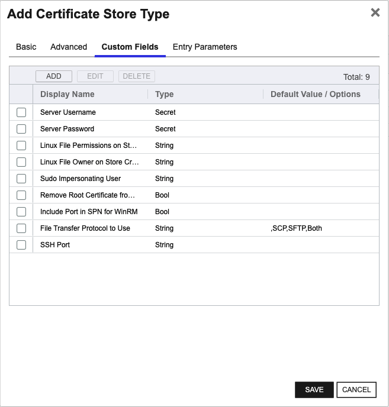
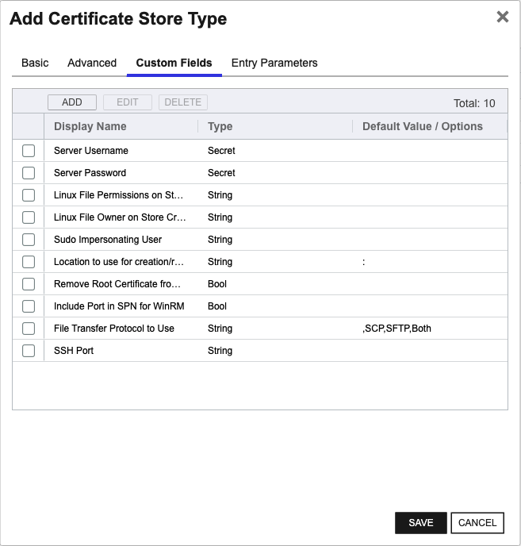

<h1 align="center" style="border-bottom: none">
    Remote File Universal Orchestrator Extension
</h1>

<p align="center">
  <!-- Badges -->

<a href="https://github.com/Keyfactor/remote-file-orchestrator/releases"></a>


</p>

<p align="center">
  <!-- TOC -->
  <a href="#support">
    <b>Support</b>
  </a>
  ·
  <a href="#installation">
    <b>Installation</b>
  </a>
  ·
  <a href="#license">
    <b>License</b>
  </a>
  ·
  <a href="https://github.com/orgs/Keyfactor/repositories?q=orchestrator">
    <b>Related Integrations</b>
  </a>
</p>

## Overview

The Remote File Orchestrator Extension is a multi-purpose integration that can remotely manage a variety of file-based certificate stores and can easily be extended to manage others.  The certificate store types that can be managed in the current version are: 

* RFJKS - Java Keystores of types JKS or PKCS12
* RFPkcs12 - Certificate stores that follow the PKCS#12 standard
* RFPEM - Files in PEM format
* RFDER - Files in binary DER format
* RFORA - Pkcs#12 formatted Oracle Wallets
* RFKDB - IBM Key Database files

The Keyfactor Univeral Orchestrator (UO) and RemoteFile Extension can be installed on either Windows or Linux operating systems as well as manage certificates residing on servers of both operating systems. A UO service managing certificates on remote servers is considered to be acting as an Orchestrator, while a UO service managing local certificates on the same server running the service is considered an Agent.  When acting as an Orchestrator, connectivity from the orchestrator server hosting the RemoteFile extension to the orchestrated server hosting the certificate store(s) being managed is achieved via either an SSH (for Linux and possibly Windows orchestrated servers) or WinRM (for Windows orchestrated servers) connection.  When acting as an agent, SSH/WinRM may still be used, OR the certificate store can be configured to bypass these and instead directly access the orchestrator server's file system.

  

Please refer to the READMEs for each supported store type for more information on proper configuration and setup for these different architectures.  The supported configurations of Universal Orchestrator hosts and managed orchestrated servers are detailed below:

| | UO Installed on Windows | UO Installed on Linux |
|-----|-----|------|
|Orchestrated Server hosting certificate store(s) on remote Windows server|WinRM connection | SSH connection |
|Orchestrated Server hosting certificate store(s) on remote Linux server| SSH connection | SSH connection |
|Certificate store(s) on same server as orchestrator service (Agent)| WinRM connection or local file system | SSH connection or local file system |

The Remote File Universal Orchestrator extension implements 6 Certificate Store Types. Depending on your use case, you may elect to use one, or all of these Certificate Store Types. Descriptions of each are provided below.

<details><summary>RFJKS</summary>

### RFJKS
The RFJKS store type can be used to manage java keystores of types JKS or PKCS12.  If creating a new java keystore and adding a certificate all via Keyfactor Command, the created java keystore will be of type PKCS12, as java keystores of type JKS have been deprecated as of JDK 9.

Use cases supported:
1. One-to-many trust entries - A trust entry is considered single certificate without a private key in a certificate store.  Each trust entry is identified with a custom alias.
2. One-to-many key entries - One-to-many certificates with private keys and optionally the full certificate chain.  Each certificate identified with a custom alias.
3. A mix of trust and key entries.
</details>

<details><summary>RFPEM</summary>

### RFPEM
The RFPEM store type can be used to manage PEM encoded files.

Use cases supported:
1. Trust stores - A file with one-to-many certificates (no private keys, no certificate chains).
2. Single certificate stores with private key in the file.
3. Single certificate stores with certificate chain and private key in the file.
4. Single certificate stores with private key in an external file.
5. Single certificate stores with certificate chain in the file and private key in an external file

NOTE: PEM stores may only have one private key (internal or external) associated with the store, as only one certificate/chain/private key combination can be stored in a PEM store supported by RFPEM.
</details>

<details><summary>RFPkcs12</summary>

### RFPkcs12
The RFPkcs12 store type can be used to manage any PKCS#12 compliant file format INCLUDING java keystores of type PKCS12.

Use cases supported:
1. One-to-many trust entries - A trust entry is considered single certificate without a private key in a certificate store.  Each trust entry is identified with a custom alias.
2. One-to-many key entries - One-to-many certificates with private keys and optionally the full certificate chain.  Each certificate identified with a custom alias.
3. A mix of trust and key entries.
</details>

<details><summary>RFDER</summary>

### RFDER
The RFORA store type can be used to manage Pkcs12 Oracle Wallets.  Please note that while this should work for Pkcs12 Oracle Wallets installed on both Windows and Linux servers, this has only been tested on wallets installed on Windows.  Please note, when entering the Store Path for an Oracle Wallet in Keyfactor Command, make sure to INCLUDE the eWallet.p12 file name that by convention is the name of the Pkcs12 wallet file that gets created.

Use cases supported:
1. One-to-many trust entries - A trust entry is considered single certificate without a private key in a certificate store.  Each trust entry is identified with a custom alias.
2. One-to-many key entries - One-to-many certificates with private keys and optionally the full certificate chain.  Each certificate identified with a custom alias.
3. A mix of trust and key entries.
</details>

<details><summary>RFKDB</summary>

### RFKDB
The RFKDB store type can be used to manage IBM Key Database Files (KDB) files.  The IBM utility, GSKCAPICMD, is used to read and write certificates from and to the target store and is therefore required to be installed on the server where each KDB certificate store being managed resides, and its location MUST be in the system $Path.

Use cases supported:
1. One-to-many trust entries - A trust entry is considered single certificate without a private key in a certificate store.  Each trust entry is identified with a custom alias.
2. One-to-many key entries - One-to-many certificates with private keys and optionally the full certificate chain.  Each certificate identified with a custom alias.
3. A mix of trust and key entries.
</details>

<details><summary>RFORA</summary>

### RFORA
The RFORA store type can be used to manage Pkcs12 Oracle Wallets.  Please note that while this should work for Pkcs12 Oracle Wallets installed on both Windows and Linux servers, this has only been tested on wallets installed on Windows.  Please note, when entering the Store Path for an Oracle Wallet in Keyfactor Command, make sure to INCLUDE the eWallet.p12 file name that by convention is the name of the Pkcs12 wallet file that gets created.

Use cases supported:
1. One-to-many trust entries - A trust entry is considered single certificate without a private key in a certificate store.  Each trust entry is identified with a custom alias.
2. One-to-many key entries - One-to-many certificates with private keys and optionally the full certificate chain.  Each certificate identified with a custom alias.
3. A mix of trust and key entries.
</details>


## Compatibility

This integration is compatible with Keyfactor Universal Orchestrator version 10.4 and later.

## Support
The Remote File Universal Orchestrator extension is supported by Keyfactor for Keyfactor customers. If you have a support issue, please open a support ticket with your Keyfactor representative. If you have a support issue, please open a support ticket via the Keyfactor Support Portal at https://support.keyfactor.com. 
 
> To report a problem or suggest a new feature, use the **[Issues](../../issues)** tab. If you want to contribute actual bug fixes or proposed enhancements, use the **[Pull requests](../../pulls)** tab.

## Requirements & Prerequisites

Before installing the Remote File Universal Orchestrator extension, we recommend that you install [kfutil](https://github.com/Keyfactor/kfutil). Kfutil is a command-line tool that simplifies the process of creating store types, installing extensions, and instantiating certificate stores in Keyfactor Command.


<details>
<summary><b>Certificate stores hosted on Linux servers:</b></summary>

1. The Remote File Orchestrator Extension makes use of a few common Linux commands when managing stores on Linux servers. If the credentials you will be connecting with need elevated access to run these commands or to access the certificate store files these commands operate against, you must set up the user id as a sudoer with no password necessary and set the config.json "UseSudo" value to "Y".  When RemoteFile is using orchestration, managing local or external certificate stores using SSH or WinRM, the security context is determined by the user id entered in the Keyfactor Command certificate store or discovery job screens.  When RemoteFile is running as an agent, managing local stores only, the security context is the user id running the Keyfactor Command Universal Orchestrator service account.  The full list of these commands below:

|Shell Command|Used For|
|---|---|
|echo|Used to append a newline and terminate all commands sent.|
|find|Used by Discovery jobs to locate potential certificate stores on the file system.|
|cp|Used by Inventory and Management Add/Remove jobs to copy the certificate store file to a temporary file (only when an alternate download folder has been configured).|
|chown|Used by the Inventory and Management Add/Remove jobs to set the permissions on the temporary file (only when an alternate download folder has been configured).|
|tee|Used by Management Add/Remove jobs to copy the temporary uploaded certificate file to the certificate store file (only when an alternate upload folder has been configured).|
|rm|Used by Inventory and Management Add/Remove jobs to remove temporary files (only when an alternate upload/download folder has been configured).|
|install|Used by the Management Create Store job when initializing a certificate store file.|
|orapki|Oracle Wallet CLI utility used by Inventory and Management Add/Remove jobs to manipulate an Oracle Wallet certificate store.  Used for the RFORA store type only.|
|gskcapicmd|IBM Key Database CLI utility used by Inventory and Management Add/Remove jobs to manipulate an IBM Key Database certificate store.  Used for the RFKDB store type only.|  

2. When orchestrating management of local or external certificate stores, the Remote File Orchestrator Extension makes use of SFTP and/or SCP to transfer files to and from the orchestrated server.  SFTP/SCP cannot make use of sudo, so all folders containing certificate stores will need to allow SFTP/SCP file transfer for the user assigned to the certificate store/discovery job.  If this is not possible, set the values in the config.json apprpriately to use an alternative upload/download folder that does allow SFTP/SCP file transfer.  If the certificate store/discovery job is configured for local (agent) access, the account running the Keyfactor Universal Orchestrator service must have access to read/write to the certificate store location, OR the config.json file must be set up to use the alternative upload/download file.  

3. SSH Authentication: When creating a Keyfactor certificate store for the remote file orchestrator extension, you may supply either a user id and password for the certificate store credentials (directly or through one of Keyfactor Command's PAM integrations), or supply a user id and SSH private key.  When using a password, the connection is attempted using SSH Password Authentication.  If that fails, Keyboard Interactive Authentication is automatically attempted.  One or both of these must be enabled on the Linux box being managed.  If private key authentication is desired, copy and paste the full SSH private key into the Password textbox (or pointer to the private key if using a PAM provider).  Please note that SSH Private Key Authentication is not available when running locally as an agent.  The following private key formats are supported: 
- PKCS#1 (BEGIN RSA PRIVATE KEY) 
- PKCS#8 (BEGIN PRIVATE KEY)
- ECDSA OPENSSH (BEGIN OPENSSH PRIVATE KEY)   

Please reference [Configuration File Setup](#configuration-file-setup) for more information on setting up the config.json file and [Certificate Stores and Discovery Jobs](#certificate-stores-and-discovery-jobs) for more information on the items above.    
</details>  

<details>  
<summary><b>Certificate stores hosted on Windows servers:</b></summary>
1. When orchestrating management of external (and potentially local) certificate stores, the RemoteFile Orchestrator Extension makes use of WinRM to connect to external certificate store servers.  The security context used is the user id entered in the Keyfactor Command certificate store or discovery job screen.  Make sure that WinRM is set up on the orchestrated server and that the WinRM port (by convention, 5585 for HTTP and 5586 for HTTPS) is part of the certificate store path when setting up your certificate stores/discovery jobs.  If running as an agent, managing local certificate stores, local commands are run under the security context of the user account running the Keyfactor Universal Orchestrator Service.  Please reference [Certificate Stores and Discovery Jobs](#certificate-stores-and-discovery-jobs) for more information on creating certificate stores for the RemoteFile Orchestrator Extension.  

</details>

Please consult with your company's system administrator for more information on configuring SSH/SFTP/SCP or WinRM in your environment.


The Remote File Universal Orchestrator extension implements 6 Certificate Store Types. Depending on your use case, you may elect to install one, or all of these Certificate Store Types.

<details><summary>RFJKS</summary>


</details>

<details><summary>RFPEM</summary>


</details>

<details><summary>RFPkcs12</summary>


</details>

<details><summary>RFDER</summary>


</details>

<details><summary>RFKDB</summary>


</details>

<details><summary>RFORA</summary>


</details>


### Create Certificate Store Types
<details><summary>RFJKS</summary>


* **Create RFJKS using kfutil**:

    ```shell
    # RFJKS
    kfutil store-types create RFJKS
    ```

* **Create RFJKS manually in the Command UI**:
    <details><summary>Create RFJKS manually in the Command UI</summary>

    Create a store type called `RFJKS` with the attributes in the tables below:

    #### Basic Tab
    | Attribute | Value | Description |
    | --------- | ----- | ----- |
    | Name | RFJKS | Display name for the store type (may be customized) |
    | Short Name | RFJKS | Short display name for the store type |
    | Capability | RFJKS | Store type name orchestrator will register with. Check the box to allow entry of value |
    | Supported Job Types (check the box for each) | Add, Discovery, Remove | Job types the extension supports |
    | Supports Add | ✅ | Check the box. Indicates that the Store Type supports Management Add |
    | Supports Remove | ✅ | Check the box. Indicates that the Store Type supports Management Remove |
    | Supports Discovery | ✅ | Check the box. Indicates that the Store Type supports Discovery |
    | Supports Reenrollment |  |  Indicates that the Store Type supports Reenrollment |
    | Supports Create | ✅ | Check the box. Indicates that the Store Type supports store creation |
    | Needs Server | ✅ | Determines if a target server name is required when creating store |
    | Blueprint Allowed |  | Determines if store type may be included in an Orchestrator blueprint |
    | Uses PowerShell |  | Determines if underlying implementation is PowerShell |
    | Requires Store Password | ✅ | Determines if a store password is required when configuring an individual store. |
    | Supports Entry Password |  | Determines if an individual entry within a store can have a password. |

    The Basic tab should look like this:

    

    #### Advanced Tab
    | Attribute | Value | Description |
    | --------- | ----- | ----- |
    | Supports Custom Alias | Required | Determines if an individual entry within a store can have a custom Alias. |
    | Private Key Handling | Optional | This determines if Keyfactor can send the private key associated with a certificate to the store. Required because IIS certificates without private keys would be invalid. |
    | PFX Password Style | Default | 'Default' - PFX password is randomly generated, 'Custom' - PFX password may be specified when the enrollment job is created (Requires the Allow Custom Password application setting to be enabled.) |

    The Advanced tab should look like this:

    

    #### Custom Fields Tab
    Custom fields operate at the certificate store level and are used to control how the orchestrator connects to the remote target server containing the certificate store to be managed. The following custom fields should be added to the store type:

    | Name | Display Name | Type | Default Value/Options | Required | Description |
    | ---- | ------------ | ---- | --------------------- | -------- | ----------- |
    | LinuxFilePermissionsOnStoreCreation | Linux File Permissions on Store Creation | String |  |  | The LinuxFilePermissionsOnStoreCreation field should contain a three-digit value between 000 and 777 representing the Linux file permissions to be set for the certificate store upon creation. Example: '600' or '755'. |
    | LinuxFileOwnerOnStoreCreation | Linux File Owner on Store Creation | String |  |  | The LinuxFileOwnerOnStoreCreation field should contain a valid user ID recognized by the destination Linux server, optionally followed by a colon and a group ID if the group owner differs. Example: 'userID' or 'userID:groupID'. |
    | SudoImpersonatingUser | Sudo Impersonating User | String |  |  | The SudoImpersonatingUser field should contain a valid user ID to impersonate using sudo on the destination Linux server. Example: 'impersonatedUserID'. |

    The Custom Fields tab should look like this:

    


    </details>
</details>

<details><summary>RFPEM</summary>


* **Create RFPEM using kfutil**:

    ```shell
    # RFPEM
    kfutil store-types create RFPEM
    ```

* **Create RFPEM manually in the Command UI**:
    <details><summary>Create RFPEM manually in the Command UI</summary>

    Create a store type called `RFPEM` with the attributes in the tables below:

    #### Basic Tab
    | Attribute | Value | Description |
    | --------- | ----- | ----- |
    | Name | RFPEM | Display name for the store type (may be customized) |
    | Short Name | RFPEM | Short display name for the store type |
    | Capability | RFPEM | Store type name orchestrator will register with. Check the box to allow entry of value |
    | Supported Job Types (check the box for each) | Add, Discovery, Remove | Job types the extension supports |
    | Supports Add | ✅ | Check the box. Indicates that the Store Type supports Management Add |
    | Supports Remove | ✅ | Check the box. Indicates that the Store Type supports Management Remove |
    | Supports Discovery | ✅ | Check the box. Indicates that the Store Type supports Discovery |
    | Supports Reenrollment |  |  Indicates that the Store Type supports Reenrollment |
    | Supports Create | ✅ | Check the box. Indicates that the Store Type supports store creation |
    | Needs Server | ✅ | Determines if a target server name is required when creating store |
    | Blueprint Allowed |  | Determines if store type may be included in an Orchestrator blueprint |
    | Uses PowerShell |  | Determines if underlying implementation is PowerShell |
    | Requires Store Password | ✅ | Determines if a store password is required when configuring an individual store. |
    | Supports Entry Password |  | Determines if an individual entry within a store can have a password. |

    The Basic tab should look like this:

    

    #### Advanced Tab
    | Attribute | Value | Description |
    | --------- | ----- | ----- |
    | Supports Custom Alias | Forbidden | Determines if an individual entry within a store can have a custom Alias. |
    | Private Key Handling | Optional | This determines if Keyfactor can send the private key associated with a certificate to the store. Required because IIS certificates without private keys would be invalid. |
    | PFX Password Style | Default | 'Default' - PFX password is randomly generated, 'Custom' - PFX password may be specified when the enrollment job is created (Requires the Allow Custom Password application setting to be enabled.) |

    The Advanced tab should look like this:

    

    #### Custom Fields Tab
    Custom fields operate at the certificate store level and are used to control how the orchestrator connects to the remote target server containing the certificate store to be managed. The following custom fields should be added to the store type:

    | Name | Display Name | Type | Default Value/Options | Required | Description |
    | ---- | ------------ | ---- | --------------------- | -------- | ----------- |
    | LinuxFilePermissionsOnStoreCreation | Linux File Permissions on Store Creation | String |  |  | The LinuxFilePermissionsOnStoreCreation field should contain a three-digit value between 000 and 777 representing the Linux file permissions to be set for the certificate store upon creation. Example: '600' or '755'. |
    | LinuxFileOwnerOnStoreCreation | Linux File Owner on Store Creation | String |  |  | The LinuxFileOwnerOnStoreCreation field should contain a valid user ID recognized by the destination Linux server, optionally followed by a colon and a group ID if the group owner differs. Example: 'userID' or 'userID:groupID'. |
    | SudoImpersonatingUser | Sudo Impersonating User | String |  |  | The SudoImpersonatingUser field should contain a valid user ID to impersonate using sudo on the destination Linux server. Example: 'impersonatedUserID'. |
    | IsTrustStore | Trust Store | Bool | false |  | The IsTrustStore field should contain a boolean value ('true' or 'false') indicating whether the store will be identified as a trust store, which can hold multiple certificates without private keys. Example: 'true' for a trust store or 'false' for a store with a single certificate and private key. |
    | IncludesChain | Store Includes Chain | Bool | false |  | The IncludesChain field should contain a boolean value ('true' or 'false') indicating whether the certificate store includes the full certificate chain along with the end entity certificate. Example: 'true' to include the full chain or 'false' to exclude it. |
    | SeparatePrivateKeyFilePath | Separate Private Key File Location | String |  |  | The SeparatePrivateKeyFilePath field should contain the full path and file name where the separate private key file will be stored if it is to be kept outside the main certificate file. Example: '/path/to/privatekey.pem'. |
    | IsRSAPrivateKey | Is RSA Private Key | Bool | false |  | The IsRSAPrivateKey field should contain a boolean value ('true' or 'false') indicating whether the private key is in PKCS#1 RSA format. Example: 'true' for a PKCS#1 RSA private key or 'false' for a PKCS#8 private key. |
    | IgnorePrivateKeyOnInventory | Ignore Private Key On Inventory | Bool | false |  | The IgnorePrivateKeyOnInventory field should contain a boolean value ('true' or 'false') indicating whether to ignore the private key during inventory, which will make the store inventory-only and return all certificates without private key entries. Example: 'true' to ignore the private key or 'false' to include it. |

    The Custom Fields tab should look like this:

    


    </details>
</details>

<details><summary>RFPkcs12</summary>


* **Create RFPkcs12 using kfutil**:

    ```shell
    # RFPkcs12
    kfutil store-types create RFPkcs12
    ```

* **Create RFPkcs12 manually in the Command UI**:
    <details><summary>Create RFPkcs12 manually in the Command UI</summary>

    Create a store type called `RFPkcs12` with the attributes in the tables below:

    #### Basic Tab
    | Attribute | Value | Description |
    | --------- | ----- | ----- |
    | Name | RFPkcs12 | Display name for the store type (may be customized) |
    | Short Name | RFPkcs12 | Short display name for the store type |
    | Capability | RFPkcs12 | Store type name orchestrator will register with. Check the box to allow entry of value |
    | Supported Job Types (check the box for each) | Add, Discovery, Remove | Job types the extension supports |
    | Supports Add | ✅ | Check the box. Indicates that the Store Type supports Management Add |
    | Supports Remove | ✅ | Check the box. Indicates that the Store Type supports Management Remove |
    | Supports Discovery | ✅ | Check the box. Indicates that the Store Type supports Discovery |
    | Supports Reenrollment |  |  Indicates that the Store Type supports Reenrollment |
    | Supports Create | ✅ | Check the box. Indicates that the Store Type supports store creation |
    | Needs Server | ✅ | Determines if a target server name is required when creating store |
    | Blueprint Allowed |  | Determines if store type may be included in an Orchestrator blueprint |
    | Uses PowerShell |  | Determines if underlying implementation is PowerShell |
    | Requires Store Password | ✅ | Determines if a store password is required when configuring an individual store. |
    | Supports Entry Password |  | Determines if an individual entry within a store can have a password. |

    The Basic tab should look like this:

    

    #### Advanced Tab
    | Attribute | Value | Description |
    | --------- | ----- | ----- |
    | Supports Custom Alias | Required | Determines if an individual entry within a store can have a custom Alias. |
    | Private Key Handling | Optional | This determines if Keyfactor can send the private key associated with a certificate to the store. Required because IIS certificates without private keys would be invalid. |
    | PFX Password Style | Default | 'Default' - PFX password is randomly generated, 'Custom' - PFX password may be specified when the enrollment job is created (Requires the Allow Custom Password application setting to be enabled.) |

    The Advanced tab should look like this:

    

    #### Custom Fields Tab
    Custom fields operate at the certificate store level and are used to control how the orchestrator connects to the remote target server containing the certificate store to be managed. The following custom fields should be added to the store type:

    | Name | Display Name | Type | Default Value/Options | Required | Description |
    | ---- | ------------ | ---- | --------------------- | -------- | ----------- |
    | LinuxFilePermissionsOnStoreCreation | Linux File Permissions on Store Creation | String |  |  | The LinuxFilePermissionsOnStoreCreation field should contain a three-digit value between 000 and 777 representing the Linux file permissions to be set for the certificate store upon creation. Example: '600' or '755'. |
    | LinuxFileOwnerOnStoreCreation | Linux File Owner on Store Creation | String |  |  | The LinuxFileOwnerOnStoreCreation field should contain a valid user ID recognized by the destination Linux server, optionally followed by a colon and a group ID if the group owner differs. Example: 'userID' or 'userID:groupID'. |
    | SudoImpersonatingUser | Sudo Impersonating User | String |  |  | The SudoImpersonatingUser field should contain a valid user ID to impersonate using sudo on the destination Linux server. Example: 'impersonatedUserID'. |

    The Custom Fields tab should look like this:

    


    </details>
</details>

<details><summary>RFDER</summary>


* **Create RFDER using kfutil**:

    ```shell
    # RFDER
    kfutil store-types create RFDER
    ```

* **Create RFDER manually in the Command UI**:
    <details><summary>Create RFDER manually in the Command UI</summary>

    Create a store type called `RFDER` with the attributes in the tables below:

    #### Basic Tab
    | Attribute | Value | Description |
    | --------- | ----- | ----- |
    | Name | RFDER | Display name for the store type (may be customized) |
    | Short Name | RFDER | Short display name for the store type |
    | Capability | RFDER | Store type name orchestrator will register with. Check the box to allow entry of value |
    | Supported Job Types (check the box for each) | Add, Discovery, Remove | Job types the extension supports |
    | Supports Add | ✅ | Check the box. Indicates that the Store Type supports Management Add |
    | Supports Remove | ✅ | Check the box. Indicates that the Store Type supports Management Remove |
    | Supports Discovery | ✅ | Check the box. Indicates that the Store Type supports Discovery |
    | Supports Reenrollment |  |  Indicates that the Store Type supports Reenrollment |
    | Supports Create | ✅ | Check the box. Indicates that the Store Type supports store creation |
    | Needs Server | ✅ | Determines if a target server name is required when creating store |
    | Blueprint Allowed |  | Determines if store type may be included in an Orchestrator blueprint |
    | Uses PowerShell |  | Determines if underlying implementation is PowerShell |
    | Requires Store Password | ✅ | Determines if a store password is required when configuring an individual store. |
    | Supports Entry Password |  | Determines if an individual entry within a store can have a password. |

    The Basic tab should look like this:

    

    #### Advanced Tab
    | Attribute | Value | Description |
    | --------- | ----- | ----- |
    | Supports Custom Alias | Forbidden | Determines if an individual entry within a store can have a custom Alias. |
    | Private Key Handling | Optional | This determines if Keyfactor can send the private key associated with a certificate to the store. Required because IIS certificates without private keys would be invalid. |
    | PFX Password Style | Default | 'Default' - PFX password is randomly generated, 'Custom' - PFX password may be specified when the enrollment job is created (Requires the Allow Custom Password application setting to be enabled.) |

    The Advanced tab should look like this:

    

    #### Custom Fields Tab
    Custom fields operate at the certificate store level and are used to control how the orchestrator connects to the remote target server containing the certificate store to be managed. The following custom fields should be added to the store type:

    | Name | Display Name | Type | Default Value/Options | Required | Description |
    | ---- | ------------ | ---- | --------------------- | -------- | ----------- |
    | LinuxFilePermissionsOnStoreCreation | Linux File Permissions on Store Creation | String |  |  | The LinuxFilePermissionsOnStoreCreation field should contain a three-digit value between 000 and 777 representing the Linux file permissions to be set for the certificate store upon creation. Example: '600' or '755'. |
    | LinuxFileOwnerOnStoreCreation | Linux File Owner on Store Creation | String |  |  | The LinuxFileOwnerOnStoreCreation field should contain a valid user ID recognized by the destination Linux server, optionally followed by a colon and a group ID if the group owner differs. Example: 'userID' or 'userID:groupID'. |
    | SudoImpersonatingUser | Sudo Impersonating User | String |  |  | The SudoImpersonatingUser field should contain a valid user ID to impersonate using sudo on the destination Linux server. Example: 'impersonatedUserID'. |
    | SeparatePrivateKeyFilePath | Separate Private Key File Location | String |  |  | The SeparatePrivateKeyFilePath field should contain the full path and file name where the separate private key file will be stored if it is to be kept outside the main certificate file. Example: '/path/to/privatekey.der'. |

    The Custom Fields tab should look like this:

    


    </details>
</details>

<details><summary>RFKDB</summary>


* **Create RFKDB using kfutil**:

    ```shell
    # RFKDB
    kfutil store-types create RFKDB
    ```

* **Create RFKDB manually in the Command UI**:
    <details><summary>Create RFKDB manually in the Command UI</summary>

    Create a store type called `RFKDB` with the attributes in the tables below:

    #### Basic Tab
    | Attribute | Value | Description |
    | --------- | ----- | ----- |
    | Name | RFKDB | Display name for the store type (may be customized) |
    | Short Name | RFKDB | Short display name for the store type |
    | Capability | RFKDB | Store type name orchestrator will register with. Check the box to allow entry of value |
    | Supported Job Types (check the box for each) | Add, Discovery, Remove | Job types the extension supports |
    | Supports Add | ✅ | Check the box. Indicates that the Store Type supports Management Add |
    | Supports Remove | ✅ | Check the box. Indicates that the Store Type supports Management Remove |
    | Supports Discovery | ✅ | Check the box. Indicates that the Store Type supports Discovery |
    | Supports Reenrollment |  |  Indicates that the Store Type supports Reenrollment |
    | Supports Create | ✅ | Check the box. Indicates that the Store Type supports store creation |
    | Needs Server | ✅ | Determines if a target server name is required when creating store |
    | Blueprint Allowed |  | Determines if store type may be included in an Orchestrator blueprint |
    | Uses PowerShell |  | Determines if underlying implementation is PowerShell |
    | Requires Store Password | ✅ | Determines if a store password is required when configuring an individual store. |
    | Supports Entry Password |  | Determines if an individual entry within a store can have a password. |

    The Basic tab should look like this:

    

    #### Advanced Tab
    | Attribute | Value | Description |
    | --------- | ----- | ----- |
    | Supports Custom Alias | Required | Determines if an individual entry within a store can have a custom Alias. |
    | Private Key Handling | Optional | This determines if Keyfactor can send the private key associated with a certificate to the store. Required because IIS certificates without private keys would be invalid. |
    | PFX Password Style | Default | 'Default' - PFX password is randomly generated, 'Custom' - PFX password may be specified when the enrollment job is created (Requires the Allow Custom Password application setting to be enabled.) |

    The Advanced tab should look like this:

    

    #### Custom Fields Tab
    Custom fields operate at the certificate store level and are used to control how the orchestrator connects to the remote target server containing the certificate store to be managed. The following custom fields should be added to the store type:

    | Name | Display Name | Type | Default Value/Options | Required | Description |
    | ---- | ------------ | ---- | --------------------- | -------- | ----------- |
    | LinuxFilePermissionsOnStoreCreation | Linux File Permissions on Store Creation | String |  |  | The LinuxFilePermissionsOnStoreCreation field should contain a three-digit value between 000 and 777 representing the Linux file permissions to be set for the certificate store upon creation. Example: '600' or '755'. |
    | LinuxFileOwnerOnStoreCreation | Linux File Owner on Store Creation | String |  |  | The LinuxFileOwnerOnStoreCreation field should contain a valid user ID recognized by the destination Linux server, optionally followed by a colon and a group ID if the group owner differs. Example: 'userID' or 'userID:groupID'. |
    | SudoImpersonatingUser | Sudo Impersonating User | String |  |  | The SudoImpersonatingUser field should contain a valid user ID to impersonate using sudo on the destination Linux server. Example: 'impersonatedUserID'. |

    The Custom Fields tab should look like this:

    


    </details>
</details>

<details><summary>RFORA</summary>


* **Create RFORA using kfutil**:

    ```shell
    # RFORA
    kfutil store-types create RFORA
    ```

* **Create RFORA manually in the Command UI**:
    <details><summary>Create RFORA manually in the Command UI</summary>

    Create a store type called `RFORA` with the attributes in the tables below:

    #### Basic Tab
    | Attribute | Value | Description |
    | --------- | ----- | ----- |
    | Name | RFORA | Display name for the store type (may be customized) |
    | Short Name | RFORA | Short display name for the store type |
    | Capability | RFORA | Store type name orchestrator will register with. Check the box to allow entry of value |
    | Supported Job Types (check the box for each) | Add, Discovery, Remove | Job types the extension supports |
    | Supports Add | ✅ | Check the box. Indicates that the Store Type supports Management Add |
    | Supports Remove | ✅ | Check the box. Indicates that the Store Type supports Management Remove |
    | Supports Discovery | ✅ | Check the box. Indicates that the Store Type supports Discovery |
    | Supports Reenrollment |  |  Indicates that the Store Type supports Reenrollment |
    | Supports Create | ✅ | Check the box. Indicates that the Store Type supports store creation |
    | Needs Server | ✅ | Determines if a target server name is required when creating store |
    | Blueprint Allowed |  | Determines if store type may be included in an Orchestrator blueprint |
    | Uses PowerShell |  | Determines if underlying implementation is PowerShell |
    | Requires Store Password | ✅ | Determines if a store password is required when configuring an individual store. |
    | Supports Entry Password |  | Determines if an individual entry within a store can have a password. |

    The Basic tab should look like this:

    

    #### Advanced Tab
    | Attribute | Value | Description |
    | --------- | ----- | ----- |
    | Supports Custom Alias | Required | Determines if an individual entry within a store can have a custom Alias. |
    | Private Key Handling | Optional | This determines if Keyfactor can send the private key associated with a certificate to the store. Required because IIS certificates without private keys would be invalid. |
    | PFX Password Style | Default | 'Default' - PFX password is randomly generated, 'Custom' - PFX password may be specified when the enrollment job is created (Requires the Allow Custom Password application setting to be enabled.) |

    The Advanced tab should look like this:

    

    #### Custom Fields Tab
    Custom fields operate at the certificate store level and are used to control how the orchestrator connects to the remote target server containing the certificate store to be managed. The following custom fields should be added to the store type:

    | Name | Display Name | Type | Default Value/Options | Required | Description |
    | ---- | ------------ | ---- | --------------------- | -------- | ----------- |
    | LinuxFilePermissionsOnStoreCreation | Linux File Permissions on Store Creation | String |  |  | The LinuxFilePermissionsOnStoreCreation field should contain a three-digit value between 000 and 777 representing the Linux file permissions to be set for the certificate store upon creation. Example: '600' or '755'. |
    | LinuxFileOwnerOnStoreCreation | Linux File Owner on Store Creation | String |  |  | The LinuxFileOwnerOnStoreCreation field should contain a valid user ID recognized by the destination Linux server, optionally followed by a colon and a group ID if the group owner differs. Example: 'userID' or 'userID:groupID'. |
    | SudoImpersonatingUser | Sudo Impersonating User | String |  |  | The SudoImpersonatingUser field should contain a valid user ID to impersonate using sudo on the destination Linux server. Example: 'impersonatedUserID'. |
    | WorkFolder | Location to use for creation/removal of work files | String |  | ✅ | The WorkFolder field should contain the path on the managed server where temporary work files can be created, modified, and deleted during Inventory and Management jobs. Example: '/path/to/workfolder'. |

    The Custom Fields tab should look like this:

    


    </details>
</details>


## Installation

1. **Download the latest Remote File Universal Orchestrator extension from GitHub.** 

    On the [Remote File Universal Orchestrator extension GitHub version page](https://github.com/Keyfactor/remote-file-orchestrator/releases/latest), click the `remote-file-orchestrator` asset to download the zip archive. Unzip the archive containing extension assemblies to a known location.

2. **Locate the Universal Orchestrator extensions directory.**

    * **Default on Windows** - `C:\Program Files\Keyfactor\Keyfactor Orchestrator\extensions`
    * **Default on Linux** - `/opt/keyfactor/orchestrator/extensions`
    
3. **Create a new directory for the Remote File Universal Orchestrator extension inside the extensions directory.**
        
    Create a new directory called `remote-file-orchestrator`.
    > The directory name does not need to match any names used elsewhere; it just has to be unique within the extensions directory.

4. **Copy the contents of the downloaded and unzipped assemblies from __step 2__ to the `remote-file-orchestrator` directory.**

5. **Restart the Universal Orchestrator service.**

    Refer to [Starting/Restarting the Universal Orchestrator service](https://software.keyfactor.com/Core-OnPrem/Current/Content/InstallingAgents/NetCoreOrchestrator/StarttheService.htm).


> The above installation steps can be supplimented by the [official Command documentation](https://software.keyfactor.com/Core-OnPrem/Current/Content/InstallingAgents/NetCoreOrchestrator/CustomExtensions.htm?Highlight=extensions).


## Post Installation

The Remote File Orchestrator Extension uses a JSON configuration file.  It is located in the {Keyfactor Orchestrator Installation Folder}\Extensions\RemoteFile.  None of the values are required, and a description of each follows below:  
{  
   "UseSudo": "N",  
   "DefaultSudoImpersonatedUser": "",  
   "CreateStoreIfMissing": "N",  
   "UseNegotiate": "N",  
   "SeparateUploadFilePath": "",  
   "FileTransferProtocol":  "SCP",  
   "DefaultLinuxPermissionsOnStoreCreation": "600",  
   "DefaultOwnerOnStoreCreation": ""  
}  

<details>
<summary><b>UseSudo</b> (Applicable for Linux hosted certificate stores only)</summary>

* Determines whether to prefix Linux command with "sudo". This can be very helpful in ensuring that the user id running commands over an ssh connection uses "least permissions necessary" to process each task. Setting this value to "Y" will prefix all Linux commands with "sudo" with the expectation that the command being executed on the orchestrated Linux server will look in the sudoers file to determine whether the logged in ID has elevated permissions for that specific command. Setting this value to "N" will result in "sudo" not being added to Linux commands.  
* Allowed values - Y/N  
* Default value - N  

</details>  

<details>
<summary><b>DefaultSudoImpersonatedUser</b> (Applicable for Linux hosted certificate stores only)</summary>

* Used in conjunction with UseSudo="Y", this optional setting can be used to set an alternate user id you wish to impersonate with sudo.  If this option does not exist or is set to an empty string, the default user of "root" will be used.  Any user id used here must have permissions to SCP/SFTP files to/from each certificate store location OR the SeparateUploadFilePath (see later in this section) as well as permissions to execute the commands listed in the "Prerequisites and Security Considerations" section above.  This value will be used for all certificate stores managed by this orchestrator extension implementation UNLESS overriden by the SudoImpersonatedUser certificate store type custom field setting described later in the [Creating Certificate Store Types](#creating-certificate-store-types) section.
* Allowed values - Any valid user id that the destination Linux server will recognize
* Default value - blank (root will be used)

</details>

<details>  
<summary><b>CreateStoreOnAddIfMissing</b></summary>

* Determines, during a Management-Add job, if a certificate store should be created if it does not already exist.  If set to "N", and the store referenced in the Management-Add job is not found, the job will return an error with a message stating that the store does not exist.  If set to "Y", the store will be created and the certificate added to the certificate store.
* Allowed values - Y/N  
* Default value - N  

</details>  

<details>  
<summary><b>UseNegotiateAuth</b> (Applicable for Windows hosted certificate stores only)</summary>

* Determines if WinRM should use Negotiate (Y) when connecting to the remote server.
* Allowed values - Y/N  
* Default value - N  

</details>  

<details>  
<summary><b>SeparateUploadFilePath</b> (Applicable for Linux hosted certificate stores only)</summary>

* Set this to the path you wish to use as the location on the orchestrated server to upload/download and later remove temporary work files when processing jobs.  If set to "" or not provided, the location of the certificate store itself will be used.  File transfer is performed using the SCP or SFTP protocols (see the File TransferProtocol setting).
* Allowed values - Any valid, existing Linux path configured to allow SCP/SFTP file upload/download tranfers.
* Default value - blank (actual store path will be used)

</details>

<details>  
<summary><b>FileTransferProtocol</b> (Applicable for Linux hosted certificate stores only)</summary>

* Determines the protocol to use when uploading/downloading files while processing a job.
* Allowed values - SCP, SFTP or Both.  If "Both" is entered, SCP will be attempted first, and if that does not work, SFTP will be tried.
* Default value - SCP. 

</details>

<details>  
<summary><b>DefaultLinuxPermissionsOnStoreCreation</b> (Applicable for Linux hosted certificate stores only)</summary>

* The Linux file permissions that will be set on a new certificate store created via a Management Create job or a Management Add job where CreateStoreOnAddIsMissing is set to "Y".  This value will be used for all certificate stores managed by this orchestrator instance unless overridden by the optional "Linux File Permissions on Store Creation" custom parameter setting on a specific certificate store.  See the [Creating Certificate Store Types](#creating-certificate-store-types) section for more information on creating RemoteFile certificate store types.
* Allowed values - Any 3 digit value from 000-777.
* Default Value - 600.  

</details>

<details>  
<summary><b>DefaultOwnerOnStoreCreation</b> (Applicable for Linux hosted certificate stores only)</summary>

* When a Management job is run to remotely create the physical certificate store on a remote server, by default the file owner and group will be set to the user name associated with the Keyfactor certificate store.  Setting DefaultOwnerOnStoreCreation to an alternate valid Linux user name will set that as the owner instead.  The owner AND group may be supplied by adding a ":" as a delimitter between the owner and group values, such as ownerId:groupId.  Supplying only the ownerId will set that value as the file owner.  The group name will default to how the Linux "install" command handles assigning the group.  The optional "Linux File Owner on Store Creation" custom parameter setting for a specific certificate store can override this value for a specific store.  See the [Creating Certificate Store Types](#creating-certificate-store-types) section for more information on creating RemoteFile certificate store types.
* Allowed values - Any valid user id that the destination Linux server will recognize
* Default Value - blank (the ID associated with the Keyfactor certificate store will be used).  

</details>


## Defining Certificate Stores

The Remote File Universal Orchestrator extension implements 6 Certificate Store Types, each of which implements different functionality. Refer to the individual instructions below for each Certificate Store Type that you deemed necessary for your use case from the installation section.

<details><summary>RFJKS</summary>


* **Manually with the Command UI**

    <details><summary>Create Certificate Stores manually in the UI</summary>

    1. **Navigate to the _Certificate Stores_ page in Keyfactor Command.**

        Log into Keyfactor Command, toggle the _Locations_ dropdown, and click _Certificate Stores_.

    2. **Add a Certificate Store.**

        Click the Add button to add a new Certificate Store. Use the table below to populate the **Attributes** in the **Add** form.
        | Attribute | Description | Attribute is PAM Eligible |
        | --------- | ----------- | ------------------------- |
        | Category | Select "RFJKS" or the customized certificate store name from the previous step. | |
        | Container | Optional container to associate certificate store with. | |
        | Client Machine | The IP address or DNS of the server hosting the certificate store.  For more information, see [Client Machine ](#client-machine-instructions) | |
        | Store Path | The full path and file name, including file extension if one exists where the certificate store file is located.  For Linux orchestrated servers, StorePath will begin with a forward slash (i.e. /folder/path/storename.ext).  For Windows orchestrated servers, it should begin with a drive letter (i.e. c:\folder\path\storename.ext). | |
        | Orchestrator | Select an approved orchestrator capable of managing `RFJKS` certificates. Specifically, one with the `RFJKS` capability. | |
        | LinuxFilePermissionsOnStoreCreation | The LinuxFilePermissionsOnStoreCreation field should contain a three-digit value between 000 and 777 representing the Linux file permissions to be set for the certificate store upon creation. Example: '600' or '755'. |  |
        | LinuxFileOwnerOnStoreCreation | The LinuxFileOwnerOnStoreCreation field should contain a valid user ID recognized by the destination Linux server, optionally followed by a colon and a group ID if the group owner differs. Example: 'userID' or 'userID:groupID'. |  |
        | SudoImpersonatingUser | The SudoImpersonatingUser field should contain a valid user ID to impersonate using sudo on the destination Linux server. Example: 'impersonatedUserID'. |  |

    </details>

* **Using kfutil**
    
    <details><summary>Create Certificate Stores with kfutil</summary>
    
    1. **Generate a CSV template for the RFJKS certificate store**

        ```shell
        kfutil stores import generate-template --store-type-name RFJKS --outpath RFJKS.csv
        ```
    2. **Populate the generated CSV file**

        Open the CSV file, and reference the table below to populate parameters for each **Attribute**.
        | Attribute | Description | Attribute is PAM Eligible |
        | --------- | ----------- | ------------------------- |
        | Category | Select "RFJKS" or the customized certificate store name from the previous step. | |
        | Container | Optional container to associate certificate store with. | |
        | Client Machine | The IP address or DNS of the server hosting the certificate store.  For more information, see [Client Machine ](#client-machine-instructions) | |
        | Store Path | The full path and file name, including file extension if one exists where the certificate store file is located.  For Linux orchestrated servers, StorePath will begin with a forward slash (i.e. /folder/path/storename.ext).  For Windows orchestrated servers, it should begin with a drive letter (i.e. c:\folder\path\storename.ext). | |
        | Orchestrator | Select an approved orchestrator capable of managing `RFJKS` certificates. Specifically, one with the `RFJKS` capability. | |
        | LinuxFilePermissionsOnStoreCreation | The LinuxFilePermissionsOnStoreCreation field should contain a three-digit value between 000 and 777 representing the Linux file permissions to be set for the certificate store upon creation. Example: '600' or '755'. |  |
        | LinuxFileOwnerOnStoreCreation | The LinuxFileOwnerOnStoreCreation field should contain a valid user ID recognized by the destination Linux server, optionally followed by a colon and a group ID if the group owner differs. Example: 'userID' or 'userID:groupID'. |  |
        | SudoImpersonatingUser | The SudoImpersonatingUser field should contain a valid user ID to impersonate using sudo on the destination Linux server. Example: 'impersonatedUserID'. |  |

    3. **Import the CSV file to create the certificate stores** 

        ```shell
        kfutil stores import csv --store-type-name RFJKS --file RFJKS.csv
        ```
    </details>

> The content in this section can be supplimented by the [official Command documentation](https://software.keyfactor.com/Core-OnPrem/Current/Content/ReferenceGuide/Certificate%20Stores.htm?Highlight=certificate%20store).


</details>

<details><summary>RFPEM</summary>


* **Manually with the Command UI**

    <details><summary>Create Certificate Stores manually in the UI</summary>

    1. **Navigate to the _Certificate Stores_ page in Keyfactor Command.**

        Log into Keyfactor Command, toggle the _Locations_ dropdown, and click _Certificate Stores_.

    2. **Add a Certificate Store.**

        Click the Add button to add a new Certificate Store. Use the table below to populate the **Attributes** in the **Add** form.
        | Attribute | Description | Attribute is PAM Eligible |
        | --------- | ----------- | ------------------------- |
        | Category | Select "RFPEM" or the customized certificate store name from the previous step. | |
        | Container | Optional container to associate certificate store with. | |
        | Client Machine | The Client Machine field should contain the DNS name or IP address of the remote orchestrated server for Linux orchestrated servers, formatted as a URL (protocol://dns-or-ip:port) for Windows orchestrated servers, or '1.1.1.1|LocalMachine' for local agents. Example: 'https://myserver.mydomain.com:5986' or '1.1.1.1|LocalMachine' for local access. | |
        | Store Path | The Store Path field should contain the full path and file name, including file extension if applicable, beginning with a forward slash (/) for Linux orchestrated servers or a drive letter (i.e., c:\folder\path\storename.ext) for Windows orchestrated servers. Example: '/folder/path/storename.pem' or 'c:\folder\path\storename.pem'. | |
        | Orchestrator | Select an approved orchestrator capable of managing `RFPEM` certificates. Specifically, one with the `RFPEM` capability. | |
        | LinuxFilePermissionsOnStoreCreation | The LinuxFilePermissionsOnStoreCreation field should contain a three-digit value between 000 and 777 representing the Linux file permissions to be set for the certificate store upon creation. Example: '600' or '755'. |  |
        | LinuxFileOwnerOnStoreCreation | The LinuxFileOwnerOnStoreCreation field should contain a valid user ID recognized by the destination Linux server, optionally followed by a colon and a group ID if the group owner differs. Example: 'userID' or 'userID:groupID'. |  |
        | SudoImpersonatingUser | The SudoImpersonatingUser field should contain a valid user ID to impersonate using sudo on the destination Linux server. Example: 'impersonatedUserID'. |  |
        | IsTrustStore | The IsTrustStore field should contain a boolean value ('true' or 'false') indicating whether the store will be identified as a trust store, which can hold multiple certificates without private keys. Example: 'true' for a trust store or 'false' for a store with a single certificate and private key. |  |
        | IncludesChain | The IncludesChain field should contain a boolean value ('true' or 'false') indicating whether the certificate store includes the full certificate chain along with the end entity certificate. Example: 'true' to include the full chain or 'false' to exclude it. |  |
        | SeparatePrivateKeyFilePath | The SeparatePrivateKeyFilePath field should contain the full path and file name where the separate private key file will be stored if it is to be kept outside the main certificate file. Example: '/path/to/privatekey.pem'. |  |
        | IsRSAPrivateKey | The IsRSAPrivateKey field should contain a boolean value ('true' or 'false') indicating whether the private key is in PKCS#1 RSA format. Example: 'true' for a PKCS#1 RSA private key or 'false' for a PKCS#8 private key. |  |
        | IgnorePrivateKeyOnInventory | The IgnorePrivateKeyOnInventory field should contain a boolean value ('true' or 'false') indicating whether to ignore the private key during inventory, which will make the store inventory-only and return all certificates without private key entries. Example: 'true' to ignore the private key or 'false' to include it. |  |

    </details>

* **Using kfutil**
    
    <details><summary>Create Certificate Stores with kfutil</summary>
    
    1. **Generate a CSV template for the RFPEM certificate store**

        ```shell
        kfutil stores import generate-template --store-type-name RFPEM --outpath RFPEM.csv
        ```
    2. **Populate the generated CSV file**

        Open the CSV file, and reference the table below to populate parameters for each **Attribute**.
        | Attribute | Description | Attribute is PAM Eligible |
        | --------- | ----------- | ------------------------- |
        | Category | Select "RFPEM" or the customized certificate store name from the previous step. | |
        | Container | Optional container to associate certificate store with. | |
        | Client Machine | The Client Machine field should contain the DNS name or IP address of the remote orchestrated server for Linux orchestrated servers, formatted as a URL (protocol://dns-or-ip:port) for Windows orchestrated servers, or '1.1.1.1|LocalMachine' for local agents. Example: 'https://myserver.mydomain.com:5986' or '1.1.1.1|LocalMachine' for local access. | |
        | Store Path | The Store Path field should contain the full path and file name, including file extension if applicable, beginning with a forward slash (/) for Linux orchestrated servers or a drive letter (i.e., c:\folder\path\storename.ext) for Windows orchestrated servers. Example: '/folder/path/storename.pem' or 'c:\folder\path\storename.pem'. | |
        | Orchestrator | Select an approved orchestrator capable of managing `RFPEM` certificates. Specifically, one with the `RFPEM` capability. | |
        | LinuxFilePermissionsOnStoreCreation | The LinuxFilePermissionsOnStoreCreation field should contain a three-digit value between 000 and 777 representing the Linux file permissions to be set for the certificate store upon creation. Example: '600' or '755'. |  |
        | LinuxFileOwnerOnStoreCreation | The LinuxFileOwnerOnStoreCreation field should contain a valid user ID recognized by the destination Linux server, optionally followed by a colon and a group ID if the group owner differs. Example: 'userID' or 'userID:groupID'. |  |
        | SudoImpersonatingUser | The SudoImpersonatingUser field should contain a valid user ID to impersonate using sudo on the destination Linux server. Example: 'impersonatedUserID'. |  |
        | IsTrustStore | The IsTrustStore field should contain a boolean value ('true' or 'false') indicating whether the store will be identified as a trust store, which can hold multiple certificates without private keys. Example: 'true' for a trust store or 'false' for a store with a single certificate and private key. |  |
        | IncludesChain | The IncludesChain field should contain a boolean value ('true' or 'false') indicating whether the certificate store includes the full certificate chain along with the end entity certificate. Example: 'true' to include the full chain or 'false' to exclude it. |  |
        | SeparatePrivateKeyFilePath | The SeparatePrivateKeyFilePath field should contain the full path and file name where the separate private key file will be stored if it is to be kept outside the main certificate file. Example: '/path/to/privatekey.pem'. |  |
        | IsRSAPrivateKey | The IsRSAPrivateKey field should contain a boolean value ('true' or 'false') indicating whether the private key is in PKCS#1 RSA format. Example: 'true' for a PKCS#1 RSA private key or 'false' for a PKCS#8 private key. |  |
        | IgnorePrivateKeyOnInventory | The IgnorePrivateKeyOnInventory field should contain a boolean value ('true' or 'false') indicating whether to ignore the private key during inventory, which will make the store inventory-only and return all certificates without private key entries. Example: 'true' to ignore the private key or 'false' to include it. |  |

    3. **Import the CSV file to create the certificate stores** 

        ```shell
        kfutil stores import csv --store-type-name RFPEM --file RFPEM.csv
        ```
    </details>

> The content in this section can be supplimented by the [official Command documentation](https://software.keyfactor.com/Core-OnPrem/Current/Content/ReferenceGuide/Certificate%20Stores.htm?Highlight=certificate%20store).


</details>

<details><summary>RFPkcs12</summary>


* **Manually with the Command UI**

    <details><summary>Create Certificate Stores manually in the UI</summary>

    1. **Navigate to the _Certificate Stores_ page in Keyfactor Command.**

        Log into Keyfactor Command, toggle the _Locations_ dropdown, and click _Certificate Stores_.

    2. **Add a Certificate Store.**

        Click the Add button to add a new Certificate Store. Use the table below to populate the **Attributes** in the **Add** form.
        | Attribute | Description | Attribute is PAM Eligible |
        | --------- | ----------- | ------------------------- |
        | Category | Select "RFPkcs12" or the customized certificate store name from the previous step. | |
        | Container | Optional container to associate certificate store with. | |
        | Client Machine | The Client Machine field should contain the DNS name or IP address of the remote orchestrated server for Linux orchestrated servers, formatted as a URL (protocol://dns-or-ip:port) for Windows orchestrated servers, or '1.1.1.1|LocalMachine' for local agents. Example: 'https://myserver.mydomain.com:5986' or '1.1.1.1|LocalMachine' for local access. | |
        | Store Path | The Store Path field should contain the full path and file name, including file extension if applicable, beginning with a forward slash (/) for Linux orchestrated servers or a drive letter (i.e., c:\folder\path\storename.p12) for Windows orchestrated servers. Example: '/folder/path/storename.p12' or 'c:\folder\path\storename.p12'. | |
        | Orchestrator | Select an approved orchestrator capable of managing `RFPkcs12` certificates. Specifically, one with the `RFPkcs12` capability. | |
        | LinuxFilePermissionsOnStoreCreation | The LinuxFilePermissionsOnStoreCreation field should contain a three-digit value between 000 and 777 representing the Linux file permissions to be set for the certificate store upon creation. Example: '600' or '755'. |  |
        | LinuxFileOwnerOnStoreCreation | The LinuxFileOwnerOnStoreCreation field should contain a valid user ID recognized by the destination Linux server, optionally followed by a colon and a group ID if the group owner differs. Example: 'userID' or 'userID:groupID'. |  |
        | SudoImpersonatingUser | The SudoImpersonatingUser field should contain a valid user ID to impersonate using sudo on the destination Linux server. Example: 'impersonatedUserID'. |  |

    </details>

* **Using kfutil**
    
    <details><summary>Create Certificate Stores with kfutil</summary>
    
    1. **Generate a CSV template for the RFPkcs12 certificate store**

        ```shell
        kfutil stores import generate-template --store-type-name RFPkcs12 --outpath RFPkcs12.csv
        ```
    2. **Populate the generated CSV file**

        Open the CSV file, and reference the table below to populate parameters for each **Attribute**.
        | Attribute | Description | Attribute is PAM Eligible |
        | --------- | ----------- | ------------------------- |
        | Category | Select "RFPkcs12" or the customized certificate store name from the previous step. | |
        | Container | Optional container to associate certificate store with. | |
        | Client Machine | The Client Machine field should contain the DNS name or IP address of the remote orchestrated server for Linux orchestrated servers, formatted as a URL (protocol://dns-or-ip:port) for Windows orchestrated servers, or '1.1.1.1|LocalMachine' for local agents. Example: 'https://myserver.mydomain.com:5986' or '1.1.1.1|LocalMachine' for local access. | |
        | Store Path | The Store Path field should contain the full path and file name, including file extension if applicable, beginning with a forward slash (/) for Linux orchestrated servers or a drive letter (i.e., c:\folder\path\storename.p12) for Windows orchestrated servers. Example: '/folder/path/storename.p12' or 'c:\folder\path\storename.p12'. | |
        | Orchestrator | Select an approved orchestrator capable of managing `RFPkcs12` certificates. Specifically, one with the `RFPkcs12` capability. | |
        | LinuxFilePermissionsOnStoreCreation | The LinuxFilePermissionsOnStoreCreation field should contain a three-digit value between 000 and 777 representing the Linux file permissions to be set for the certificate store upon creation. Example: '600' or '755'. |  |
        | LinuxFileOwnerOnStoreCreation | The LinuxFileOwnerOnStoreCreation field should contain a valid user ID recognized by the destination Linux server, optionally followed by a colon and a group ID if the group owner differs. Example: 'userID' or 'userID:groupID'. |  |
        | SudoImpersonatingUser | The SudoImpersonatingUser field should contain a valid user ID to impersonate using sudo on the destination Linux server. Example: 'impersonatedUserID'. |  |

    3. **Import the CSV file to create the certificate stores** 

        ```shell
        kfutil stores import csv --store-type-name RFPkcs12 --file RFPkcs12.csv
        ```
    </details>

> The content in this section can be supplimented by the [official Command documentation](https://software.keyfactor.com/Core-OnPrem/Current/Content/ReferenceGuide/Certificate%20Stores.htm?Highlight=certificate%20store).


</details>

<details><summary>RFDER</summary>


* **Manually with the Command UI**

    <details><summary>Create Certificate Stores manually in the UI</summary>

    1. **Navigate to the _Certificate Stores_ page in Keyfactor Command.**

        Log into Keyfactor Command, toggle the _Locations_ dropdown, and click _Certificate Stores_.

    2. **Add a Certificate Store.**

        Click the Add button to add a new Certificate Store. Use the table below to populate the **Attributes** in the **Add** form.
        | Attribute | Description | Attribute is PAM Eligible |
        | --------- | ----------- | ------------------------- |
        | Category | Select "RFDER" or the customized certificate store name from the previous step. | |
        | Container | Optional container to associate certificate store with. | |
        | Client Machine | The Client Machine field should contain the DNS name or IP address of the remote orchestrated server for Linux orchestrated servers, formatted as a URL (protocol://dns-or-ip:port) for Windows orchestrated servers, or '1.1.1.1|LocalMachine' for local agents. Example: 'https://myserver.mydomain.com:5986' or '1.1.1.1|LocalMachine' for local access. | |
        | Store Path | The Store Path field should contain the full path and file name, including file extension if applicable, beginning with a forward slash (/) for Linux orchestrated servers or a drive letter (i.e., c:\folder\path\storename.der) for Windows orchestrated servers. Example: '/folder/path/storename.der' or 'c:\folder\path\storename.der'. | |
        | Orchestrator | Select an approved orchestrator capable of managing `RFDER` certificates. Specifically, one with the `RFDER` capability. | |
        | LinuxFilePermissionsOnStoreCreation | The LinuxFilePermissionsOnStoreCreation field should contain a three-digit value between 000 and 777 representing the Linux file permissions to be set for the certificate store upon creation. Example: '600' or '755'. |  |
        | LinuxFileOwnerOnStoreCreation | The LinuxFileOwnerOnStoreCreation field should contain a valid user ID recognized by the destination Linux server, optionally followed by a colon and a group ID if the group owner differs. Example: 'userID' or 'userID:groupID'. |  |
        | SudoImpersonatingUser | The SudoImpersonatingUser field should contain a valid user ID to impersonate using sudo on the destination Linux server. Example: 'impersonatedUserID'. |  |
        | SeparatePrivateKeyFilePath | The SeparatePrivateKeyFilePath field should contain the full path and file name where the separate private key file will be stored if it is to be kept outside the main certificate file. Example: '/path/to/privatekey.der'. |  |

    </details>

* **Using kfutil**
    
    <details><summary>Create Certificate Stores with kfutil</summary>
    
    1. **Generate a CSV template for the RFDER certificate store**

        ```shell
        kfutil stores import generate-template --store-type-name RFDER --outpath RFDER.csv
        ```
    2. **Populate the generated CSV file**

        Open the CSV file, and reference the table below to populate parameters for each **Attribute**.
        | Attribute | Description | Attribute is PAM Eligible |
        | --------- | ----------- | ------------------------- |
        | Category | Select "RFDER" or the customized certificate store name from the previous step. | |
        | Container | Optional container to associate certificate store with. | |
        | Client Machine | The Client Machine field should contain the DNS name or IP address of the remote orchestrated server for Linux orchestrated servers, formatted as a URL (protocol://dns-or-ip:port) for Windows orchestrated servers, or '1.1.1.1|LocalMachine' for local agents. Example: 'https://myserver.mydomain.com:5986' or '1.1.1.1|LocalMachine' for local access. | |
        | Store Path | The Store Path field should contain the full path and file name, including file extension if applicable, beginning with a forward slash (/) for Linux orchestrated servers or a drive letter (i.e., c:\folder\path\storename.der) for Windows orchestrated servers. Example: '/folder/path/storename.der' or 'c:\folder\path\storename.der'. | |
        | Orchestrator | Select an approved orchestrator capable of managing `RFDER` certificates. Specifically, one with the `RFDER` capability. | |
        | LinuxFilePermissionsOnStoreCreation | The LinuxFilePermissionsOnStoreCreation field should contain a three-digit value between 000 and 777 representing the Linux file permissions to be set for the certificate store upon creation. Example: '600' or '755'. |  |
        | LinuxFileOwnerOnStoreCreation | The LinuxFileOwnerOnStoreCreation field should contain a valid user ID recognized by the destination Linux server, optionally followed by a colon and a group ID if the group owner differs. Example: 'userID' or 'userID:groupID'. |  |
        | SudoImpersonatingUser | The SudoImpersonatingUser field should contain a valid user ID to impersonate using sudo on the destination Linux server. Example: 'impersonatedUserID'. |  |
        | SeparatePrivateKeyFilePath | The SeparatePrivateKeyFilePath field should contain the full path and file name where the separate private key file will be stored if it is to be kept outside the main certificate file. Example: '/path/to/privatekey.der'. |  |

    3. **Import the CSV file to create the certificate stores** 

        ```shell
        kfutil stores import csv --store-type-name RFDER --file RFDER.csv
        ```
    </details>

> The content in this section can be supplimented by the [official Command documentation](https://software.keyfactor.com/Core-OnPrem/Current/Content/ReferenceGuide/Certificate%20Stores.htm?Highlight=certificate%20store).


</details>

<details><summary>RFKDB</summary>


* **Manually with the Command UI**

    <details><summary>Create Certificate Stores manually in the UI</summary>

    1. **Navigate to the _Certificate Stores_ page in Keyfactor Command.**

        Log into Keyfactor Command, toggle the _Locations_ dropdown, and click _Certificate Stores_.

    2. **Add a Certificate Store.**

        Click the Add button to add a new Certificate Store. Use the table below to populate the **Attributes** in the **Add** form.
        | Attribute | Description | Attribute is PAM Eligible |
        | --------- | ----------- | ------------------------- |
        | Category | Select "RFKDB" or the customized certificate store name from the previous step. | |
        | Container | Optional container to associate certificate store with. | |
        | Client Machine | The Client Machine field should contain the DNS name or IP address of the remote orchestrated server for Linux orchestrated servers, formatted as a URL (protocol://dns-or-ip:port) for Windows orchestrated servers, or '1.1.1.1|LocalMachine' for local agents. Example: 'https://myserver.mydomain.com:5986' or '1.1.1.1|LocalMachine' for local access. | |
        | Store Path | The Store Path field should contain the full path and file name, including file extension if applicable, beginning with a forward slash (/) for Linux orchestrated servers or a drive letter (i.e., c:\folder\path\storename.kdb) for Windows orchestrated servers. Example: '/folder/path/storename.kdb' or 'c:\folder\path\storename.kdb'. | |
        | Orchestrator | Select an approved orchestrator capable of managing `RFKDB` certificates. Specifically, one with the `RFKDB` capability. | |
        | LinuxFilePermissionsOnStoreCreation | The LinuxFilePermissionsOnStoreCreation field should contain a three-digit value between 000 and 777 representing the Linux file permissions to be set for the certificate store upon creation. Example: '600' or '755'. |  |
        | LinuxFileOwnerOnStoreCreation | The LinuxFileOwnerOnStoreCreation field should contain a valid user ID recognized by the destination Linux server, optionally followed by a colon and a group ID if the group owner differs. Example: 'userID' or 'userID:groupID'. |  |
        | SudoImpersonatingUser | The SudoImpersonatingUser field should contain a valid user ID to impersonate using sudo on the destination Linux server. Example: 'impersonatedUserID'. |  |

    </details>

* **Using kfutil**
    
    <details><summary>Create Certificate Stores with kfutil</summary>
    
    1. **Generate a CSV template for the RFKDB certificate store**

        ```shell
        kfutil stores import generate-template --store-type-name RFKDB --outpath RFKDB.csv
        ```
    2. **Populate the generated CSV file**

        Open the CSV file, and reference the table below to populate parameters for each **Attribute**.
        | Attribute | Description | Attribute is PAM Eligible |
        | --------- | ----------- | ------------------------- |
        | Category | Select "RFKDB" or the customized certificate store name from the previous step. | |
        | Container | Optional container to associate certificate store with. | |
        | Client Machine | The Client Machine field should contain the DNS name or IP address of the remote orchestrated server for Linux orchestrated servers, formatted as a URL (protocol://dns-or-ip:port) for Windows orchestrated servers, or '1.1.1.1|LocalMachine' for local agents. Example: 'https://myserver.mydomain.com:5986' or '1.1.1.1|LocalMachine' for local access. | |
        | Store Path | The Store Path field should contain the full path and file name, including file extension if applicable, beginning with a forward slash (/) for Linux orchestrated servers or a drive letter (i.e., c:\folder\path\storename.kdb) for Windows orchestrated servers. Example: '/folder/path/storename.kdb' or 'c:\folder\path\storename.kdb'. | |
        | Orchestrator | Select an approved orchestrator capable of managing `RFKDB` certificates. Specifically, one with the `RFKDB` capability. | |
        | LinuxFilePermissionsOnStoreCreation | The LinuxFilePermissionsOnStoreCreation field should contain a three-digit value between 000 and 777 representing the Linux file permissions to be set for the certificate store upon creation. Example: '600' or '755'. |  |
        | LinuxFileOwnerOnStoreCreation | The LinuxFileOwnerOnStoreCreation field should contain a valid user ID recognized by the destination Linux server, optionally followed by a colon and a group ID if the group owner differs. Example: 'userID' or 'userID:groupID'. |  |
        | SudoImpersonatingUser | The SudoImpersonatingUser field should contain a valid user ID to impersonate using sudo on the destination Linux server. Example: 'impersonatedUserID'. |  |

    3. **Import the CSV file to create the certificate stores** 

        ```shell
        kfutil stores import csv --store-type-name RFKDB --file RFKDB.csv
        ```
    </details>

> The content in this section can be supplimented by the [official Command documentation](https://software.keyfactor.com/Core-OnPrem/Current/Content/ReferenceGuide/Certificate%20Stores.htm?Highlight=certificate%20store).


</details>

<details><summary>RFORA</summary>


* **Manually with the Command UI**

    <details><summary>Create Certificate Stores manually in the UI</summary>

    1. **Navigate to the _Certificate Stores_ page in Keyfactor Command.**

        Log into Keyfactor Command, toggle the _Locations_ dropdown, and click _Certificate Stores_.

    2. **Add a Certificate Store.**

        Click the Add button to add a new Certificate Store. Use the table below to populate the **Attributes** in the **Add** form.
        | Attribute | Description | Attribute is PAM Eligible |
        | --------- | ----------- | ------------------------- |
        | Category | Select "RFORA" or the customized certificate store name from the previous step. | |
        | Container | Optional container to associate certificate store with. | |
        | Client Machine | The Client Machine field should contain the DNS name or IP address of the remote orchestrated server for Linux orchestrated servers, formatted as a URL (protocol://dns-or-ip:port) for Windows orchestrated servers, or '1.1.1.1|LocalMachine' for local agents. Example: 'https://myserver.mydomain.com:5986' or '1.1.1.1|LocalMachine' for local access. | |
        | Store Path | The Store Path field should contain the full path and file name of the Oracle Wallet, including the 'eWallet.p12' file name by convention. Example: '/path/to/eWallet.p12' or 'c:\path\to\eWallet.p12'. | |
        | Orchestrator | Select an approved orchestrator capable of managing `RFORA` certificates. Specifically, one with the `RFORA` capability. | |
        | LinuxFilePermissionsOnStoreCreation | The LinuxFilePermissionsOnStoreCreation field should contain a three-digit value between 000 and 777 representing the Linux file permissions to be set for the certificate store upon creation. Example: '600' or '755'. |  |
        | LinuxFileOwnerOnStoreCreation | The LinuxFileOwnerOnStoreCreation field should contain a valid user ID recognized by the destination Linux server, optionally followed by a colon and a group ID if the group owner differs. Example: 'userID' or 'userID:groupID'. |  |
        | SudoImpersonatingUser | The SudoImpersonatingUser field should contain a valid user ID to impersonate using sudo on the destination Linux server. Example: 'impersonatedUserID'. |  |
        | WorkFolder | The WorkFolder field should contain the path on the managed server where temporary work files can be created, modified, and deleted during Inventory and Management jobs. Example: '/path/to/workfolder'. |  |

    </details>

* **Using kfutil**
    
    <details><summary>Create Certificate Stores with kfutil</summary>
    
    1. **Generate a CSV template for the RFORA certificate store**

        ```shell
        kfutil stores import generate-template --store-type-name RFORA --outpath RFORA.csv
        ```
    2. **Populate the generated CSV file**

        Open the CSV file, and reference the table below to populate parameters for each **Attribute**.
        | Attribute | Description | Attribute is PAM Eligible |
        | --------- | ----------- | ------------------------- |
        | Category | Select "RFORA" or the customized certificate store name from the previous step. | |
        | Container | Optional container to associate certificate store with. | |
        | Client Machine | The Client Machine field should contain the DNS name or IP address of the remote orchestrated server for Linux orchestrated servers, formatted as a URL (protocol://dns-or-ip:port) for Windows orchestrated servers, or '1.1.1.1|LocalMachine' for local agents. Example: 'https://myserver.mydomain.com:5986' or '1.1.1.1|LocalMachine' for local access. | |
        | Store Path | The Store Path field should contain the full path and file name of the Oracle Wallet, including the 'eWallet.p12' file name by convention. Example: '/path/to/eWallet.p12' or 'c:\path\to\eWallet.p12'. | |
        | Orchestrator | Select an approved orchestrator capable of managing `RFORA` certificates. Specifically, one with the `RFORA` capability. | |
        | LinuxFilePermissionsOnStoreCreation | The LinuxFilePermissionsOnStoreCreation field should contain a three-digit value between 000 and 777 representing the Linux file permissions to be set for the certificate store upon creation. Example: '600' or '755'. |  |
        | LinuxFileOwnerOnStoreCreation | The LinuxFileOwnerOnStoreCreation field should contain a valid user ID recognized by the destination Linux server, optionally followed by a colon and a group ID if the group owner differs. Example: 'userID' or 'userID:groupID'. |  |
        | SudoImpersonatingUser | The SudoImpersonatingUser field should contain a valid user ID to impersonate using sudo on the destination Linux server. Example: 'impersonatedUserID'. |  |
        | WorkFolder | The WorkFolder field should contain the path on the managed server where temporary work files can be created, modified, and deleted during Inventory and Management jobs. Example: '/path/to/workfolder'. |  |

    3. **Import the CSV file to create the certificate stores** 

        ```shell
        kfutil stores import csv --store-type-name RFORA --file RFORA.csv
        ```
    </details>

> The content in this section can be supplimented by the [official Command documentation](https://software.keyfactor.com/Core-OnPrem/Current/Content/ReferenceGuide/Certificate%20Stores.htm?Highlight=certificate%20store).


</details>

## Discovering Certificate Stores with the Discovery Job
When scheduling discovery jobs in Keyfactor Command, there are a few fields that are important to highlight here:  

<details>
<summary>Client Machine</summary>

The IP address or DNS of the server hosting the certificate store.  For more information, see [Client Machine ](#client-machine-instructions)

</details>

<details>
<summary>Store Path</summary>

For Linux orchestrated servers, "StorePath" will begin with a forward slash (/) and contain the full path and file name, including file extension if one exists (i.e. /folder/path/storename.ext).  For Windows orchestrated servers, it should be the full path and file name, including file extension if one exists, beginning with a drive letter (i.e. c:\folder\path\storename.ext).  

</details>

<details>
<summary>Server Username/Password</summary>

A username and password (or valid PAM key if the username and/or password is stored in a KF Command configured PAM integration).  The password can be an SSH private key if connecting via SSH to a server using SSH private key authentication.  If acting as an *agent* using local file access, just check "No Value" for the username and password.

</details>
<details>
<summary>Directories to Search</summary>

Enter one or more comma delimitted file paths to search (please reference the Keyfactor Command Reference Guide for more information), but there is also a special value that can be used on Windows orchestrated servers instead - "fullscan".  Entering fullscan in this field will tell the RemoteFile discovery job to search all available drive letters at the root and recursively search all of them for files matching the other search criteria.

</details>

<details>
<summary>Extensions</summary>

In addition to entering one or more comma delimitted extensions to search for (please reference the Keyfactor Command Reference Guide for more information), a reserved value of "noext" can be used that will cause the RemoteFile discovery job to search for files that do not have an extension.  This value can be chained with other extensions using the comma delimiter.  For example, entering pem,jks,noext will cause the RemoteFile discovery job to return file locations with extensions of "pem", "jks", *and* files that do not have extensions.  

</details>

Please refer to the Keyfactor Command Reference Guide for complete information on creating certificate stores and scheduling discovery jobs in Keyfactor Command.


## License

Apache License 2.0, see [LICENSE](LICENSE).

## Related Integrations

See all [Keyfactor Universal Orchestrator extensions](https://github.com/orgs/Keyfactor/repositories?q=orchestrator).