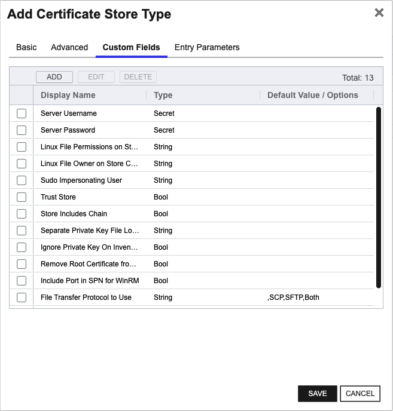
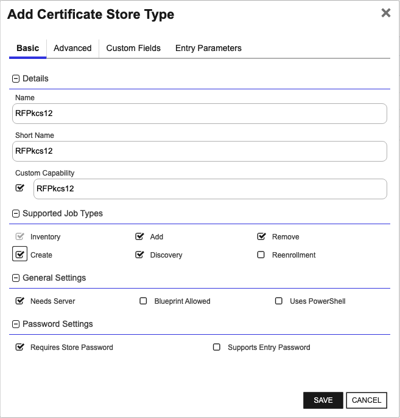

<h1 align="center" style="border-bottom: none">
    Remote File Universal Orchestrator Extension
</h1>

<p align="center">
  <!-- Badges -->

<a href="https://github.com/Keyfactor/remote-file-orchestrator/releases"></a>


</p>

<p align="center">
  <!-- TOC -->
  <a href="#support">
    <b>Support</b>
  </a>
  ·
  <a href="#installation">
    <b>Installation</b>
  </a>
  ·
  <a href="#license">
    <b>License</b>
  </a>
  ·
  <a href="https://github.com/orgs/Keyfactor/repositories?q=orchestrator">
    <b>Related Integrations</b>
  </a>
</p>

## Overview

The Remote File Orchestrator Extension is a multipurpose integration that can remotely manage a variety of file-based
certificate stores and can easily be extended to manage others.

The Keyfactor Universal Orchestrator (UO) and RemoteFile Extension can be installed on either Windows or Linux operating
systems as well as manage certificates residing on servers of both operating systems. A UO service managing certificates
on remote servers is considered to be acting as an Orchestrator, while a UO service managing local certificates on the
same server running the service is considered an Agent. When acting as an Orchestrator, connectivity from the
orchestrator server hosting the `RemoteFile` extension to the orchestrated server hosting the certificate store(s) being
managed is achieved via either an `SSH` (for Linux and possibly Windows orchestrated servers) or WinRM (for Windows
orchestrated servers) connection. When acting as an agent, `SSH/WinRM` may still be used, OR the certificate store can be
configured to bypass these and instead directly access the orchestrator server's file system.


The supported configurations of Universal Orchestrator hosts and managed orchestrated servers are detailed below:

|                                                                           | UO Installed on Windows               | UO Installed on Linux               |
|---------------------------------------------------------------------------|---------------------------------------|-------------------------------------|
| Orchestrated Server hosting certificate store(s) on remote Windows server | WinRM connection                      | SSH connection                      |
| Orchestrated Server hosting certificate store(s) on remote Linux server   | SSH connection                        | SSH connection                      |
| Certificate store(s) on same server as orchestrator service (Agent)       | WinRM connection or local file system | SSH connection or local file system |  

Note: when creating, adding certificates to, or removing certificates from any store managed by `RemoteFile`, the
destination store file will be recreated. When this occurs, current AES encryption algorithms will be used for affected
certificates and certificate store files.

The Remote File Universal Orchestrator extension implements 6 Certificate Store Types. Depending on your use case, you may elect to use one, or all of these Certificate Store Types. Descriptions of each are provided below.

- [RFJKS](#RFJKS)

- [RFPEM](#RFPEM)

- [RFPkcs12](#RFPkcs12)

- [RFDER](#RFDER)

- [RFKDB](#RFKDB)

- [RFORA](#RFORA)


## Compatibility

This integration is compatible with Keyfactor Universal Orchestrator version 10.4 and later.

## Support
The Remote File Universal Orchestrator extension is supported by Keyfactor. If you require support for any issues or have feature request, please open a support ticket by either contacting your Keyfactor representative or via the Keyfactor Support Portal at https://support.keyfactor.com.

> If you want to contribute bug fixes or additional enhancements, use the **[Pull requests](../../pulls)** tab.

## Requirements & Prerequisites

Before installing the Remote File Universal Orchestrator extension, we recommend that you install [kfutil](https://github.com/Keyfactor/kfutil). Kfutil is a command-line tool that simplifies the process of creating store types, installing extensions, and instantiating certificate stores in Keyfactor Command.


<details>
<summary><b>Certificate stores hosted on Linux servers:</b></summary>

1. The Remote File Orchestrator Extension makes use of a few common Linux commands when managing stores on Linux
   servers as well as some specialized CLI commands for certain store types. If the credentials you will be connecting with 
   need elevated access to run these commands or to access the
   certificate store files these commands operate against, you must set up the user id as a sudoer with no password
   necessary and set the config.json `UseSudo` value to `Y`. When `RemoteFile` is using orchestration, managing local or
   external certificate stores using `SSH` or `WinRM`, the security context is determined by the user id entered into the
   Keyfactor Command certificate store or discovery job screens. When RemoteFile is running as an agent, managing local
   stores only, the security context is the user id running the Keyfactor Command Universal Orchestrator service
   account. The full list of these commands and when they are used is illustrated below:

| Shell Command  | Discovery | Inventory | Management-Add | Management-Delete | Management-Create |
|----------------|-----------|-----------|----------------|-------------------|-------------------|
| `echo`         | X         | X         | X              | X                 | X                 |
| `find`         | X         |           |                |                   |                   |
| `cp`           |           | X(a)      | X(a)           | X(a)              |                   |
| `ls`           |           |           | X              | X                 | X                 |
| `chown`        |           | X(b)      | X(b)           | X(b)              |                   |
| `tee`          |           | X(c)      | X(a)           | X(a)              |                   |
| `rm`           |           | X(d)      | X(d)           | X(d)              |                   |
| `install`      |           |           |                |                   | X                 |
| `orapki`       |           | X(e)      | X(e)           | X(e)              |                   |
| `gskcapicmd`   |           | X(f)      | X(f)           | X(f)              |                   |  

(a) - Only used if config.json setting SeparateUploadFilePath is used (non empty value)  
(b) - Only used if config.json setting SeparateUploadFilePath is used (non empty value) AND the config.json or certificate store setting SudoImpersonatedUser is not used (empty value)  
(c) - Only used if store type is RFKDB or RFORA AND config.json setting SeparateUploadFilePath is used (non empty value)  
(d) - Only used if using store type is either RFKDB or RFORA OR any store type and the config.json setting SeparateUploadFilePath is used (non empty value)  
(e) - RFORA store type only  
(f) - RFKDB store type only

2. When orchestrating management of local or external certificate stores, the Remote File Orchestrator Extension makes
   use of SFTP and/or SCP to transfer files to and from the orchestrated server. `SFTP/SCP` cannot make use of `sudo`, so
   all folders containing certificate stores will need to allow SFTP/SCP file transfer for the user assigned to the
   certificate store/discovery job. If this is not possible, set the values in the `config.json` appropriately to use an
   alternative upload/download folder that does allow `SFTP/SCP` file transfer. If the certificate store/discovery job is
   configured for local (agent) access, the account running the Keyfactor Universal Orchestrator service must have
   access to read/write to the certificate store location, OR the `config.json` file must be set up to use the alternative
   upload/download file.

3. `SSH` Authentication: When creating a Keyfactor certificate store for the `RemoteFile` orchestrator extension, you may
   supply either a user id and password for the certificate store credentials (directly or through one of Keyfactor
   Command's PAM integrations), or supply a user id and `SSH` private key. When using a password, the connection is
   attempted using `SSH` password authentication. If that fails, Keyboard Interactive Authentication is automatically
   attempted. One or both of these must be enabled on the Linux box being managed. If private key authentication is
   desired, copy and paste the full SSH private key into the Password textbox (or pointer to the private key if using a
   PAM provider). Please note that SSH Private Key Authentication is not available when running locally as an agent. The
   following private key formats are supported:

- PKCS#1 (`BEGIN RSA PRIVATE KEY`)
- PKCS#8 (`BEGIN PRIVATE KEY`)
- ECDSA OPENSSH (`BEGIN OPENSSH PRIVATE KEY`)

Please reference [Post Installation](#post-installation) for more information on setting up the `config.json` file
and [Defining Certificate Stores](#defining-certificate-stores)
and [Discovering Certificate Stores with the Discovery Job](#discovering-certificate-stores-with-the-discovery-job) for
more information on defining and configuring certificate stores.
</details>  

<details>  
<summary><b>Certificate stores hosted on Windows servers:</b></summary>

1. When orchestrating management of external (and potentially local) certificate stores, the `RemoteFile` Orchestrator 
Extension makes use of `WinRM` to connect to external certificate store servers.  The security context used is the user id 
entered in the Keyfactor Command certificate store or discovery job screen.  Make sure that `WinRM` is set up on the 
orchestrated server and that the `WinRM` port (by convention, `5585` for `HTTP` and `5586` for `HTTPS`) is part of the certificate 
store path when setting up your certificate stores/discovery jobs. If running as an agent, managing local certificate stores, 
local commands are run under the security context of the user account running the Keyfactor Universal Orchestrator Service.  
Please reference [Certificate Stores and Discovery Jobs](#certificate-stores-and-discovery-jobs) for more information on 
creating certificate stores for the `RemoteFile` Orchestrator Extension.  

</details>

Please consult with your system administrator for more information on configuring `SSH/SFTP/SCP` or `WinRM` in your environment.


## Certificate Store Types

To use the Remote File Universal Orchestrator extension, you **must** create the Certificate Store Types required for your use-case. This only needs to happen _once_ per Keyfactor Command instance.

The Remote File Universal Orchestrator extension implements 6 Certificate Store Types. Depending on your use case, you may elect to use one, or all of these Certificate Store Types.

### RFJKS

<details><summary>Click to expand details</summary>


The `RFJKS` store type can be used to manage java keystores of types `JKS` or `PKCS12`.  If creating a new java keystore 
and adding a certificate all via Keyfactor Command, the created java keystore will be of type `PKCS12`, as java keystores 
of type `JKS` have been deprecated as of `JDK 9`.

#### Supported use cases
1. One-to-many trust entries - A trust entry is defined as a single certificate without a private key in a certificate store.  Each trust entry is identified with a custom alias.
2. One-to-many key entries - One-to-many certificates with private keys and optionally the full certificate chain.  Each certificate is identified with a custom alias.
3. A mix of trust and key entries.


#### Supported Operations

| Operation    | Is Supported                                                                                                           |
|--------------|------------------------------------------------------------------------------------------------------------------------|
| Add          | ✅ Checked        |
| Remove       | ✅ Checked     |
| Discovery    | ✅ Checked  |
| Reenrollment | 🔲 Unchecked |
| Create       | ✅ Checked     |

#### Store Type Creation

##### Using kfutil:
`kfutil` is a custom CLI for the Keyfactor Command API and can be used to create certificate store types.
For more information on [kfutil](https://github.com/Keyfactor/kfutil) check out the [docs](https://github.com/Keyfactor/kfutil?tab=readme-ov-file#quickstart)
   <details><summary>Click to expand RFJKS kfutil details</summary>

   ##### Using online definition from GitHub:
   This will reach out to GitHub and pull the latest store-type definition
   ```shell
   # RFJKS
   kfutil store-types create RFJKS
   ```

   ##### Offline creation using integration-manifest file:
   If required, it is possible to create store types from the [integration-manifest.json](./integration-manifest.json) included in this repo.
   You would first download the [integration-manifest.json](./integration-manifest.json) and then run the following command
   in your offline environment.
   ```shell
   kfutil store-types create --from-file integration-manifest.json
   ```
   </details>


#### Manual Creation
Below are instructions on how to create the RFJKS store type manually in
the Keyfactor Command Portal
   <details><summary>Click to expand manual RFJKS details</summary>

   Create a store type called `RFJKS` with the attributes in the tables below:

   ##### Basic Tab
   | Attribute | Value | Description |
   | --------- | ----- | ----- |
   | Name | RFJKS | Display name for the store type (may be customized) |
   | Short Name | RFJKS | Short display name for the store type |
   | Capability | RFJKS | Store type name orchestrator will register with. Check the box to allow entry of value |
   | Supports Add | ✅ Checked | Check the box. Indicates that the Store Type supports Management Add |
   | Supports Remove | ✅ Checked | Check the box. Indicates that the Store Type supports Management Remove |
   | Supports Discovery | ✅ Checked | Check the box. Indicates that the Store Type supports Discovery |
   | Supports Reenrollment | 🔲 Unchecked |  Indicates that the Store Type supports Reenrollment |
   | Supports Create | ✅ Checked | Check the box. Indicates that the Store Type supports store creation |
   | Needs Server | ✅ Checked | Determines if a target server name is required when creating store |
   | Blueprint Allowed | 🔲 Unchecked | Determines if store type may be included in an Orchestrator blueprint |
   | Uses PowerShell | 🔲 Unchecked | Determines if underlying implementation is PowerShell |
   | Requires Store Password | ✅ Checked | Enables users to optionally specify a store password when defining a Certificate Store. |
   | Supports Entry Password | 🔲 Unchecked | Determines if an individual entry within a store can have a password. |

   The Basic tab should look like this:

   

   ##### Advanced Tab
   | Attribute | Value | Description |
   | --------- | ----- | ----- |
   | Supports Custom Alias | Required | Determines if an individual entry within a store can have a custom Alias. |
   | Private Key Handling | Optional | This determines if Keyfactor can send the private key associated with a certificate to the store. Required because IIS certificates without private keys would be invalid. |
   | PFX Password Style | Default | 'Default' - PFX password is randomly generated, 'Custom' - PFX password may be specified when the enrollment job is created (Requires the Allow Custom Password application setting to be enabled.) |

   The Advanced tab should look like this:

   

   > For Keyfactor **Command versions 24.4 and later**, a Certificate Format dropdown is available with PFX and PEM options. Ensure that **PFX** is selected, as this determines the format of new and renewed certificates sent to the Orchestrator during a Management job. Currently, all Keyfactor-supported Orchestrator extensions support only PFX.

   ##### Custom Fields Tab
   Custom fields operate at the certificate store level and are used to control how the orchestrator connects to the remote target server containing the certificate store to be managed. The following custom fields should be added to the store type:

   | Name | Display Name | Description | Type | Default Value/Options | Required |
   | ---- | ------------ | ---- | --------------------- | -------- | ----------- |
   | ServerUsername | Server Username | A username (or valid PAM key if the username is stored in a KF Command configured PAM integration). If acting as an *agent* using local file access, just check *No Value* | Secret |  | 🔲 Unchecked |
   | ServerPassword | Server Password | A password (or valid PAM key if the password is stored in a KF Command configured PAM integration). The password can also be an SSH private key if connecting via SSH to a server using SSH private key authentication. If acting as an *agent* using local file access, just check *No Value* | Secret |  | 🔲 Unchecked |
   | LinuxFilePermissionsOnStoreCreation | Linux File Permissions on Store Creation | The LinuxFilePermissionsOnStoreCreation field should contain a three-digit value between 000 and 777 representing the Linux file permissions to be set for the certificate store upon creation. Example: '600' or '755'.  Overrides DefaultLinuxPermissionOnStoreCreation [config.json](#post-installation) setting. | String |  | 🔲 Unchecked |
   | LinuxFileOwnerOnStoreCreation | Linux File Owner on Store Creation | The LinuxFileOwnerOnStoreCreation field should contain a valid user ID recognized by the destination Linux server, optionally followed by a colon and a group ID if the group owner differs. Example: 'userID' or 'userID:groupID'.  Overrides DefaultOwnerOnStoreCreation [config.json](#post-installation) setting. | String |  | 🔲 Unchecked |
   | SudoImpersonatingUser | Sudo Impersonating User | The SudoImpersonatingUser field should contain a valid user ID to impersonate using sudo on the destination Linux server. Example: 'impersonatedUserID'.  Overrides DefaultSudoImpersonatedUser [config.json](#post-installation) setting. | String |  | 🔲 Unchecked |
   | RemoveRootCertificate | Remove Root Certificate from Chain | Remove root certificate from chain when adding/renewing a certificate in a store. | Bool | False | 🔲 Unchecked |
   | IncludePortInSPN | Include Port in SPN for WinRM | Internally set the -IncludePortInSPN option when creating the remote PowerShell connection. Needed for some Kerberos configurations. | Bool | False | 🔲 Unchecked |
   | FileTransferProtocol | File Transfer Protocol to Use | Which protocol should be used when uploading/downloading files - SCP, SFTP, or Both (try one, and then if necessary, the other).  Overrides FileTransferProtocol [config.json](#post-installation) setting. | MultipleChoice | ,SCP,SFTP,Both | 🔲 Unchecked |
   | SSHPort | SSH Port | Integer value representing the port that should be used when connecting to Linux servers over SSH.  Overrides SSHPort [config.json](#post-installation) setting. | String |  | 🔲 Unchecked |

   The Custom Fields tab should look like this:

   

   </details>
</details>

### RFPEM

<details><summary>Click to expand details</summary>


The `RFPEM` store type can be used to manage `PEM` encoded files.

#### Supported use cases
1. Trust stores - A file with one-to-many certificates (no private keys, no certificate chains).
2. Single certificate stores with private key in the file.
3. Single certificate stores with certificate chain and private key in the file.
4. Single certificate stores with private key in an external file.
5. Single certificate stores with certificate chain in the file and private key in an external file

#### Additional Considerations and Limitations
- `PEM` stores may only have one private key (internal or external) associated with the store, as only one certificate/chain/private key combination can be stored in a PEM store supported by `RFPEM`. 
- Private keys will be stored in encrypted or unencrypted `PKCS#8` format (`BEGIN [ENCRYPTED] PRIVATE KEY`) based on the Store Password set on the Keyfactor Command Certificate Store unless managing a `PEM` store that currently contains a private key in `PKCS#1` format (`BEGIN RSA PRIVATE KEY` or `BEGIN EC PRIVATE KEY`). 
- Store password *MUST* be set to `No Password` if managing a store with a `PKCS#1` private key, as encrypted `PKCS#1` keys are not supported with this integration.


#### Supported Operations

| Operation    | Is Supported                                                                                                           |
|--------------|------------------------------------------------------------------------------------------------------------------------|
| Add          | ✅ Checked        |
| Remove       | ✅ Checked     |
| Discovery    | ✅ Checked  |
| Reenrollment | 🔲 Unchecked |
| Create       | ✅ Checked     |

#### Store Type Creation

##### Using kfutil:
`kfutil` is a custom CLI for the Keyfactor Command API and can be used to create certificate store types.
For more information on [kfutil](https://github.com/Keyfactor/kfutil) check out the [docs](https://github.com/Keyfactor/kfutil?tab=readme-ov-file#quickstart)
   <details><summary>Click to expand RFPEM kfutil details</summary>

   ##### Using online definition from GitHub:
   This will reach out to GitHub and pull the latest store-type definition
   ```shell
   # RFPEM
   kfutil store-types create RFPEM
   ```

   ##### Offline creation using integration-manifest file:
   If required, it is possible to create store types from the [integration-manifest.json](./integration-manifest.json) included in this repo.
   You would first download the [integration-manifest.json](./integration-manifest.json) and then run the following command
   in your offline environment.
   ```shell
   kfutil store-types create --from-file integration-manifest.json
   ```
   </details>


#### Manual Creation
Below are instructions on how to create the RFPEM store type manually in
the Keyfactor Command Portal
   <details><summary>Click to expand manual RFPEM details</summary>

   Create a store type called `RFPEM` with the attributes in the tables below:

   ##### Basic Tab
   | Attribute | Value | Description |
   | --------- | ----- | ----- |
   | Name | RFPEM | Display name for the store type (may be customized) |
   | Short Name | RFPEM | Short display name for the store type |
   | Capability | RFPEM | Store type name orchestrator will register with. Check the box to allow entry of value |
   | Supports Add | ✅ Checked | Check the box. Indicates that the Store Type supports Management Add |
   | Supports Remove | ✅ Checked | Check the box. Indicates that the Store Type supports Management Remove |
   | Supports Discovery | ✅ Checked | Check the box. Indicates that the Store Type supports Discovery |
   | Supports Reenrollment | 🔲 Unchecked |  Indicates that the Store Type supports Reenrollment |
   | Supports Create | ✅ Checked | Check the box. Indicates that the Store Type supports store creation |
   | Needs Server | ✅ Checked | Determines if a target server name is required when creating store |
   | Blueprint Allowed | 🔲 Unchecked | Determines if store type may be included in an Orchestrator blueprint |
   | Uses PowerShell | 🔲 Unchecked | Determines if underlying implementation is PowerShell |
   | Requires Store Password | ✅ Checked | Enables users to optionally specify a store password when defining a Certificate Store. |
   | Supports Entry Password | 🔲 Unchecked | Determines if an individual entry within a store can have a password. |

   The Basic tab should look like this:

   

   ##### Advanced Tab
   | Attribute | Value | Description |
   | --------- | ----- | ----- |
   | Supports Custom Alias | Forbidden | Determines if an individual entry within a store can have a custom Alias. |
   | Private Key Handling | Optional | This determines if Keyfactor can send the private key associated with a certificate to the store. Required because IIS certificates without private keys would be invalid. |
   | PFX Password Style | Default | 'Default' - PFX password is randomly generated, 'Custom' - PFX password may be specified when the enrollment job is created (Requires the Allow Custom Password application setting to be enabled.) |

   The Advanced tab should look like this:

   

   > For Keyfactor **Command versions 24.4 and later**, a Certificate Format dropdown is available with PFX and PEM options. Ensure that **PFX** is selected, as this determines the format of new and renewed certificates sent to the Orchestrator during a Management job. Currently, all Keyfactor-supported Orchestrator extensions support only PFX.

   ##### Custom Fields Tab
   Custom fields operate at the certificate store level and are used to control how the orchestrator connects to the remote target server containing the certificate store to be managed. The following custom fields should be added to the store type:

   | Name | Display Name | Description | Type | Default Value/Options | Required |
   | ---- | ------------ | ---- | --------------------- | -------- | ----------- |
   | ServerUsername | Server Username | A username (or valid PAM key if the username is stored in a KF Command configured PAM integration). If acting as an *agent* using local file access, just check *No Value* | Secret |  | 🔲 Unchecked |
   | ServerPassword | Server Password | A password (or valid PAM key if the password is stored in a KF Command configured PAM integration). The password can also be an SSH private key if connecting via SSH to a server using SSH private key authentication. If acting as an *agent* using local file access, just check *No Value* | Secret |  | 🔲 Unchecked |
   | LinuxFilePermissionsOnStoreCreation | Linux File Permissions on Store Creation | The LinuxFilePermissionsOnStoreCreation field should contain a three-digit value between 000 and 777 representing the Linux file permissions to be set for the certificate store upon creation. Example: '600' or '755'.  Overrides DefaultLinuxPermissionOnStoreCreation [config.json](#post-installation) setting. | String |  | 🔲 Unchecked |
   | LinuxFileOwnerOnStoreCreation | Linux File Owner on Store Creation | The LinuxFileOwnerOnStoreCreation field should contain a valid user ID recognized by the destination Linux server, optionally followed by a colon and a group ID if the group owner differs. Example: 'userID' or 'userID:groupID'.  Overrides DefaultOwnerOnStoreCreation [config.json](#post-installation) setting. | String |  | 🔲 Unchecked |
   | SudoImpersonatingUser | Sudo Impersonating User | The SudoImpersonatingUser field should contain a valid user ID to impersonate using sudo on the destination Linux server. Example: 'impersonatedUserID'.  Overrides [config.json](#post-installation) DefaultSudoImpersonatedUser setting.. | String |  | 🔲 Unchecked |
   | IsTrustStore | Trust Store | The IsTrustStore field should contain a boolean value ('true' or 'false') indicating whether the store will be identified as a trust store, which can hold multiple certificates without private keys. Example: 'true' for a trust store or 'false' for a store with a single certificate and private key. | Bool | false | 🔲 Unchecked |
   | IncludesChain | Store Includes Chain | The IncludesChain field should contain a boolean value ('true' or 'false') indicating whether the certificate store includes the full certificate chain along with the end entity certificate. Example: 'true' to include the full chain or 'false' to exclude it. | Bool | false | 🔲 Unchecked |
   | SeparatePrivateKeyFilePath | Separate Private Key File Location | The SeparatePrivateKeyFilePath field should contain the full path and file name where the separate private key file will be stored if it is to be kept outside the main certificate file. Example: '/path/to/privatekey.pem'. | String |  | 🔲 Unchecked |
   | IgnorePrivateKeyOnInventory | Ignore Private Key On Inventory | The IgnorePrivateKeyOnInventory field should contain a boolean value ('true' or 'false') indicating whether to disregard the private key during inventory. Setting this to 'true' will allow inventory for the store without needing to supply the location of the private key or the password if the key is encrypted.  However, doing this makes the store in effect inventory-only and no management jobs will be able to be run for this store. Example: 'true' to ignore the private key or 'false' to include it. | Bool | false | 🔲 Unchecked |
   | RemoveRootCertificate | Remove Root Certificate from Chain | Remove root certificate from chain when adding/renewing a certificate in a store. | Bool | False | 🔲 Unchecked |
   | IncludePortInSPN | Include Port in SPN for WinRM | Internally set the -IncludePortInSPN option when creating the remote PowerShell connection. Needed for some Kerberos configurations. | Bool | False | 🔲 Unchecked |
   | FileTransferProtocol | File Transfer Protocol to Use | Which protocol should be used when uploading/downloading files - SCP, SFTP, or Both (try one, and then if necessary, the other).  Overrides FileTransferProtocol [config.json](#post-installation) setting. | MultipleChoice | ,SCP,SFTP,Both | 🔲 Unchecked |
   | SSHPort | SSH Port | Integer value representing the port that should be used when connecting to Linux servers over SSH.  Overrides SSHPort [config.json](#post-installation) setting. | String |  | 🔲 Unchecked |

   The Custom Fields tab should look like this:

   

   </details>
</details>

### RFPkcs12

<details><summary>Click to expand details</summary>


The `RFPkcs12` store type can be used to manage any `PKCS#12` compliant file format INCLUDING java keystores of type `PKCS12`.

#### Supported use cases
1. One-to-many trust entries - A trust entry is defined as a single certificate without a private key in a certificate store.  Each trust entry MUST BE identified with a custom friendly name/alias.
2. One-to-many key entries - One-to-many certificates with private keys and optionally the full certificate chain.  Each certificate MUST BE identified with a custom friendly name/alias.
3. A mix of trust and key entries.  Each entry MUST BE identified with a custom friendly name/alias.
4. Single certificate stores with a blank/missing friendly name/alias.  Any management add job will replace the current certificate entry and will keep the friendly name/alias blank.  The Keyfactor Command certificate store will show the current certificate thumbprint as the entry's alias.

#### Unsupported use cases
1. Multiple key and/or trust entries with a mix of existing and non-existing friendly names/aliases.
2. Multiple key and/or trust entries with blank friendly names/aliases


#### Supported Operations

| Operation    | Is Supported                                                                                                           |
|--------------|------------------------------------------------------------------------------------------------------------------------|
| Add          | ✅ Checked        |
| Remove       | ✅ Checked     |
| Discovery    | ✅ Checked  |
| Reenrollment | 🔲 Unchecked |
| Create       | ✅ Checked     |

#### Store Type Creation

##### Using kfutil:
`kfutil` is a custom CLI for the Keyfactor Command API and can be used to create certificate store types.
For more information on [kfutil](https://github.com/Keyfactor/kfutil) check out the [docs](https://github.com/Keyfactor/kfutil?tab=readme-ov-file#quickstart)
   <details><summary>Click to expand RFPkcs12 kfutil details</summary>

   ##### Using online definition from GitHub:
   This will reach out to GitHub and pull the latest store-type definition
   ```shell
   # RFPkcs12
   kfutil store-types create RFPkcs12
   ```

   ##### Offline creation using integration-manifest file:
   If required, it is possible to create store types from the [integration-manifest.json](./integration-manifest.json) included in this repo.
   You would first download the [integration-manifest.json](./integration-manifest.json) and then run the following command
   in your offline environment.
   ```shell
   kfutil store-types create --from-file integration-manifest.json
   ```
   </details>


#### Manual Creation
Below are instructions on how to create the RFPkcs12 store type manually in
the Keyfactor Command Portal
   <details><summary>Click to expand manual RFPkcs12 details</summary>

   Create a store type called `RFPkcs12` with the attributes in the tables below:

   ##### Basic Tab
   | Attribute | Value | Description |
   | --------- | ----- | ----- |
   | Name | RFPkcs12 | Display name for the store type (may be customized) |
   | Short Name | RFPkcs12 | Short display name for the store type |
   | Capability | RFPkcs12 | Store type name orchestrator will register with. Check the box to allow entry of value |
   | Supports Add | ✅ Checked | Check the box. Indicates that the Store Type supports Management Add |
   | Supports Remove | ✅ Checked | Check the box. Indicates that the Store Type supports Management Remove |
   | Supports Discovery | ✅ Checked | Check the box. Indicates that the Store Type supports Discovery |
   | Supports Reenrollment | 🔲 Unchecked |  Indicates that the Store Type supports Reenrollment |
   | Supports Create | ✅ Checked | Check the box. Indicates that the Store Type supports store creation |
   | Needs Server | ✅ Checked | Determines if a target server name is required when creating store |
   | Blueprint Allowed | 🔲 Unchecked | Determines if store type may be included in an Orchestrator blueprint |
   | Uses PowerShell | 🔲 Unchecked | Determines if underlying implementation is PowerShell |
   | Requires Store Password | ✅ Checked | Enables users to optionally specify a store password when defining a Certificate Store. |
   | Supports Entry Password | 🔲 Unchecked | Determines if an individual entry within a store can have a password. |

   The Basic tab should look like this:

   

   ##### Advanced Tab
   | Attribute | Value | Description |
   | --------- | ----- | ----- |
   | Supports Custom Alias | Required | Determines if an individual entry within a store can have a custom Alias. |
   | Private Key Handling | Optional | This determines if Keyfactor can send the private key associated with a certificate to the store. Required because IIS certificates without private keys would be invalid. |
   | PFX Password Style | Default | 'Default' - PFX password is randomly generated, 'Custom' - PFX password may be specified when the enrollment job is created (Requires the Allow Custom Password application setting to be enabled.) |

   The Advanced tab should look like this:

   

   > For Keyfactor **Command versions 24.4 and later**, a Certificate Format dropdown is available with PFX and PEM options. Ensure that **PFX** is selected, as this determines the format of new and renewed certificates sent to the Orchestrator during a Management job. Currently, all Keyfactor-supported Orchestrator extensions support only PFX.

   ##### Custom Fields Tab
   Custom fields operate at the certificate store level and are used to control how the orchestrator connects to the remote target server containing the certificate store to be managed. The following custom fields should be added to the store type:

   | Name | Display Name | Description | Type | Default Value/Options | Required |
   | ---- | ------------ | ---- | --------------------- | -------- | ----------- |
   | ServerUsername | Server Username | A username (or valid PAM key if the username is stored in a KF Command configured PAM integration). If acting as an *agent* using local file access, just check *No Value* | Secret |  | 🔲 Unchecked |
   | ServerPassword | Server Password | A password (or valid PAM key if the password is stored in a KF Command configured PAM integration). The password can also be an SSH private key if connecting via SSH to a server using SSH private key authentication. If acting as an *agent* using local file access, just check *No Value* | Secret |  | 🔲 Unchecked |
   | LinuxFilePermissionsOnStoreCreation | Linux File Permissions on Store Creation | The LinuxFilePermissionsOnStoreCreation field should contain a three-digit value between 000 and 777 representing the Linux file permissions to be set for the certificate store upon creation. Example: '600' or '755'.  Overrides DefaultLinuxPermissionOnStoreCreation [config.json](#post-installation) setting. | String |  | 🔲 Unchecked |
   | LinuxFileOwnerOnStoreCreation | Linux File Owner on Store Creation | The LinuxFileOwnerOnStoreCreation field should contain a valid user ID recognized by the destination Linux server, optionally followed by a colon and a group ID if the group owner differs. Example: 'userID' or 'userID:groupID'.  Overrides DefaultOwnerOnStoreCreation [config.json](#post-installation) setting. | String |  | 🔲 Unchecked |
   | SudoImpersonatingUser | Sudo Impersonating User | The SudoImpersonatingUser field should contain a valid user ID to impersonate using sudo on the destination Linux server. Example: 'impersonatedUserID'.  Overrides DefaultSudoImpersonatedUser [config.json](#post-installation) setting. | String |  | 🔲 Unchecked |
   | RemoveRootCertificate | Remove Root Certificate from Chain | Remove root certificate from chain when adding/renewing a certificate in a store. | Bool | False | 🔲 Unchecked |
   | IncludePortInSPN | Include Port in SPN for WinRM | Internally set the -IncludePortInSPN option when creating the remote PowerShell connection. Needed for some Kerberos configurations. | Bool | False | 🔲 Unchecked |
   | FileTransferProtocol | File Transfer Protocol to Use | Which protocol should be used when uploading/downloading files - SCP, SFTP, or Both (try one, and then if necessary, the other).  Overrides FileTransferProtocol [config.json](#post-installation) setting. | MultipleChoice | ,SCP,SFTP,Both | 🔲 Unchecked |
   | SSHPort | SSH Port | Integer value representing the port that should be used when connecting to Linux servers over SSH.  Overrides SSHPort [config.json](#post-installation) setting. | String |  | 🔲 Unchecked |

   The Custom Fields tab should look like this:

   

   </details>
</details>

### RFDER

<details><summary>Click to expand details</summary>


The `RFDER` store type can be used to manage DER encoded files.

#### Supported use cases
1. Single certificate stores with private key in an external file.
2. Single certificate stores with no private key.


#### Supported Operations

| Operation    | Is Supported                                                                                                           |
|--------------|------------------------------------------------------------------------------------------------------------------------|
| Add          | ✅ Checked        |
| Remove       | ✅ Checked     |
| Discovery    | ✅ Checked  |
| Reenrollment | 🔲 Unchecked |
| Create       | ✅ Checked     |

#### Store Type Creation

##### Using kfutil:
`kfutil` is a custom CLI for the Keyfactor Command API and can be used to create certificate store types.
For more information on [kfutil](https://github.com/Keyfactor/kfutil) check out the [docs](https://github.com/Keyfactor/kfutil?tab=readme-ov-file#quickstart)
   <details><summary>Click to expand RFDER kfutil details</summary>

   ##### Using online definition from GitHub:
   This will reach out to GitHub and pull the latest store-type definition
   ```shell
   # RFDER
   kfutil store-types create RFDER
   ```

   ##### Offline creation using integration-manifest file:
   If required, it is possible to create store types from the [integration-manifest.json](./integration-manifest.json) included in this repo.
   You would first download the [integration-manifest.json](./integration-manifest.json) and then run the following command
   in your offline environment.
   ```shell
   kfutil store-types create --from-file integration-manifest.json
   ```
   </details>


#### Manual Creation
Below are instructions on how to create the RFDER store type manually in
the Keyfactor Command Portal
   <details><summary>Click to expand manual RFDER details</summary>

   Create a store type called `RFDER` with the attributes in the tables below:

   ##### Basic Tab
   | Attribute | Value | Description |
   | --------- | ----- | ----- |
   | Name | RFDER | Display name for the store type (may be customized) |
   | Short Name | RFDER | Short display name for the store type |
   | Capability | RFDER | Store type name orchestrator will register with. Check the box to allow entry of value |
   | Supports Add | ✅ Checked | Check the box. Indicates that the Store Type supports Management Add |
   | Supports Remove | ✅ Checked | Check the box. Indicates that the Store Type supports Management Remove |
   | Supports Discovery | ✅ Checked | Check the box. Indicates that the Store Type supports Discovery |
   | Supports Reenrollment | 🔲 Unchecked |  Indicates that the Store Type supports Reenrollment |
   | Supports Create | ✅ Checked | Check the box. Indicates that the Store Type supports store creation |
   | Needs Server | ✅ Checked | Determines if a target server name is required when creating store |
   | Blueprint Allowed | 🔲 Unchecked | Determines if store type may be included in an Orchestrator blueprint |
   | Uses PowerShell | 🔲 Unchecked | Determines if underlying implementation is PowerShell |
   | Requires Store Password | ✅ Checked | Enables users to optionally specify a store password when defining a Certificate Store. |
   | Supports Entry Password | 🔲 Unchecked | Determines if an individual entry within a store can have a password. |

   The Basic tab should look like this:

   

   ##### Advanced Tab
   | Attribute | Value | Description |
   | --------- | ----- | ----- |
   | Supports Custom Alias | Forbidden | Determines if an individual entry within a store can have a custom Alias. |
   | Private Key Handling | Optional | This determines if Keyfactor can send the private key associated with a certificate to the store. Required because IIS certificates without private keys would be invalid. |
   | PFX Password Style | Default | 'Default' - PFX password is randomly generated, 'Custom' - PFX password may be specified when the enrollment job is created (Requires the Allow Custom Password application setting to be enabled.) |

   The Advanced tab should look like this:

   

   > For Keyfactor **Command versions 24.4 and later**, a Certificate Format dropdown is available with PFX and PEM options. Ensure that **PFX** is selected, as this determines the format of new and renewed certificates sent to the Orchestrator during a Management job. Currently, all Keyfactor-supported Orchestrator extensions support only PFX.

   ##### Custom Fields Tab
   Custom fields operate at the certificate store level and are used to control how the orchestrator connects to the remote target server containing the certificate store to be managed. The following custom fields should be added to the store type:

   | Name | Display Name | Description | Type | Default Value/Options | Required |
   | ---- | ------------ | ---- | --------------------- | -------- | ----------- |
   | ServerUsername | Server Username | A username (or valid PAM key if the username is stored in a KF Command configured PAM integration). If acting as an *agent* using local file access, just check *No Value* | Secret |  | 🔲 Unchecked |
   | ServerPassword | Server Password | A password (or valid PAM key if the password is stored in a KF Command configured PAM integration). The password can also be an SSH private key if connecting via SSH to a server using SSH private key authentication. If acting as an *agent* using local file access, just check *No Value* | Secret |  | 🔲 Unchecked |
   | LinuxFilePermissionsOnStoreCreation | Linux File Permissions on Store Creation | The LinuxFilePermissionsOnStoreCreation field should contain a three-digit value between 000 and 777 representing the Linux file permissions to be set for the certificate store upon creation. Example: '600' or '755'.  Overrides DefaultLinuxPermissionOnStoreCreation [config.json](#post-installation) setting. | String |  | 🔲 Unchecked |
   | LinuxFileOwnerOnStoreCreation | Linux File Owner on Store Creation | The LinuxFileOwnerOnStoreCreation field should contain a valid user ID recognized by the destination Linux server, optionally followed by a colon and a group ID if the group owner differs. Example: 'userID' or 'userID:groupID'.  Overrides DefaultOwnerOnStoreCreation [config.json](#post-installation) setting. | String |  | 🔲 Unchecked |
   | SudoImpersonatingUser | Sudo Impersonating User | The SudoImpersonatingUser field should contain a valid user ID to impersonate using sudo on the destination Linux server. Example: 'impersonatedUserID'.  Overrides [config.json](#post-installation) DefaultSudoImpersonatedUser setting. | String |  | 🔲 Unchecked |
   | SeparatePrivateKeyFilePath | Separate Private Key File Location | The SeparatePrivateKeyFilePath field should contain the full path and file name where the separate private key file will be stored if it is to be kept outside the main certificate file. Example: '/path/to/privatekey.der'. | String |  | 🔲 Unchecked |
   | RemoveRootCertificate | Remove Root Certificate from Chain | Remove root certificate from chain when adding/renewing a certificate in a store. | Bool | False | 🔲 Unchecked |
   | IncludePortInSPN | Include Port in SPN for WinRM | Internally set the -IncludePortInSPN option when creating the remote PowerShell connection. Needed for some Kerberos configurations. | Bool | False | 🔲 Unchecked |
   | FileTransferProtocol | File Transfer Protocol to Use | Which protocol should be used when uploading/downloading files - SCP, SFTP, or Both (try one, and then if necessary, the other).  Overrides FileTransferProtocol [config.json](#post-installation) setting. | MultipleChoice | ,SCP,SFTP,Both | 🔲 Unchecked |
   | SSHPort | SSH Port | Integer value representing the port that should be used when connecting to Linux servers over SSH.  Overrides SSHPort [config.json](#post-installation) setting. | String |  | 🔲 Unchecked |

   The Custom Fields tab should look like this:

   

   </details>
</details>

### RFKDB

<details><summary>Click to expand details</summary>


The `RFKDB` store type can be used to manage IBM Key Database Files (`KDB`) files.  The IBM utility, `GSKCAPICMD`, is used 
to read and write certificates from and to the target store and is therefore required to be installed on the server where 
each `KDB` certificate store being managed resides, and its location MUST be in the system `$Path`.

#### Supported use cases
1. One-to-many trust entries - A trust entry is defined as a single certificate without a private key in a certificate store.  Each trust entry is identified with a custom alias.
2. One-to-many key entries - One-to-many certificates with private keys and optionally the full certificate chain.  Each certificate is identified with a custom alias.
3. A mix of trust and key entries.


#### Supported Operations

| Operation    | Is Supported                                                                                                           |
|--------------|------------------------------------------------------------------------------------------------------------------------|
| Add          | ✅ Checked        |
| Remove       | ✅ Checked     |
| Discovery    | ✅ Checked  |
| Reenrollment | 🔲 Unchecked |
| Create       | ✅ Checked     |

#### Store Type Creation

##### Using kfutil:
`kfutil` is a custom CLI for the Keyfactor Command API and can be used to create certificate store types.
For more information on [kfutil](https://github.com/Keyfactor/kfutil) check out the [docs](https://github.com/Keyfactor/kfutil?tab=readme-ov-file#quickstart)
   <details><summary>Click to expand RFKDB kfutil details</summary>

   ##### Using online definition from GitHub:
   This will reach out to GitHub and pull the latest store-type definition
   ```shell
   # RFKDB
   kfutil store-types create RFKDB
   ```

   ##### Offline creation using integration-manifest file:
   If required, it is possible to create store types from the [integration-manifest.json](./integration-manifest.json) included in this repo.
   You would first download the [integration-manifest.json](./integration-manifest.json) and then run the following command
   in your offline environment.
   ```shell
   kfutil store-types create --from-file integration-manifest.json
   ```
   </details>


#### Manual Creation
Below are instructions on how to create the RFKDB store type manually in
the Keyfactor Command Portal
   <details><summary>Click to expand manual RFKDB details</summary>

   Create a store type called `RFKDB` with the attributes in the tables below:

   ##### Basic Tab
   | Attribute | Value | Description |
   | --------- | ----- | ----- |
   | Name | RFKDB | Display name for the store type (may be customized) |
   | Short Name | RFKDB | Short display name for the store type |
   | Capability | RFKDB | Store type name orchestrator will register with. Check the box to allow entry of value |
   | Supports Add | ✅ Checked | Check the box. Indicates that the Store Type supports Management Add |
   | Supports Remove | ✅ Checked | Check the box. Indicates that the Store Type supports Management Remove |
   | Supports Discovery | ✅ Checked | Check the box. Indicates that the Store Type supports Discovery |
   | Supports Reenrollment | 🔲 Unchecked |  Indicates that the Store Type supports Reenrollment |
   | Supports Create | ✅ Checked | Check the box. Indicates that the Store Type supports store creation |
   | Needs Server | ✅ Checked | Determines if a target server name is required when creating store |
   | Blueprint Allowed | 🔲 Unchecked | Determines if store type may be included in an Orchestrator blueprint |
   | Uses PowerShell | 🔲 Unchecked | Determines if underlying implementation is PowerShell |
   | Requires Store Password | ✅ Checked | Enables users to optionally specify a store password when defining a Certificate Store. |
   | Supports Entry Password | 🔲 Unchecked | Determines if an individual entry within a store can have a password. |

   The Basic tab should look like this:

   

   ##### Advanced Tab
   | Attribute | Value | Description |
   | --------- | ----- | ----- |
   | Supports Custom Alias | Required | Determines if an individual entry within a store can have a custom Alias. |
   | Private Key Handling | Optional | This determines if Keyfactor can send the private key associated with a certificate to the store. Required because IIS certificates without private keys would be invalid. |
   | PFX Password Style | Default | 'Default' - PFX password is randomly generated, 'Custom' - PFX password may be specified when the enrollment job is created (Requires the Allow Custom Password application setting to be enabled.) |

   The Advanced tab should look like this:

   

   > For Keyfactor **Command versions 24.4 and later**, a Certificate Format dropdown is available with PFX and PEM options. Ensure that **PFX** is selected, as this determines the format of new and renewed certificates sent to the Orchestrator during a Management job. Currently, all Keyfactor-supported Orchestrator extensions support only PFX.

   ##### Custom Fields Tab
   Custom fields operate at the certificate store level and are used to control how the orchestrator connects to the remote target server containing the certificate store to be managed. The following custom fields should be added to the store type:

   | Name | Display Name | Description | Type | Default Value/Options | Required |
   | ---- | ------------ | ---- | --------------------- | -------- | ----------- |
   | ServerUsername | Server Username | A username (or valid PAM key if the username is stored in a KF Command configured PAM integration). If acting as an *agent* using local file access, just check *No Value* | Secret |  | 🔲 Unchecked |
   | ServerPassword | Server Password | A password (or valid PAM key if the password is stored in a KF Command configured PAM integration). The password can also be an SSH private key if connecting via SSH to a server using SSH private key authentication. If acting as an *agent* using local file access, just check *No Value* | Secret |  | 🔲 Unchecked |
   | LinuxFilePermissionsOnStoreCreation | Linux File Permissions on Store Creation | The LinuxFilePermissionsOnStoreCreation field should contain a three-digit value between 000 and 777 representing the Linux file permissions to be set for the certificate store upon creation. Example: '600' or '755'.  Overrides DefaultLinuxPermissionOnStoreCreation [config.json](#post-installation) setting. | String |  | 🔲 Unchecked |
   | LinuxFileOwnerOnStoreCreation | Linux File Owner on Store Creation | The LinuxFileOwnerOnStoreCreation field should contain a valid user ID recognized by the destination Linux server, optionally followed by a colon and a group ID if the group owner differs. Example: 'userID' or 'userID:groupID'.  Overrides DefaultOwnerOnStoreCreation [config.json](#post-installation) setting. | String |  | 🔲 Unchecked |
   | SudoImpersonatingUser | Sudo Impersonating User | The SudoImpersonatingUser field should contain a valid user ID to impersonate using sudo on the destination Linux server. Example: 'impersonatedUserID'.  Overrides [config.json](#post-installation) DefaultSudoImpersonatedUser setting. | String |  | 🔲 Unchecked |
   | RemoveRootCertificate | Remove Root Certificate from Chain | Remove root certificate from chain when adding/renewing a certificate in a store. | Bool | False | 🔲 Unchecked |
   | IncludePortInSPN | Include Port in SPN for WinRM | Internally set the -IncludePortInSPN option when creating the remote PowerShell connection. Needed for some Kerberos configurations. | Bool | False | 🔲 Unchecked |
   | FileTransferProtocol | File Transfer Protocol to Use | Which protocol should be used when uploading/downloading files - SCP, SFTP, or Both (try one, and then if necessary, the other).  Overrides FileTransferProtocol [config.json](#post-installation) setting. | MultipleChoice | ,SCP,SFTP,Both | 🔲 Unchecked |
   | SSHPort | SSH Port | Integer value representing the port that should be used when connecting to Linux servers over SSH.  Overrides SSHPort [config.json](#post-installation) setting. | String |  | 🔲 Unchecked |

   The Custom Fields tab should look like this:

   

   </details>
</details>

### RFORA

<details><summary>Click to expand details</summary>


The `RFORA` store type can be used to manage `PKCS12` Oracle Wallets. 

> NOTE: This should work for `PKCS12` Oracle Wallets installed on both Windows and Linux servers, this has only been tested on wallets installed on Windows.  
> NOTE: When entering the Store Path for an Oracle Wallet in Keyfactor Command, make sure to INCLUDE the `eWallet.p12` file name that by convention is the name of the `PKCS12` wallet file that gets created.

#### Supported use cases
1. One-to-many trust entries - A trust entry is defined as a single certificate without a private key in a certificate store.  Each trust entry is identified with a custom alias.
2. One-to-many key entries - One-to-many certificates with private keys and optionally the full certificate chain.  Each certificate is identified with a custom alias.
3. A mix of trust and key entries.


#### Supported Operations

| Operation    | Is Supported                                                                                                           |
|--------------|------------------------------------------------------------------------------------------------------------------------|
| Add          | ✅ Checked        |
| Remove       | ✅ Checked     |
| Discovery    | ✅ Checked  |
| Reenrollment | 🔲 Unchecked |
| Create       | ✅ Checked     |

#### Store Type Creation

##### Using kfutil:
`kfutil` is a custom CLI for the Keyfactor Command API and can be used to create certificate store types.
For more information on [kfutil](https://github.com/Keyfactor/kfutil) check out the [docs](https://github.com/Keyfactor/kfutil?tab=readme-ov-file#quickstart)
   <details><summary>Click to expand RFORA kfutil details</summary>

   ##### Using online definition from GitHub:
   This will reach out to GitHub and pull the latest store-type definition
   ```shell
   # RFORA
   kfutil store-types create RFORA
   ```

   ##### Offline creation using integration-manifest file:
   If required, it is possible to create store types from the [integration-manifest.json](./integration-manifest.json) included in this repo.
   You would first download the [integration-manifest.json](./integration-manifest.json) and then run the following command
   in your offline environment.
   ```shell
   kfutil store-types create --from-file integration-manifest.json
   ```
   </details>


#### Manual Creation
Below are instructions on how to create the RFORA store type manually in
the Keyfactor Command Portal
   <details><summary>Click to expand manual RFORA details</summary>

   Create a store type called `RFORA` with the attributes in the tables below:

   ##### Basic Tab
   | Attribute | Value | Description |
   | --------- | ----- | ----- |
   | Name | RFORA | Display name for the store type (may be customized) |
   | Short Name | RFORA | Short display name for the store type |
   | Capability | RFORA | Store type name orchestrator will register with. Check the box to allow entry of value |
   | Supports Add | ✅ Checked | Check the box. Indicates that the Store Type supports Management Add |
   | Supports Remove | ✅ Checked | Check the box. Indicates that the Store Type supports Management Remove |
   | Supports Discovery | ✅ Checked | Check the box. Indicates that the Store Type supports Discovery |
   | Supports Reenrollment | 🔲 Unchecked |  Indicates that the Store Type supports Reenrollment |
   | Supports Create | ✅ Checked | Check the box. Indicates that the Store Type supports store creation |
   | Needs Server | ✅ Checked | Determines if a target server name is required when creating store |
   | Blueprint Allowed | 🔲 Unchecked | Determines if store type may be included in an Orchestrator blueprint |
   | Uses PowerShell | 🔲 Unchecked | Determines if underlying implementation is PowerShell |
   | Requires Store Password | ✅ Checked | Enables users to optionally specify a store password when defining a Certificate Store. |
   | Supports Entry Password | 🔲 Unchecked | Determines if an individual entry within a store can have a password. |

   The Basic tab should look like this:

   

   ##### Advanced Tab
   | Attribute | Value | Description |
   | --------- | ----- | ----- |
   | Supports Custom Alias | Required | Determines if an individual entry within a store can have a custom Alias. |
   | Private Key Handling | Optional | This determines if Keyfactor can send the private key associated with a certificate to the store. Required because IIS certificates without private keys would be invalid. |
   | PFX Password Style | Default | 'Default' - PFX password is randomly generated, 'Custom' - PFX password may be specified when the enrollment job is created (Requires the Allow Custom Password application setting to be enabled.) |

   The Advanced tab should look like this:

   

   > For Keyfactor **Command versions 24.4 and later**, a Certificate Format dropdown is available with PFX and PEM options. Ensure that **PFX** is selected, as this determines the format of new and renewed certificates sent to the Orchestrator during a Management job. Currently, all Keyfactor-supported Orchestrator extensions support only PFX.

   ##### Custom Fields Tab
   Custom fields operate at the certificate store level and are used to control how the orchestrator connects to the remote target server containing the certificate store to be managed. The following custom fields should be added to the store type:

   | Name | Display Name | Description | Type | Default Value/Options | Required |
   | ---- | ------------ | ---- | --------------------- | -------- | ----------- |
   | ServerUsername | Server Username | A username (or valid PAM key if the username is stored in a KF Command configured PAM integration). If acting as an *agent* using local file access, just check *No Value* | Secret |  | 🔲 Unchecked |
   | ServerPassword | Server Password | A password (or valid PAM key if the password is stored in a KF Command configured PAM integration). The password can also be an SSH private key if connecting via SSH to a server using SSH private key authentication. If acting as an *agent* using local file access, just check *No Value* | Secret |  | 🔲 Unchecked |
   | LinuxFilePermissionsOnStoreCreation | Linux File Permissions on Store Creation | The LinuxFilePermissionsOnStoreCreation field should contain a three-digit value between 000 and 777 representing the Linux file permissions to be set for the certificate store upon creation. Example: '600' or '755'.  Overrides DefaultLinuxPermissionOnStoreCreation [config.json](#post-installation) setting. | String |  | 🔲 Unchecked |
   | LinuxFileOwnerOnStoreCreation | Linux File Owner on Store Creation | The LinuxFileOwnerOnStoreCreation field should contain a valid user ID recognized by the destination Linux server, optionally followed by a colon and a group ID if the group owner differs. Example: 'userID' or 'userID:groupID'.  Overrides DefaultOwnerOnStoreCreation [config.json](#post-installation) setting. | String |  | 🔲 Unchecked |
   | SudoImpersonatingUser | Sudo Impersonating User | The SudoImpersonatingUser field should contain a valid user ID to impersonate using sudo on the destination Linux server. Example: 'impersonatedUserID'.  Overrides [config.json](#post-installation) DefaultSudoImpersonatedUser setting. | String |  | 🔲 Unchecked |
   | WorkFolder | Location to use for creation/removal of work files | The WorkFolder field should contain the path on the managed server where temporary work files can be created, modified, and deleted during Inventory and Management jobs. Example: '/path/to/workfolder'. | String |  | ✅ Checked |
   | RemoveRootCertificate | Remove Root Certificate from Chain | Remove root certificate from chain when adding/renewing a certificate in a store. | Bool | False | 🔲 Unchecked |
   | IncludePortInSPN | Include Port in SPN for WinRM | Internally set the -IncludePortInSPN option when creating the remote PowerShell connection. Needed for some Kerberos configurations. | Bool | False | 🔲 Unchecked |
   | FileTransferProtocol | File Transfer Protocol to Use | Which protocol should be used when uploading/downloading files - SCP, SFTP, or Both (try one, and then if necessary, the other).  Overrides FileTransferProtocol [config.json](#post-installation) setting. | MultipleChoice | ,SCP,SFTP,Both | 🔲 Unchecked |
   | SSHPort | SSH Port | Integer value representing the port that should be used when connecting to Linux servers over SSH.  Overrides SSHPort [config.json](#post-installation) setting. | String |  | 🔲 Unchecked |

   The Custom Fields tab should look like this:

   

   </details>
</details>


## Installation

1. **Download the latest Remote File Universal Orchestrator extension from GitHub.**

    Navigate to the [Remote File Universal Orchestrator extension GitHub version page](https://github.com/Keyfactor/remote-file-orchestrator/releases/latest). Refer to the compatibility matrix below to determine whether the `net6.0` or `net8.0` asset should be downloaded. Then, click the corresponding asset to download the zip archive.

   | Universal Orchestrator Version | Latest .NET version installed on the Universal Orchestrator server | `rollForward` condition in `Orchestrator.runtimeconfig.json` | `remote-file-orchestrator` .NET version to download |
   | --------- | ----------- | ----------- | ----------- |
   | Older than `11.0.0` | | | `net6.0` |
   | Between `11.0.0` and `11.5.1` (inclusive) | `net6.0` | | `net6.0` |
   | Between `11.0.0` and `11.5.1` (inclusive) | `net8.0` | `Disable` | `net6.0` |
   | Between `11.0.0` and `11.5.1` (inclusive) | `net8.0` | `LatestMajor` | `net8.0` |
   | `11.6` _and_ newer | `net8.0` | | `net8.0` |

    Unzip the archive containing extension assemblies to a known location.

    > **Note** If you don't see an asset with a corresponding .NET version, you should always assume that it was compiled for `net6.0`.

2. **Locate the Universal Orchestrator extensions directory.**

    * **Default on Windows** - `C:\Program Files\Keyfactor\Keyfactor Orchestrator\extensions`
    * **Default on Linux** - `/opt/keyfactor/orchestrator/extensions`

3. **Create a new directory for the Remote File Universal Orchestrator extension inside the extensions directory.**

    Create a new directory called `remote-file-orchestrator`.
    > The directory name does not need to match any names used elsewhere; it just has to be unique within the extensions directory.

4. **Copy the contents of the downloaded and unzipped assemblies from __step 2__ to the `remote-file-orchestrator` directory.**

5. **Restart the Universal Orchestrator service.**

    Refer to [Starting/Restarting the Universal Orchestrator service](https://software.keyfactor.com/Core-OnPrem/Current/Content/InstallingAgents/NetCoreOrchestrator/StarttheService.htm).


6. **(optional) PAM Integration**

    The Remote File Universal Orchestrator extension is compatible with all supported Keyfactor PAM extensions to resolve PAM-eligible secrets. PAM extensions running on Universal Orchestrators enable secure retrieval of secrets from a connected PAM provider.

    To configure a PAM provider, [reference the Keyfactor Integration Catalog](https://keyfactor.github.io/integrations-catalog/content/pam) to select an extension and follow the associated instructions to install it on the Universal Orchestrator (remote).


> The above installation steps can be supplemented by the [official Command documentation](https://software.keyfactor.com/Core-OnPrem/Current/Content/InstallingAgents/NetCoreOrchestrator/CustomExtensions.htm?Highlight=extensions).


## Post Installation

The Remote File Orchestrator Extension uses a JSON configuration file. It is located in the `{Keyfactor Orchestrator Installation Folder}\Extensions\RemoteFile`. None of the values are required, and a description of each follows below:

```json
{
  "UseSudo": "N",
  "DefaultSudoImpersonatedUser": "",
  "CreateStoreIfMissing": "N",
  "UseNegotiate": "N",
  "SeparateUploadFilePath": "",
  "FileTransferProtocol": "SCP",
  "DefaultLinuxPermissionsOnStoreCreation": "600",
  "DefaultOwnerOnStoreCreation": "",
  "SSHPort": ""
}
``` 

| Key                                      | Default Value | Allowed Values                        | Description                                                                                                                                                                                                                                              |
|------------------------------------------|---------------|---------------------------------------|----------------------------------------------------------------------------------------------------------------------------------------------------------------------------------------------------------------------------------------------------------|
| `UseSudo`                                | `N`           | `Y/N`                                 | Determines whether to prefix Linux commands with `sudo`. Setting to `Y` will prefix all Linux commands with `sudo`. Setting to `N` will not add `sudo` to Linux commands. Only applicable for Linux hosted certificate stores.                           |
| `DefaultSudoImpersonatedUser`            |               | Any valid user id                     | Used with UseSudo=`Y` to set an alternate user to impersonate with sudo. If empty, `root` will be used by default. The user must have permissions to SCP/SFTP files and execute necessary commands. Only applicable for Linux hosted certificate stores. |
| `CreateStoreIfMissing`                   | `N`           | `Y/N`                                 | Determines if a certificate store should be created during a Management-Add job if it doesn't exist. If `N`, the job will return an error. If `Y`, the store will be created and the certificate added.                                                  |
| `UseNegotiate`                           | `N`           | `Y/N`                                 | Determines if WinRM should use Negotiate (Y) when connecting to the remote server. Only applicable for Windows hosted certificate stores.                                                                                                                |
| `SeparateUploadFilePath`                 |               | Any valid, existing Linux path        | Path on the orchestrated server for uploading/downloading temporary work files. If empty, the certificate store location will be used. Only applicable for Linux hosted certificate stores.                                                              |
| `FileTransferProtocol`                   | `SCP`         | `SCP, SFTP, Both`                     | Protocol used for uploading/downloading files. If `Both`, `SCP` will be tried first, then `SFTP`. Only applicable for Linux hosted certificate stores.                                                                                                   |
| `DefaultLinuxPermissionsOnStoreCreation` | `600`         | Any 3-digit value from 000-777        | Linux file permissions set on new certificate stores. If blank, permissions from the parent folder will be used. Only applicable for Linux hosted certificate stores.                                                                                    |
| `DefaultOwnerOnStoreCreation`            |               | Any valid user id                     | Sets the owner for newly created certificate stores. Can include group with format `ownerId:groupId`. If blank, the owner of the parent folder will be used. Only applicable for Linux hosted certificate stores.                                        |
| `SSHPort`                                |               | Any valid integer representing a port | The port that SSH is listening on. Default is 22. Only applicable for Linux hosted certificate stores.                                                                                                                                                   |


## Defining Certificate Stores

The Remote File Universal Orchestrator extension implements 6 Certificate Store Types, each of which implements different functionality. Refer to the individual instructions below for each Certificate Store Type that you deemed necessary for your use case from the installation section.

<details><summary>RFJKS (RFJKS)</summary>


### Store Creation

#### Manually with the Command UI

<details><summary>Click to expand details</summary>

1. **Navigate to the _Certificate Stores_ page in Keyfactor Command.**

    Log into Keyfactor Command, toggle the _Locations_ dropdown, and click _Certificate Stores_.

2. **Add a Certificate Store.**

    Click the Add button to add a new Certificate Store. Use the table below to populate the **Attributes** in the **Add** form.

   | Attribute | Description                                             |
   | --------- |---------------------------------------------------------|
   | Category | Select "RFJKS" or the customized certificate store name from the previous step. |
   | Container | Optional container to associate certificate store with. |
   | Client Machine | The IP address or DNS of the server hosting the certificate store.  For more information, see [Client Machine ](#client-machine-instructions) |
   | Store Path | The full path and file name, including file extension if one exists where the certificate store file is located.  For Linux orchestrated servers, StorePath will begin with a forward slash (i.e. /folder/path/storename.ext).  For Windows orchestrated servers, it should begin with a drive letter (i.e. c:\folder\path\storename.ext). |
   | Store Password | Password used to secure the Certificate Store |
   | Orchestrator | Select an approved orchestrator capable of managing `RFJKS` certificates. Specifically, one with the `RFJKS` capability. |
   | ServerUsername | A username (or valid PAM key if the username is stored in a KF Command configured PAM integration). If acting as an *agent* using local file access, just check *No Value* |
   | ServerPassword | A password (or valid PAM key if the password is stored in a KF Command configured PAM integration). The password can also be an SSH private key if connecting via SSH to a server using SSH private key authentication. If acting as an *agent* using local file access, just check *No Value* |
   | LinuxFilePermissionsOnStoreCreation | The LinuxFilePermissionsOnStoreCreation field should contain a three-digit value between 000 and 777 representing the Linux file permissions to be set for the certificate store upon creation. Example: '600' or '755'.  Overrides DefaultLinuxPermissionOnStoreCreation [config.json](#post-installation) setting. |
   | LinuxFileOwnerOnStoreCreation | The LinuxFileOwnerOnStoreCreation field should contain a valid user ID recognized by the destination Linux server, optionally followed by a colon and a group ID if the group owner differs. Example: 'userID' or 'userID:groupID'.  Overrides DefaultOwnerOnStoreCreation [config.json](#post-installation) setting. |
   | SudoImpersonatingUser | The SudoImpersonatingUser field should contain a valid user ID to impersonate using sudo on the destination Linux server. Example: 'impersonatedUserID'.  Overrides DefaultSudoImpersonatedUser [config.json](#post-installation) setting. |
   | RemoveRootCertificate | Remove root certificate from chain when adding/renewing a certificate in a store. |
   | IncludePortInSPN | Internally set the -IncludePortInSPN option when creating the remote PowerShell connection. Needed for some Kerberos configurations. |
   | FileTransferProtocol | Which protocol should be used when uploading/downloading files - SCP, SFTP, or Both (try one, and then if necessary, the other).  Overrides FileTransferProtocol [config.json](#post-installation) setting. |
   | SSHPort | Integer value representing the port that should be used when connecting to Linux servers over SSH.  Overrides SSHPort [config.json](#post-installation) setting. |

</details>


#### Using kfutil CLI

<details><summary>Click to expand details</summary>

1. **Generate a CSV template for the RFJKS certificate store**

    ```shell
    kfutil stores import generate-template --store-type-name RFJKS --outpath RFJKS.csv
    ```
2. **Populate the generated CSV file**

    Open the CSV file, and reference the table below to populate parameters for each **Attribute**.

   | Attribute | Description |
   | --------- | ----------- |
   | Category | Select "RFJKS" or the customized certificate store name from the previous step. |
   | Container | Optional container to associate certificate store with. |
   | Client Machine | The IP address or DNS of the server hosting the certificate store.  For more information, see [Client Machine ](#client-machine-instructions) |
   | Store Path | The full path and file name, including file extension if one exists where the certificate store file is located.  For Linux orchestrated servers, StorePath will begin with a forward slash (i.e. /folder/path/storename.ext).  For Windows orchestrated servers, it should begin with a drive letter (i.e. c:\folder\path\storename.ext). |
   | Store Password | Password used to secure the Certificate Store |
   | Orchestrator | Select an approved orchestrator capable of managing `RFJKS` certificates. Specifically, one with the `RFJKS` capability. |
   | Properties.ServerUsername | A username (or valid PAM key if the username is stored in a KF Command configured PAM integration). If acting as an *agent* using local file access, just check *No Value* |
   | Properties.ServerPassword | A password (or valid PAM key if the password is stored in a KF Command configured PAM integration). The password can also be an SSH private key if connecting via SSH to a server using SSH private key authentication. If acting as an *agent* using local file access, just check *No Value* |
   | Properties.LinuxFilePermissionsOnStoreCreation | The LinuxFilePermissionsOnStoreCreation field should contain a three-digit value between 000 and 777 representing the Linux file permissions to be set for the certificate store upon creation. Example: '600' or '755'.  Overrides DefaultLinuxPermissionOnStoreCreation [config.json](#post-installation) setting. |
   | Properties.LinuxFileOwnerOnStoreCreation | The LinuxFileOwnerOnStoreCreation field should contain a valid user ID recognized by the destination Linux server, optionally followed by a colon and a group ID if the group owner differs. Example: 'userID' or 'userID:groupID'.  Overrides DefaultOwnerOnStoreCreation [config.json](#post-installation) setting. |
   | Properties.SudoImpersonatingUser | The SudoImpersonatingUser field should contain a valid user ID to impersonate using sudo on the destination Linux server. Example: 'impersonatedUserID'.  Overrides DefaultSudoImpersonatedUser [config.json](#post-installation) setting. |
   | Properties.RemoveRootCertificate | Remove root certificate from chain when adding/renewing a certificate in a store. |
   | Properties.IncludePortInSPN | Internally set the -IncludePortInSPN option when creating the remote PowerShell connection. Needed for some Kerberos configurations. |
   | Properties.FileTransferProtocol | Which protocol should be used when uploading/downloading files - SCP, SFTP, or Both (try one, and then if necessary, the other).  Overrides FileTransferProtocol [config.json](#post-installation) setting. |
   | Properties.SSHPort | Integer value representing the port that should be used when connecting to Linux servers over SSH.  Overrides SSHPort [config.json](#post-installation) setting. |

3. **Import the CSV file to create the certificate stores**

    ```shell
    kfutil stores import csv --store-type-name RFJKS --file RFJKS.csv
    ```

</details>


#### PAM Provider Eligible Fields
<details><summary>Attributes eligible for retrieval by a PAM Provider on the Universal Orchestrator</summary>

If a PAM provider was installed _on the Universal Orchestrator_ in the [Installation](#Installation) section, the following parameters can be configured for retrieval _on the Universal Orchestrator_.

   | Attribute | Description |
   | --------- | ----------- |
   | ServerUsername | A username (or valid PAM key if the username is stored in a KF Command configured PAM integration). If acting as an *agent* using local file access, just check *No Value* |
   | ServerPassword | A password (or valid PAM key if the password is stored in a KF Command configured PAM integration). The password can also be an SSH private key if connecting via SSH to a server using SSH private key authentication. If acting as an *agent* using local file access, just check *No Value* |
   | StorePassword | Password used to secure the Certificate Store |

Please refer to the **Universal Orchestrator (remote)** usage section ([PAM providers on the Keyfactor Integration Catalog](https://keyfactor.github.io/integrations-catalog/content/pam)) for your selected PAM provider for instructions on how to load attributes orchestrator-side.
> Any secret can be rendered by a PAM provider _installed on the Keyfactor Command server_. The above parameters are specific to attributes that can be fetched by an installed PAM provider running on the Universal Orchestrator server itself.

</details>


> The content in this section can be supplemented by the [official Command documentation](https://software.keyfactor.com/Core-OnPrem/Current/Content/ReferenceGuide/Certificate%20Stores.htm?Highlight=certificate%20store).


</details>

<details><summary>RFPEM (RFPEM)</summary>


### Store Creation

#### Manually with the Command UI

<details><summary>Click to expand details</summary>

1. **Navigate to the _Certificate Stores_ page in Keyfactor Command.**

    Log into Keyfactor Command, toggle the _Locations_ dropdown, and click _Certificate Stores_.

2. **Add a Certificate Store.**

    Click the Add button to add a new Certificate Store. Use the table below to populate the **Attributes** in the **Add** form.

   | Attribute | Description                                             |
   | --------- |---------------------------------------------------------|
   | Category | Select "RFPEM" or the customized certificate store name from the previous step. |
   | Container | Optional container to associate certificate store with. |
   | Client Machine | The Client Machine field should contain the DNS name or IP address of the remote orchestrated server for Linux orchestrated servers, formatted as a URL (protocol://dns-or-ip:port) for Windows orchestrated servers, or '1.1.1.1|LocalMachine' for local agents. Example: 'https://myserver.mydomain.com:5986' or '1.1.1.1|LocalMachine' for local access. |
   | Store Path | The Store Path field should contain the full path and file name, including file extension if applicable, beginning with a forward slash (/) for Linux orchestrated servers or a drive letter (i.e., c:\folder\path\storename.ext) for Windows orchestrated servers. Example: '/folder/path/storename.pem' or 'c:\folder\path\storename.pem'. |
   | Store Password | Password used to secure the Certificate Store.  For stores with PKCS#8 private keys, set the password for encrypted private keys (BEGIN ENCRYPTED PRIVATE KEY) or 'No Value' for unencrypted private keys (BEGIN PRIVATE KEY).  If managing a store with a PKCS#1 private key (BEGIN RSA PRIVATE KEY), this value MUST be set to 'No Value' |
   | Orchestrator | Select an approved orchestrator capable of managing `RFPEM` certificates. Specifically, one with the `RFPEM` capability. |
   | ServerUsername | A username (or valid PAM key if the username is stored in a KF Command configured PAM integration). If acting as an *agent* using local file access, just check *No Value* |
   | ServerPassword | A password (or valid PAM key if the password is stored in a KF Command configured PAM integration). The password can also be an SSH private key if connecting via SSH to a server using SSH private key authentication. If acting as an *agent* using local file access, just check *No Value* |
   | LinuxFilePermissionsOnStoreCreation | The LinuxFilePermissionsOnStoreCreation field should contain a three-digit value between 000 and 777 representing the Linux file permissions to be set for the certificate store upon creation. Example: '600' or '755'.  Overrides DefaultLinuxPermissionOnStoreCreation [config.json](#post-installation) setting. |
   | LinuxFileOwnerOnStoreCreation | The LinuxFileOwnerOnStoreCreation field should contain a valid user ID recognized by the destination Linux server, optionally followed by a colon and a group ID if the group owner differs. Example: 'userID' or 'userID:groupID'.  Overrides DefaultOwnerOnStoreCreation [config.json](#post-installation) setting. |
   | SudoImpersonatingUser | The SudoImpersonatingUser field should contain a valid user ID to impersonate using sudo on the destination Linux server. Example: 'impersonatedUserID'.  Overrides [config.json](#post-installation) DefaultSudoImpersonatedUser setting.. |
   | IsTrustStore | The IsTrustStore field should contain a boolean value ('true' or 'false') indicating whether the store will be identified as a trust store, which can hold multiple certificates without private keys. Example: 'true' for a trust store or 'false' for a store with a single certificate and private key. |
   | IncludesChain | The IncludesChain field should contain a boolean value ('true' or 'false') indicating whether the certificate store includes the full certificate chain along with the end entity certificate. Example: 'true' to include the full chain or 'false' to exclude it. |
   | SeparatePrivateKeyFilePath | The SeparatePrivateKeyFilePath field should contain the full path and file name where the separate private key file will be stored if it is to be kept outside the main certificate file. Example: '/path/to/privatekey.pem'. |
   | IgnorePrivateKeyOnInventory | The IgnorePrivateKeyOnInventory field should contain a boolean value ('true' or 'false') indicating whether to disregard the private key during inventory. Setting this to 'true' will allow inventory for the store without needing to supply the location of the private key or the password if the key is encrypted.  However, doing this makes the store in effect inventory-only and no management jobs will be able to be run for this store. Example: 'true' to ignore the private key or 'false' to include it. |
   | RemoveRootCertificate | Remove root certificate from chain when adding/renewing a certificate in a store. |
   | IncludePortInSPN | Internally set the -IncludePortInSPN option when creating the remote PowerShell connection. Needed for some Kerberos configurations. |
   | FileTransferProtocol | Which protocol should be used when uploading/downloading files - SCP, SFTP, or Both (try one, and then if necessary, the other).  Overrides FileTransferProtocol [config.json](#post-installation) setting. |
   | SSHPort | Integer value representing the port that should be used when connecting to Linux servers over SSH.  Overrides SSHPort [config.json](#post-installation) setting. |

</details>


#### Using kfutil CLI

<details><summary>Click to expand details</summary>

1. **Generate a CSV template for the RFPEM certificate store**

    ```shell
    kfutil stores import generate-template --store-type-name RFPEM --outpath RFPEM.csv
    ```
2. **Populate the generated CSV file**

    Open the CSV file, and reference the table below to populate parameters for each **Attribute**.

   | Attribute | Description |
   | --------- | ----------- |
   | Category | Select "RFPEM" or the customized certificate store name from the previous step. |
   | Container | Optional container to associate certificate store with. |
   | Client Machine | The Client Machine field should contain the DNS name or IP address of the remote orchestrated server for Linux orchestrated servers, formatted as a URL (protocol://dns-or-ip:port) for Windows orchestrated servers, or '1.1.1.1|LocalMachine' for local agents. Example: 'https://myserver.mydomain.com:5986' or '1.1.1.1|LocalMachine' for local access. |
   | Store Path | The Store Path field should contain the full path and file name, including file extension if applicable, beginning with a forward slash (/) for Linux orchestrated servers or a drive letter (i.e., c:\folder\path\storename.ext) for Windows orchestrated servers. Example: '/folder/path/storename.pem' or 'c:\folder\path\storename.pem'. |
   | Store Password | Password used to secure the Certificate Store.  For stores with PKCS#8 private keys, set the password for encrypted private keys (BEGIN ENCRYPTED PRIVATE KEY) or 'No Value' for unencrypted private keys (BEGIN PRIVATE KEY).  If managing a store with a PKCS#1 private key (BEGIN RSA PRIVATE KEY), this value MUST be set to 'No Value' |
   | Orchestrator | Select an approved orchestrator capable of managing `RFPEM` certificates. Specifically, one with the `RFPEM` capability. |
   | Properties.ServerUsername | A username (or valid PAM key if the username is stored in a KF Command configured PAM integration). If acting as an *agent* using local file access, just check *No Value* |
   | Properties.ServerPassword | A password (or valid PAM key if the password is stored in a KF Command configured PAM integration). The password can also be an SSH private key if connecting via SSH to a server using SSH private key authentication. If acting as an *agent* using local file access, just check *No Value* |
   | Properties.LinuxFilePermissionsOnStoreCreation | The LinuxFilePermissionsOnStoreCreation field should contain a three-digit value between 000 and 777 representing the Linux file permissions to be set for the certificate store upon creation. Example: '600' or '755'.  Overrides DefaultLinuxPermissionOnStoreCreation [config.json](#post-installation) setting. |
   | Properties.LinuxFileOwnerOnStoreCreation | The LinuxFileOwnerOnStoreCreation field should contain a valid user ID recognized by the destination Linux server, optionally followed by a colon and a group ID if the group owner differs. Example: 'userID' or 'userID:groupID'.  Overrides DefaultOwnerOnStoreCreation [config.json](#post-installation) setting. |
   | Properties.SudoImpersonatingUser | The SudoImpersonatingUser field should contain a valid user ID to impersonate using sudo on the destination Linux server. Example: 'impersonatedUserID'.  Overrides [config.json](#post-installation) DefaultSudoImpersonatedUser setting.. |
   | Properties.IsTrustStore | The IsTrustStore field should contain a boolean value ('true' or 'false') indicating whether the store will be identified as a trust store, which can hold multiple certificates without private keys. Example: 'true' for a trust store or 'false' for a store with a single certificate and private key. |
   | Properties.IncludesChain | The IncludesChain field should contain a boolean value ('true' or 'false') indicating whether the certificate store includes the full certificate chain along with the end entity certificate. Example: 'true' to include the full chain or 'false' to exclude it. |
   | Properties.SeparatePrivateKeyFilePath | The SeparatePrivateKeyFilePath field should contain the full path and file name where the separate private key file will be stored if it is to be kept outside the main certificate file. Example: '/path/to/privatekey.pem'. |
   | Properties.IgnorePrivateKeyOnInventory | The IgnorePrivateKeyOnInventory field should contain a boolean value ('true' or 'false') indicating whether to disregard the private key during inventory. Setting this to 'true' will allow inventory for the store without needing to supply the location of the private key or the password if the key is encrypted.  However, doing this makes the store in effect inventory-only and no management jobs will be able to be run for this store. Example: 'true' to ignore the private key or 'false' to include it. |
   | Properties.RemoveRootCertificate | Remove root certificate from chain when adding/renewing a certificate in a store. |
   | Properties.IncludePortInSPN | Internally set the -IncludePortInSPN option when creating the remote PowerShell connection. Needed for some Kerberos configurations. |
   | Properties.FileTransferProtocol | Which protocol should be used when uploading/downloading files - SCP, SFTP, or Both (try one, and then if necessary, the other).  Overrides FileTransferProtocol [config.json](#post-installation) setting. |
   | Properties.SSHPort | Integer value representing the port that should be used when connecting to Linux servers over SSH.  Overrides SSHPort [config.json](#post-installation) setting. |

3. **Import the CSV file to create the certificate stores**

    ```shell
    kfutil stores import csv --store-type-name RFPEM --file RFPEM.csv
    ```

</details>


#### PAM Provider Eligible Fields
<details><summary>Attributes eligible for retrieval by a PAM Provider on the Universal Orchestrator</summary>

If a PAM provider was installed _on the Universal Orchestrator_ in the [Installation](#Installation) section, the following parameters can be configured for retrieval _on the Universal Orchestrator_.

   | Attribute | Description |
   | --------- | ----------- |
   | ServerUsername | A username (or valid PAM key if the username is stored in a KF Command configured PAM integration). If acting as an *agent* using local file access, just check *No Value* |
   | ServerPassword | A password (or valid PAM key if the password is stored in a KF Command configured PAM integration). The password can also be an SSH private key if connecting via SSH to a server using SSH private key authentication. If acting as an *agent* using local file access, just check *No Value* |
   | StorePassword | Password used to secure the Certificate Store.  For stores with PKCS#8 private keys, set the password for encrypted private keys (BEGIN ENCRYPTED PRIVATE KEY) or 'No Value' for unencrypted private keys (BEGIN PRIVATE KEY).  If managing a store with a PKCS#1 private key (BEGIN RSA PRIVATE KEY), this value MUST be set to 'No Value' |

Please refer to the **Universal Orchestrator (remote)** usage section ([PAM providers on the Keyfactor Integration Catalog](https://keyfactor.github.io/integrations-catalog/content/pam)) for your selected PAM provider for instructions on how to load attributes orchestrator-side.
> Any secret can be rendered by a PAM provider _installed on the Keyfactor Command server_. The above parameters are specific to attributes that can be fetched by an installed PAM provider running on the Universal Orchestrator server itself.

</details>


> The content in this section can be supplemented by the [official Command documentation](https://software.keyfactor.com/Core-OnPrem/Current/Content/ReferenceGuide/Certificate%20Stores.htm?Highlight=certificate%20store).


</details>

<details><summary>RFPkcs12 (RFPkcs12)</summary>


### Store Creation

#### Manually with the Command UI

<details><summary>Click to expand details</summary>

1. **Navigate to the _Certificate Stores_ page in Keyfactor Command.**

    Log into Keyfactor Command, toggle the _Locations_ dropdown, and click _Certificate Stores_.

2. **Add a Certificate Store.**

    Click the Add button to add a new Certificate Store. Use the table below to populate the **Attributes** in the **Add** form.

   | Attribute | Description                                             |
   | --------- |---------------------------------------------------------|
   | Category | Select "RFPkcs12" or the customized certificate store name from the previous step. |
   | Container | Optional container to associate certificate store with. |
   | Client Machine | The Client Machine field should contain the DNS name or IP address of the remote orchestrated server for Linux orchestrated servers, formatted as a URL (protocol://dns-or-ip:port) for Windows orchestrated servers, or '1.1.1.1|LocalMachine' for local agents. Example: 'https://myserver.mydomain.com:5986' or '1.1.1.1|LocalMachine' for local access. |
   | Store Path | The Store Path field should contain the full path and file name, including file extension if applicable, beginning with a forward slash (/) for Linux orchestrated servers or a drive letter (i.e., c:\folder\path\storename.p12) for Windows orchestrated servers. Example: '/folder/path/storename.p12' or 'c:\folder\path\storename.p12'. |
   | Store Password | Password used to secure the Certificate Store |
   | Orchestrator | Select an approved orchestrator capable of managing `RFPkcs12` certificates. Specifically, one with the `RFPkcs12` capability. |
   | ServerUsername | A username (or valid PAM key if the username is stored in a KF Command configured PAM integration). If acting as an *agent* using local file access, just check *No Value* |
   | ServerPassword | A password (or valid PAM key if the password is stored in a KF Command configured PAM integration). The password can also be an SSH private key if connecting via SSH to a server using SSH private key authentication. If acting as an *agent* using local file access, just check *No Value* |
   | LinuxFilePermissionsOnStoreCreation | The LinuxFilePermissionsOnStoreCreation field should contain a three-digit value between 000 and 777 representing the Linux file permissions to be set for the certificate store upon creation. Example: '600' or '755'.  Overrides DefaultLinuxPermissionOnStoreCreation [config.json](#post-installation) setting. |
   | LinuxFileOwnerOnStoreCreation | The LinuxFileOwnerOnStoreCreation field should contain a valid user ID recognized by the destination Linux server, optionally followed by a colon and a group ID if the group owner differs. Example: 'userID' or 'userID:groupID'.  Overrides DefaultOwnerOnStoreCreation [config.json](#post-installation) setting. |
   | SudoImpersonatingUser | The SudoImpersonatingUser field should contain a valid user ID to impersonate using sudo on the destination Linux server. Example: 'impersonatedUserID'.  Overrides DefaultSudoImpersonatedUser [config.json](#post-installation) setting. |
   | RemoveRootCertificate | Remove root certificate from chain when adding/renewing a certificate in a store. |
   | IncludePortInSPN | Internally set the -IncludePortInSPN option when creating the remote PowerShell connection. Needed for some Kerberos configurations. |
   | FileTransferProtocol | Which protocol should be used when uploading/downloading files - SCP, SFTP, or Both (try one, and then if necessary, the other).  Overrides FileTransferProtocol [config.json](#post-installation) setting. |
   | SSHPort | Integer value representing the port that should be used when connecting to Linux servers over SSH.  Overrides SSHPort [config.json](#post-installation) setting. |

</details>


#### Using kfutil CLI

<details><summary>Click to expand details</summary>

1. **Generate a CSV template for the RFPkcs12 certificate store**

    ```shell
    kfutil stores import generate-template --store-type-name RFPkcs12 --outpath RFPkcs12.csv
    ```
2. **Populate the generated CSV file**

    Open the CSV file, and reference the table below to populate parameters for each **Attribute**.

   | Attribute | Description |
   | --------- | ----------- |
   | Category | Select "RFPkcs12" or the customized certificate store name from the previous step. |
   | Container | Optional container to associate certificate store with. |
   | Client Machine | The Client Machine field should contain the DNS name or IP address of the remote orchestrated server for Linux orchestrated servers, formatted as a URL (protocol://dns-or-ip:port) for Windows orchestrated servers, or '1.1.1.1|LocalMachine' for local agents. Example: 'https://myserver.mydomain.com:5986' or '1.1.1.1|LocalMachine' for local access. |
   | Store Path | The Store Path field should contain the full path and file name, including file extension if applicable, beginning with a forward slash (/) for Linux orchestrated servers or a drive letter (i.e., c:\folder\path\storename.p12) for Windows orchestrated servers. Example: '/folder/path/storename.p12' or 'c:\folder\path\storename.p12'. |
   | Store Password | Password used to secure the Certificate Store |
   | Orchestrator | Select an approved orchestrator capable of managing `RFPkcs12` certificates. Specifically, one with the `RFPkcs12` capability. |
   | Properties.ServerUsername | A username (or valid PAM key if the username is stored in a KF Command configured PAM integration). If acting as an *agent* using local file access, just check *No Value* |
   | Properties.ServerPassword | A password (or valid PAM key if the password is stored in a KF Command configured PAM integration). The password can also be an SSH private key if connecting via SSH to a server using SSH private key authentication. If acting as an *agent* using local file access, just check *No Value* |
   | Properties.LinuxFilePermissionsOnStoreCreation | The LinuxFilePermissionsOnStoreCreation field should contain a three-digit value between 000 and 777 representing the Linux file permissions to be set for the certificate store upon creation. Example: '600' or '755'.  Overrides DefaultLinuxPermissionOnStoreCreation [config.json](#post-installation) setting. |
   | Properties.LinuxFileOwnerOnStoreCreation | The LinuxFileOwnerOnStoreCreation field should contain a valid user ID recognized by the destination Linux server, optionally followed by a colon and a group ID if the group owner differs. Example: 'userID' or 'userID:groupID'.  Overrides DefaultOwnerOnStoreCreation [config.json](#post-installation) setting. |
   | Properties.SudoImpersonatingUser | The SudoImpersonatingUser field should contain a valid user ID to impersonate using sudo on the destination Linux server. Example: 'impersonatedUserID'.  Overrides DefaultSudoImpersonatedUser [config.json](#post-installation) setting. |
   | Properties.RemoveRootCertificate | Remove root certificate from chain when adding/renewing a certificate in a store. |
   | Properties.IncludePortInSPN | Internally set the -IncludePortInSPN option when creating the remote PowerShell connection. Needed for some Kerberos configurations. |
   | Properties.FileTransferProtocol | Which protocol should be used when uploading/downloading files - SCP, SFTP, or Both (try one, and then if necessary, the other).  Overrides FileTransferProtocol [config.json](#post-installation) setting. |
   | Properties.SSHPort | Integer value representing the port that should be used when connecting to Linux servers over SSH.  Overrides SSHPort [config.json](#post-installation) setting. |

3. **Import the CSV file to create the certificate stores**

    ```shell
    kfutil stores import csv --store-type-name RFPkcs12 --file RFPkcs12.csv
    ```

</details>


#### PAM Provider Eligible Fields
<details><summary>Attributes eligible for retrieval by a PAM Provider on the Universal Orchestrator</summary>

If a PAM provider was installed _on the Universal Orchestrator_ in the [Installation](#Installation) section, the following parameters can be configured for retrieval _on the Universal Orchestrator_.

   | Attribute | Description |
   | --------- | ----------- |
   | ServerUsername | A username (or valid PAM key if the username is stored in a KF Command configured PAM integration). If acting as an *agent* using local file access, just check *No Value* |
   | ServerPassword | A password (or valid PAM key if the password is stored in a KF Command configured PAM integration). The password can also be an SSH private key if connecting via SSH to a server using SSH private key authentication. If acting as an *agent* using local file access, just check *No Value* |
   | StorePassword | Password used to secure the Certificate Store |

Please refer to the **Universal Orchestrator (remote)** usage section ([PAM providers on the Keyfactor Integration Catalog](https://keyfactor.github.io/integrations-catalog/content/pam)) for your selected PAM provider for instructions on how to load attributes orchestrator-side.
> Any secret can be rendered by a PAM provider _installed on the Keyfactor Command server_. The above parameters are specific to attributes that can be fetched by an installed PAM provider running on the Universal Orchestrator server itself.

</details>


> The content in this section can be supplemented by the [official Command documentation](https://software.keyfactor.com/Core-OnPrem/Current/Content/ReferenceGuide/Certificate%20Stores.htm?Highlight=certificate%20store).


</details>

<details><summary>RFDER (RFDER)</summary>


### Store Creation

#### Manually with the Command UI

<details><summary>Click to expand details</summary>

1. **Navigate to the _Certificate Stores_ page in Keyfactor Command.**

    Log into Keyfactor Command, toggle the _Locations_ dropdown, and click _Certificate Stores_.

2. **Add a Certificate Store.**

    Click the Add button to add a new Certificate Store. Use the table below to populate the **Attributes** in the **Add** form.

   | Attribute | Description                                             |
   | --------- |---------------------------------------------------------|
   | Category | Select "RFDER" or the customized certificate store name from the previous step. |
   | Container | Optional container to associate certificate store with. |
   | Client Machine | The Client Machine field should contain the DNS name or IP address of the remote orchestrated server for Linux orchestrated servers, formatted as a URL (protocol://dns-or-ip:port) for Windows orchestrated servers, or '1.1.1.1|LocalMachine' for local agents. Example: 'https://myserver.mydomain.com:5986' or '1.1.1.1|LocalMachine' for local access. |
   | Store Path | The Store Path field should contain the full path and file name, including file extension if applicable, beginning with a forward slash (/) for Linux orchestrated servers or a drive letter (i.e., c:\folder\path\storename.der) for Windows orchestrated servers. Example: '/folder/path/storename.der' or 'c:\folder\path\storename.der'. |
   | Store Password | Password used to secure the Certificate Store |
   | Orchestrator | Select an approved orchestrator capable of managing `RFDER` certificates. Specifically, one with the `RFDER` capability. |
   | ServerUsername | A username (or valid PAM key if the username is stored in a KF Command configured PAM integration). If acting as an *agent* using local file access, just check *No Value* |
   | ServerPassword | A password (or valid PAM key if the password is stored in a KF Command configured PAM integration). The password can also be an SSH private key if connecting via SSH to a server using SSH private key authentication. If acting as an *agent* using local file access, just check *No Value* |
   | LinuxFilePermissionsOnStoreCreation | The LinuxFilePermissionsOnStoreCreation field should contain a three-digit value between 000 and 777 representing the Linux file permissions to be set for the certificate store upon creation. Example: '600' or '755'.  Overrides DefaultLinuxPermissionOnStoreCreation [config.json](#post-installation) setting. |
   | LinuxFileOwnerOnStoreCreation | The LinuxFileOwnerOnStoreCreation field should contain a valid user ID recognized by the destination Linux server, optionally followed by a colon and a group ID if the group owner differs. Example: 'userID' or 'userID:groupID'.  Overrides DefaultOwnerOnStoreCreation [config.json](#post-installation) setting. |
   | SudoImpersonatingUser | The SudoImpersonatingUser field should contain a valid user ID to impersonate using sudo on the destination Linux server. Example: 'impersonatedUserID'.  Overrides [config.json](#post-installation) DefaultSudoImpersonatedUser setting. |
   | SeparatePrivateKeyFilePath | The SeparatePrivateKeyFilePath field should contain the full path and file name where the separate private key file will be stored if it is to be kept outside the main certificate file. Example: '/path/to/privatekey.der'. |
   | RemoveRootCertificate | Remove root certificate from chain when adding/renewing a certificate in a store. |
   | IncludePortInSPN | Internally set the -IncludePortInSPN option when creating the remote PowerShell connection. Needed for some Kerberos configurations. |
   | FileTransferProtocol | Which protocol should be used when uploading/downloading files - SCP, SFTP, or Both (try one, and then if necessary, the other).  Overrides FileTransferProtocol [config.json](#post-installation) setting. |
   | SSHPort | Integer value representing the port that should be used when connecting to Linux servers over SSH.  Overrides SSHPort [config.json](#post-installation) setting. |

</details>


#### Using kfutil CLI

<details><summary>Click to expand details</summary>

1. **Generate a CSV template for the RFDER certificate store**

    ```shell
    kfutil stores import generate-template --store-type-name RFDER --outpath RFDER.csv
    ```
2. **Populate the generated CSV file**

    Open the CSV file, and reference the table below to populate parameters for each **Attribute**.

   | Attribute | Description |
   | --------- | ----------- |
   | Category | Select "RFDER" or the customized certificate store name from the previous step. |
   | Container | Optional container to associate certificate store with. |
   | Client Machine | The Client Machine field should contain the DNS name or IP address of the remote orchestrated server for Linux orchestrated servers, formatted as a URL (protocol://dns-or-ip:port) for Windows orchestrated servers, or '1.1.1.1|LocalMachine' for local agents. Example: 'https://myserver.mydomain.com:5986' or '1.1.1.1|LocalMachine' for local access. |
   | Store Path | The Store Path field should contain the full path and file name, including file extension if applicable, beginning with a forward slash (/) for Linux orchestrated servers or a drive letter (i.e., c:\folder\path\storename.der) for Windows orchestrated servers. Example: '/folder/path/storename.der' or 'c:\folder\path\storename.der'. |
   | Store Password | Password used to secure the Certificate Store |
   | Orchestrator | Select an approved orchestrator capable of managing `RFDER` certificates. Specifically, one with the `RFDER` capability. |
   | Properties.ServerUsername | A username (or valid PAM key if the username is stored in a KF Command configured PAM integration). If acting as an *agent* using local file access, just check *No Value* |
   | Properties.ServerPassword | A password (or valid PAM key if the password is stored in a KF Command configured PAM integration). The password can also be an SSH private key if connecting via SSH to a server using SSH private key authentication. If acting as an *agent* using local file access, just check *No Value* |
   | Properties.LinuxFilePermissionsOnStoreCreation | The LinuxFilePermissionsOnStoreCreation field should contain a three-digit value between 000 and 777 representing the Linux file permissions to be set for the certificate store upon creation. Example: '600' or '755'.  Overrides DefaultLinuxPermissionOnStoreCreation [config.json](#post-installation) setting. |
   | Properties.LinuxFileOwnerOnStoreCreation | The LinuxFileOwnerOnStoreCreation field should contain a valid user ID recognized by the destination Linux server, optionally followed by a colon and a group ID if the group owner differs. Example: 'userID' or 'userID:groupID'.  Overrides DefaultOwnerOnStoreCreation [config.json](#post-installation) setting. |
   | Properties.SudoImpersonatingUser | The SudoImpersonatingUser field should contain a valid user ID to impersonate using sudo on the destination Linux server. Example: 'impersonatedUserID'.  Overrides [config.json](#post-installation) DefaultSudoImpersonatedUser setting. |
   | Properties.SeparatePrivateKeyFilePath | The SeparatePrivateKeyFilePath field should contain the full path and file name where the separate private key file will be stored if it is to be kept outside the main certificate file. Example: '/path/to/privatekey.der'. |
   | Properties.RemoveRootCertificate | Remove root certificate from chain when adding/renewing a certificate in a store. |
   | Properties.IncludePortInSPN | Internally set the -IncludePortInSPN option when creating the remote PowerShell connection. Needed for some Kerberos configurations. |
   | Properties.FileTransferProtocol | Which protocol should be used when uploading/downloading files - SCP, SFTP, or Both (try one, and then if necessary, the other).  Overrides FileTransferProtocol [config.json](#post-installation) setting. |
   | Properties.SSHPort | Integer value representing the port that should be used when connecting to Linux servers over SSH.  Overrides SSHPort [config.json](#post-installation) setting. |

3. **Import the CSV file to create the certificate stores**

    ```shell
    kfutil stores import csv --store-type-name RFDER --file RFDER.csv
    ```

</details>


#### PAM Provider Eligible Fields
<details><summary>Attributes eligible for retrieval by a PAM Provider on the Universal Orchestrator</summary>

If a PAM provider was installed _on the Universal Orchestrator_ in the [Installation](#Installation) section, the following parameters can be configured for retrieval _on the Universal Orchestrator_.

   | Attribute | Description |
   | --------- | ----------- |
   | ServerUsername | A username (or valid PAM key if the username is stored in a KF Command configured PAM integration). If acting as an *agent* using local file access, just check *No Value* |
   | ServerPassword | A password (or valid PAM key if the password is stored in a KF Command configured PAM integration). The password can also be an SSH private key if connecting via SSH to a server using SSH private key authentication. If acting as an *agent* using local file access, just check *No Value* |
   | StorePassword | Password used to secure the Certificate Store |

Please refer to the **Universal Orchestrator (remote)** usage section ([PAM providers on the Keyfactor Integration Catalog](https://keyfactor.github.io/integrations-catalog/content/pam)) for your selected PAM provider for instructions on how to load attributes orchestrator-side.
> Any secret can be rendered by a PAM provider _installed on the Keyfactor Command server_. The above parameters are specific to attributes that can be fetched by an installed PAM provider running on the Universal Orchestrator server itself.

</details>


> The content in this section can be supplemented by the [official Command documentation](https://software.keyfactor.com/Core-OnPrem/Current/Content/ReferenceGuide/Certificate%20Stores.htm?Highlight=certificate%20store).


</details>

<details><summary>RFKDB (RFKDB)</summary>


### Store Creation

#### Manually with the Command UI

<details><summary>Click to expand details</summary>

1. **Navigate to the _Certificate Stores_ page in Keyfactor Command.**

    Log into Keyfactor Command, toggle the _Locations_ dropdown, and click _Certificate Stores_.

2. **Add a Certificate Store.**

    Click the Add button to add a new Certificate Store. Use the table below to populate the **Attributes** in the **Add** form.

   | Attribute | Description                                             |
   | --------- |---------------------------------------------------------|
   | Category | Select "RFKDB" or the customized certificate store name from the previous step. |
   | Container | Optional container to associate certificate store with. |
   | Client Machine | The Client Machine field should contain the DNS name or IP address of the remote orchestrated server for Linux orchestrated servers, formatted as a URL (protocol://dns-or-ip:port) for Windows orchestrated servers, or '1.1.1.1|LocalMachine' for local agents. Example: 'https://myserver.mydomain.com:5986' or '1.1.1.1|LocalMachine' for local access. |
   | Store Path | The Store Path field should contain the full path and file name, including file extension if applicable, beginning with a forward slash (/) for Linux orchestrated servers or a drive letter (i.e., c:\folder\path\storename.kdb) for Windows orchestrated servers. Example: '/folder/path/storename.kdb' or 'c:\folder\path\storename.kdb'. |
   | Store Password | Password used to secure the Certificate Store |
   | Orchestrator | Select an approved orchestrator capable of managing `RFKDB` certificates. Specifically, one with the `RFKDB` capability. |
   | ServerUsername | A username (or valid PAM key if the username is stored in a KF Command configured PAM integration). If acting as an *agent* using local file access, just check *No Value* |
   | ServerPassword | A password (or valid PAM key if the password is stored in a KF Command configured PAM integration). The password can also be an SSH private key if connecting via SSH to a server using SSH private key authentication. If acting as an *agent* using local file access, just check *No Value* |
   | LinuxFilePermissionsOnStoreCreation | The LinuxFilePermissionsOnStoreCreation field should contain a three-digit value between 000 and 777 representing the Linux file permissions to be set for the certificate store upon creation. Example: '600' or '755'.  Overrides DefaultLinuxPermissionOnStoreCreation [config.json](#post-installation) setting. |
   | LinuxFileOwnerOnStoreCreation | The LinuxFileOwnerOnStoreCreation field should contain a valid user ID recognized by the destination Linux server, optionally followed by a colon and a group ID if the group owner differs. Example: 'userID' or 'userID:groupID'.  Overrides DefaultOwnerOnStoreCreation [config.json](#post-installation) setting. |
   | SudoImpersonatingUser | The SudoImpersonatingUser field should contain a valid user ID to impersonate using sudo on the destination Linux server. Example: 'impersonatedUserID'.  Overrides [config.json](#post-installation) DefaultSudoImpersonatedUser setting. |
   | RemoveRootCertificate | Remove root certificate from chain when adding/renewing a certificate in a store. |
   | IncludePortInSPN | Internally set the -IncludePortInSPN option when creating the remote PowerShell connection. Needed for some Kerberos configurations. |
   | FileTransferProtocol | Which protocol should be used when uploading/downloading files - SCP, SFTP, or Both (try one, and then if necessary, the other).  Overrides FileTransferProtocol [config.json](#post-installation) setting. |
   | SSHPort | Integer value representing the port that should be used when connecting to Linux servers over SSH.  Overrides SSHPort [config.json](#post-installation) setting. |

</details>


#### Using kfutil CLI

<details><summary>Click to expand details</summary>

1. **Generate a CSV template for the RFKDB certificate store**

    ```shell
    kfutil stores import generate-template --store-type-name RFKDB --outpath RFKDB.csv
    ```
2. **Populate the generated CSV file**

    Open the CSV file, and reference the table below to populate parameters for each **Attribute**.

   | Attribute | Description |
   | --------- | ----------- |
   | Category | Select "RFKDB" or the customized certificate store name from the previous step. |
   | Container | Optional container to associate certificate store with. |
   | Client Machine | The Client Machine field should contain the DNS name or IP address of the remote orchestrated server for Linux orchestrated servers, formatted as a URL (protocol://dns-or-ip:port) for Windows orchestrated servers, or '1.1.1.1|LocalMachine' for local agents. Example: 'https://myserver.mydomain.com:5986' or '1.1.1.1|LocalMachine' for local access. |
   | Store Path | The Store Path field should contain the full path and file name, including file extension if applicable, beginning with a forward slash (/) for Linux orchestrated servers or a drive letter (i.e., c:\folder\path\storename.kdb) for Windows orchestrated servers. Example: '/folder/path/storename.kdb' or 'c:\folder\path\storename.kdb'. |
   | Store Password | Password used to secure the Certificate Store |
   | Orchestrator | Select an approved orchestrator capable of managing `RFKDB` certificates. Specifically, one with the `RFKDB` capability. |
   | Properties.ServerUsername | A username (or valid PAM key if the username is stored in a KF Command configured PAM integration). If acting as an *agent* using local file access, just check *No Value* |
   | Properties.ServerPassword | A password (or valid PAM key if the password is stored in a KF Command configured PAM integration). The password can also be an SSH private key if connecting via SSH to a server using SSH private key authentication. If acting as an *agent* using local file access, just check *No Value* |
   | Properties.LinuxFilePermissionsOnStoreCreation | The LinuxFilePermissionsOnStoreCreation field should contain a three-digit value between 000 and 777 representing the Linux file permissions to be set for the certificate store upon creation. Example: '600' or '755'.  Overrides DefaultLinuxPermissionOnStoreCreation [config.json](#post-installation) setting. |
   | Properties.LinuxFileOwnerOnStoreCreation | The LinuxFileOwnerOnStoreCreation field should contain a valid user ID recognized by the destination Linux server, optionally followed by a colon and a group ID if the group owner differs. Example: 'userID' or 'userID:groupID'.  Overrides DefaultOwnerOnStoreCreation [config.json](#post-installation) setting. |
   | Properties.SudoImpersonatingUser | The SudoImpersonatingUser field should contain a valid user ID to impersonate using sudo on the destination Linux server. Example: 'impersonatedUserID'.  Overrides [config.json](#post-installation) DefaultSudoImpersonatedUser setting. |
   | Properties.RemoveRootCertificate | Remove root certificate from chain when adding/renewing a certificate in a store. |
   | Properties.IncludePortInSPN | Internally set the -IncludePortInSPN option when creating the remote PowerShell connection. Needed for some Kerberos configurations. |
   | Properties.FileTransferProtocol | Which protocol should be used when uploading/downloading files - SCP, SFTP, or Both (try one, and then if necessary, the other).  Overrides FileTransferProtocol [config.json](#post-installation) setting. |
   | Properties.SSHPort | Integer value representing the port that should be used when connecting to Linux servers over SSH.  Overrides SSHPort [config.json](#post-installation) setting. |

3. **Import the CSV file to create the certificate stores**

    ```shell
    kfutil stores import csv --store-type-name RFKDB --file RFKDB.csv
    ```

</details>


#### PAM Provider Eligible Fields
<details><summary>Attributes eligible for retrieval by a PAM Provider on the Universal Orchestrator</summary>

If a PAM provider was installed _on the Universal Orchestrator_ in the [Installation](#Installation) section, the following parameters can be configured for retrieval _on the Universal Orchestrator_.

   | Attribute | Description |
   | --------- | ----------- |
   | ServerUsername | A username (or valid PAM key if the username is stored in a KF Command configured PAM integration). If acting as an *agent* using local file access, just check *No Value* |
   | ServerPassword | A password (or valid PAM key if the password is stored in a KF Command configured PAM integration). The password can also be an SSH private key if connecting via SSH to a server using SSH private key authentication. If acting as an *agent* using local file access, just check *No Value* |
   | StorePassword | Password used to secure the Certificate Store |

Please refer to the **Universal Orchestrator (remote)** usage section ([PAM providers on the Keyfactor Integration Catalog](https://keyfactor.github.io/integrations-catalog/content/pam)) for your selected PAM provider for instructions on how to load attributes orchestrator-side.
> Any secret can be rendered by a PAM provider _installed on the Keyfactor Command server_. The above parameters are specific to attributes that can be fetched by an installed PAM provider running on the Universal Orchestrator server itself.

</details>


> The content in this section can be supplemented by the [official Command documentation](https://software.keyfactor.com/Core-OnPrem/Current/Content/ReferenceGuide/Certificate%20Stores.htm?Highlight=certificate%20store).


</details>

<details><summary>RFORA (RFORA)</summary>


### Store Creation

#### Manually with the Command UI

<details><summary>Click to expand details</summary>

1. **Navigate to the _Certificate Stores_ page in Keyfactor Command.**

    Log into Keyfactor Command, toggle the _Locations_ dropdown, and click _Certificate Stores_.

2. **Add a Certificate Store.**

    Click the Add button to add a new Certificate Store. Use the table below to populate the **Attributes** in the **Add** form.

   | Attribute | Description                                             |
   | --------- |---------------------------------------------------------|
   | Category | Select "RFORA" or the customized certificate store name from the previous step. |
   | Container | Optional container to associate certificate store with. |
   | Client Machine | The Client Machine field should contain the DNS name or IP address of the remote orchestrated server for Linux orchestrated servers, formatted as a URL (protocol://dns-or-ip:port) for Windows orchestrated servers, or '1.1.1.1|LocalMachine' for local agents. Example: 'https://myserver.mydomain.com:5986' or '1.1.1.1|LocalMachine' for local access. |
   | Store Path | The Store Path field should contain the full path and file name of the Oracle Wallet, including the 'eWallet.p12' file name by convention. Example: '/path/to/eWallet.p12' or 'c:\path\to\eWallet.p12'. |
   | Store Password | Password used to secure the Certificate Store |
   | Orchestrator | Select an approved orchestrator capable of managing `RFORA` certificates. Specifically, one with the `RFORA` capability. |
   | ServerUsername | A username (or valid PAM key if the username is stored in a KF Command configured PAM integration). If acting as an *agent* using local file access, just check *No Value* |
   | ServerPassword | A password (or valid PAM key if the password is stored in a KF Command configured PAM integration). The password can also be an SSH private key if connecting via SSH to a server using SSH private key authentication. If acting as an *agent* using local file access, just check *No Value* |
   | LinuxFilePermissionsOnStoreCreation | The LinuxFilePermissionsOnStoreCreation field should contain a three-digit value between 000 and 777 representing the Linux file permissions to be set for the certificate store upon creation. Example: '600' or '755'.  Overrides DefaultLinuxPermissionOnStoreCreation [config.json](#post-installation) setting. |
   | LinuxFileOwnerOnStoreCreation | The LinuxFileOwnerOnStoreCreation field should contain a valid user ID recognized by the destination Linux server, optionally followed by a colon and a group ID if the group owner differs. Example: 'userID' or 'userID:groupID'.  Overrides DefaultOwnerOnStoreCreation [config.json](#post-installation) setting. |
   | SudoImpersonatingUser | The SudoImpersonatingUser field should contain a valid user ID to impersonate using sudo on the destination Linux server. Example: 'impersonatedUserID'.  Overrides [config.json](#post-installation) DefaultSudoImpersonatedUser setting. |
   | WorkFolder | The WorkFolder field should contain the path on the managed server where temporary work files can be created, modified, and deleted during Inventory and Management jobs. Example: '/path/to/workfolder'. |
   | RemoveRootCertificate | Remove root certificate from chain when adding/renewing a certificate in a store. |
   | IncludePortInSPN | Internally set the -IncludePortInSPN option when creating the remote PowerShell connection. Needed for some Kerberos configurations. |
   | FileTransferProtocol | Which protocol should be used when uploading/downloading files - SCP, SFTP, or Both (try one, and then if necessary, the other).  Overrides FileTransferProtocol [config.json](#post-installation) setting. |
   | SSHPort | Integer value representing the port that should be used when connecting to Linux servers over SSH.  Overrides SSHPort [config.json](#post-installation) setting. |

</details>


#### Using kfutil CLI

<details><summary>Click to expand details</summary>

1. **Generate a CSV template for the RFORA certificate store**

    ```shell
    kfutil stores import generate-template --store-type-name RFORA --outpath RFORA.csv
    ```
2. **Populate the generated CSV file**

    Open the CSV file, and reference the table below to populate parameters for each **Attribute**.

   | Attribute | Description |
   | --------- | ----------- |
   | Category | Select "RFORA" or the customized certificate store name from the previous step. |
   | Container | Optional container to associate certificate store with. |
   | Client Machine | The Client Machine field should contain the DNS name or IP address of the remote orchestrated server for Linux orchestrated servers, formatted as a URL (protocol://dns-or-ip:port) for Windows orchestrated servers, or '1.1.1.1|LocalMachine' for local agents. Example: 'https://myserver.mydomain.com:5986' or '1.1.1.1|LocalMachine' for local access. |
   | Store Path | The Store Path field should contain the full path and file name of the Oracle Wallet, including the 'eWallet.p12' file name by convention. Example: '/path/to/eWallet.p12' or 'c:\path\to\eWallet.p12'. |
   | Store Password | Password used to secure the Certificate Store |
   | Orchestrator | Select an approved orchestrator capable of managing `RFORA` certificates. Specifically, one with the `RFORA` capability. |
   | Properties.ServerUsername | A username (or valid PAM key if the username is stored in a KF Command configured PAM integration). If acting as an *agent* using local file access, just check *No Value* |
   | Properties.ServerPassword | A password (or valid PAM key if the password is stored in a KF Command configured PAM integration). The password can also be an SSH private key if connecting via SSH to a server using SSH private key authentication. If acting as an *agent* using local file access, just check *No Value* |
   | Properties.LinuxFilePermissionsOnStoreCreation | The LinuxFilePermissionsOnStoreCreation field should contain a three-digit value between 000 and 777 representing the Linux file permissions to be set for the certificate store upon creation. Example: '600' or '755'.  Overrides DefaultLinuxPermissionOnStoreCreation [config.json](#post-installation) setting. |
   | Properties.LinuxFileOwnerOnStoreCreation | The LinuxFileOwnerOnStoreCreation field should contain a valid user ID recognized by the destination Linux server, optionally followed by a colon and a group ID if the group owner differs. Example: 'userID' or 'userID:groupID'.  Overrides DefaultOwnerOnStoreCreation [config.json](#post-installation) setting. |
   | Properties.SudoImpersonatingUser | The SudoImpersonatingUser field should contain a valid user ID to impersonate using sudo on the destination Linux server. Example: 'impersonatedUserID'.  Overrides [config.json](#post-installation) DefaultSudoImpersonatedUser setting. |
   | Properties.WorkFolder | The WorkFolder field should contain the path on the managed server where temporary work files can be created, modified, and deleted during Inventory and Management jobs. Example: '/path/to/workfolder'. |
   | Properties.RemoveRootCertificate | Remove root certificate from chain when adding/renewing a certificate in a store. |
   | Properties.IncludePortInSPN | Internally set the -IncludePortInSPN option when creating the remote PowerShell connection. Needed for some Kerberos configurations. |
   | Properties.FileTransferProtocol | Which protocol should be used when uploading/downloading files - SCP, SFTP, or Both (try one, and then if necessary, the other).  Overrides FileTransferProtocol [config.json](#post-installation) setting. |
   | Properties.SSHPort | Integer value representing the port that should be used when connecting to Linux servers over SSH.  Overrides SSHPort [config.json](#post-installation) setting. |

3. **Import the CSV file to create the certificate stores**

    ```shell
    kfutil stores import csv --store-type-name RFORA --file RFORA.csv
    ```

</details>


#### PAM Provider Eligible Fields
<details><summary>Attributes eligible for retrieval by a PAM Provider on the Universal Orchestrator</summary>

If a PAM provider was installed _on the Universal Orchestrator_ in the [Installation](#Installation) section, the following parameters can be configured for retrieval _on the Universal Orchestrator_.

   | Attribute | Description |
   | --------- | ----------- |
   | ServerUsername | A username (or valid PAM key if the username is stored in a KF Command configured PAM integration). If acting as an *agent* using local file access, just check *No Value* |
   | ServerPassword | A password (or valid PAM key if the password is stored in a KF Command configured PAM integration). The password can also be an SSH private key if connecting via SSH to a server using SSH private key authentication. If acting as an *agent* using local file access, just check *No Value* |
   | StorePassword | Password used to secure the Certificate Store |

Please refer to the **Universal Orchestrator (remote)** usage section ([PAM providers on the Keyfactor Integration Catalog](https://keyfactor.github.io/integrations-catalog/content/pam)) for your selected PAM provider for instructions on how to load attributes orchestrator-side.
> Any secret can be rendered by a PAM provider _installed on the Keyfactor Command server_. The above parameters are specific to attributes that can be fetched by an installed PAM provider running on the Universal Orchestrator server itself.

</details>


> The content in this section can be supplemented by the [official Command documentation](https://software.keyfactor.com/Core-OnPrem/Current/Content/ReferenceGuide/Certificate%20Stores.htm?Highlight=certificate%20store).


</details>

## Discovering Certificate Stores with the Discovery Job
When scheduling discovery jobs in Keyfactor Command, there are a few fields that are important to highlight here:

| Field                    | Description                                                                                                                                                                                                                                                                                                                                           |
|--------------------------|-------------------------------------------------------------------------------------------------------------------------------------------------------------------------------------------------------------------------------------------------------------------------------------------------------------------------------------------------------|
| Client Machine           | The IP address or DNS of the server hosting the certificate store. For more information, see [Client Machine](#client-machine-instructions)                                                                                                                                                                                                           |
| Server Username/Password | A username and password (or valid PAM key if the username and/or password is stored in a KF Command configured PAM integration). The password can be an SSH private key if connecting via SSH to a server using SSH private key authentication. If acting as an *agent* using local file access, just check `No Value` for the username and password. |
| Directories to Search    | Enter one or more comma delimited file paths to search. A special value `fullscan` can be used on Windows orchestrated servers to search all available drive letters at the root and recursively search all of them for files matching the other search criteria.                                                                                     |
| Extensions               | Enter one or more comma delimited extensions to search for. A reserved value of `noext` can be used to search for files without an extension. This can be combined with other extensions (e.g., pem,jks,noext will find files with .pem and .jks extensions, as well as files with no extension).                                                     |

Please refer to the Keyfactor Command Reference Guide for complete information on creating certificate stores and
scheduling discovery jobs in Keyfactor Command.


## Client Machine Instructions

When creating a Certificate Store or scheduling a Discovery Job, you will be asked to provide a `Client Machine`.

### Linux

For Linux orchestrated servers, `Client Machine` should be the DNS name or IP address of the remote orchestrated server.

### Windows

For Windows orchestrated servers, it should be the following URL format: `protocol://dns-or-ip:port`.

| Component   | Description                               | Common Value                  |
|-------------|-------------------------------------------|-------------------------------|
| `protocol`  | Protocol used by your WinRM configuration | http or https                 |
| `dns-or-ip` | DNS name or IP address of the server      | domain name or IP address     |
| `port`      | Port WinRM is running under               | 5985 for http, 5986 for https |

Example: https://myserver.mydomain.com:5986

### Localhost

For agent mode (accessing stores on the same server where Universal Orchestrator Services is running):

1. Add `|LocalMachine` to the Client Machine value to bypass SSH/WinRM and access the local file system directly
    - Examples: `1.1.1.1|LocalMachine`, `hostname|LocalMachine`
    - The value to the left of the pipe `|` will not be used for connectivity but will be used as part of the
      Certificate Store definition in Keyfactor Command

2. Important considerations:
    - `Store Type` + `Client Machine` + `Store Path` must be unique in Keyfactor Command
    - Best practice: Use the full DNS or IP Address to the left of the `|` character

## Developer Notes

The Remote File Orchestrator Extension is designed to be highly extensible, enabling its use with various file-based
certificate stores beyond the specific implementations currently referenced above. The advantage to extending this
integration rather than creating a new one is that the configuration, remoting, and Inventory/Management/Discovery logic
is already written. The developer needs to only implement a few classes and write code to convert the desired file-based 
store to a common format. This section describes the steps necessary to add additional store/file types. Please
note that familiarity with the [.Net Core BouncyCastle cryptography library](https://github.com/bcgit/bc-csharp) is a
prerequisite for adding additional supported file/store types.

Steps to create a new supported file-based certificate store type:

1. Clone this repository from GitHub
2. Open the .net core solution in the IDE of your choice
3. Under the ImplementationStoreTypes folder, create a new folder named for the new certificate store type
4. Create a new class (with namespace of Keyfactor.Extensions.Orchestrator.RemoteFile.{NewType}) in the new folder that
   will implement ICertificateStoreSerializer. By convention, {StoreTypeName}CertificateSerializer would be a good
   choice for the class name. This interface requires you to implement three methods:
    - `DesrializeRemoteCertificateStore` - This method takes in a byte array containing the contents of file-based store
      you are managing. The developer will need to convert that to an Org.BouncyCastle.Pkcs.Pkcs12Store class and return
      it.
    - `SerializeRemoteCertificateStore` - This method takes in an Org.BouncyCastle.Pkcs.Pkcs12Store and converts it to a
      collection of custom file representations.
    - `GetPrivateKeyPath` - This method returns the location of the external private key file for single certificate
      stores. This is only used for `RFPEM`, and all other implementations return `NULL` for this method. If this
      is not applicable to your implementation, just return a `NULL` value for this method.
5. Create an `Inventory.cs` class (with namespace of `Keyfactor.Extensions.Orchestrator.RemoteFile.{NewType}`) under the new
   folder and have it inherit `InventoryBase`. Override the internal `GetCertificateStoreSerializer()` method with a one-line implementation returning a new instantiation of the class created in step 4.
6. Create a `Management.cs` class (with namespace of `Keyfactor.Extensions.Orchestrator.RemoteFile.{NewType}`) under the new
   folder and have it inherit `ManagementBase`. Override the internal `GetCertificateStoreSerializer()` method with a one-line implementation returning a new instantiation of the class created in step 4.
7. Modify the manifest.json file to add three new sections (for Inventory, Management, and Discovery). Make sure for
   each, the `NewType` in Certstores.{NewType}.{Operation}, matches what you will use for the certificate store type
   short name in Keyfactor Command. On the `TypeFullName` line for all three sections, make sure the namespace matches
   what you used for your new classes. Note that the namespace for Discovery uses a common class for all supported
   types. Discovery is a common implementation for all supported store types.
8. Modify the integration-manifest.json file to add the new store type under the store_types element.


## License

Apache License 2.0, see [LICENSE](LICENSE).

## Related Integrations

See all [Keyfactor Universal Orchestrator extensions](https://github.com/orgs/Keyfactor/repositories?q=orchestrator).