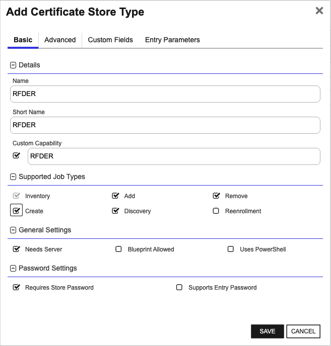

## RFDER

The RFDER Certificate Store Type is designed to manage DER encoded files, providing a structured and efficient way to handle cryptographic certificates in DER format. By integrating RFDER with the Remote File Universal Orchestrator extension, users can perform inventory, add, remove, create, and discovery operations on DER encoded certificate stores, streamlining certificate management processes.

### Representation and Use Cases

The RFDER Certificate Store represents files encoded in the Distinguished Encoding Rules (DER) format. DER is a binary format for data structures described by the ASN.1 standard, and it is commonly used for X.509 certificates. This store type supports several specific use cases:

1. **Single Certificate Stores with External Private Key**: Files containing a single certificate with the private key stored in an external file.
2. **Single Certificate Stores without Private Key**: Files containing a single certificate without an associated private key.

### Important Considerations

There are several important caveats and limitations to be aware of when using the RFDER Certificate Store Type:

1. **Single Certificate Limitation**: The RFDER store type is designed to handle single certificate entries only. It does not support multiple certificates within a single store.

2. **Private Key Handling**: For use cases where the certificate has an associated private key, it must be stored in an external file. Configuration for the external private key file can be specified using the `SeparatePrivateKeyFilePath` custom field.

3. **Security Context and Permissions**: When orchestrating management tasks, the security context is determined by the user ID entered in the Keyfactor Command certificate store or discovery job screens. When running locally as an agent, the security context is the user ID running the Keyfactor Command Universal Orchestrator service account. Elevated permissions may be required for certain operations, especially on Linux servers, which might involve configuring the orchestrated server for sudo access.

4. **Command Dependencies**: Managing DER certificate stores on Linux servers involves using several common Linux commands such as `chown`, `cp`, and `rm`. Ensure that the appropriate permissions are in place for these commands to execute successfully.

By understanding these key points, users can effectively leverage the RFDER Certificate Store Type to manage DER encoded certificates within their Keyfactor Command environment, ensuring secure and efficient certificate handling.


### Supported Job Types

| Job Name | Supported |
| -------- | --------- |
| Inventory | ✅ |
| Management Add | ✅ |
| Management Remove | ✅ |
| Discovery | ✅ |
| Create | ✅ |
| Reenrollment |  |

## Requirements

### Prerequisites and Security Considerations

<details>
<summary><b>Certificate stores hosted on Linux servers:</b></summary>

1. The Remote File Orchestrator Extension makes use of a few common Linux commands when managing stores on Linux servers. If the credentials you will be connecting with need elevated access to run these commands or to access the certificate store files these commands operate against, you must set up the user id as a sudoer with no password necessary and set the config.json "UseSudo" value to "Y".  When RemoteFile is using orchestration, managing local or external certificate stores using SSH or WinRM, the security context is determined by the user id entered in the Keyfactor Command certificate store or discovery job screens.  When RemoteFile is running as an agent, managing local stores only, the security context is the user id running the Keyfactor Command Universal Orchestrator service account.  The full list of these commands below:

|Shell Command|Used For|
|---|---|
|echo|Used to append a newline and terminate all commands sent.|
|find|Used by Discovery jobs to locate potential certificate stores on the file system.|
|cp|Used by Inventory and Management Add/Remove jobs to copy the certificate store file to a temporary file (only when an alternate download folder has been configured).|
|chown|Used by the Inventory and Management Add/Remove jobs to set the permissions on the temporary file (only when an alternate download folder has been configured).|
|tee|Used by Management Add/Remove jobs to copy the temporary uploaded certificate file to the certificate store file (only when an alternate upload folder has been configured).|
|rm|Used by Inventory and Management Add/Remove jobs to remove temporary files (only when an alternate upload/download folder has been configured).|
|install|Used by the Management Create Store job when initializing a certificate store file.|
|orapki|Oracle Wallet CLI utility used by Inventory and Management Add/Remove jobs to manipulate an Oracle Wallet certificate store.  Used for the RFORA store type only.|
|gskcapicmd|IBM Key Database CLI utility used by Inventory and Management Add/Remove jobs to manipulate an IBM Key Database certificate store.  Used for the RFKDB store type only.|  

2. When orchestrating management of local or external certificate stores, the Remote File Orchestrator Extension makes use of SFTP and/or SCP to transfer files to and from the orchestrated server.  SFTP/SCP cannot make use of sudo, so all folders containing certificate stores will need to allow SFTP/SCP file transfer for the user assigned to the certificate store/discovery job.  If this is not possible, set the values in the config.json apprpriately to use an alternative upload/download folder that does allow SFTP/SCP file transfer.  If the certificate store/discovery job is configured for local (agent) access, the account running the Keyfactor Universal Orchestrator service must have access to read/write to the certificate store location, OR the config.json file must be set up to use the alternative upload/download file.  

3. SSH Key Authentication: When creating a Keyfactor certificate store for the remote file orchestrator extension, you may supply either a user id and password for the certificate store credentials (directly or through one of Keyfactor Command's PAM integrations), or supply a user id and SSH private key.  Both PKCS#1 (BEGIN RSA PRIVATE KEY) and PKCS#8 (BEGIN PRIVATE KEY) formats are supported for the SSH private key.  If using the normal Keyfactor Command credentials dialog without PAM integration, just copy and paste the full SSH private key into the Password textbox.  SSH Key Authentication is not available when running locally as an agent.

Please reference [Configuration File Setup](#configuration-file-setup) for more information on setting up the config.json file and [Certificate Stores and Discovery Jobs](#certificate-stores-and-discovery-jobs) for more information on the items above.    
</details>  

<details>  
<summary><b>Certificate stores hosted on Windows servers:</b></summary>
1. When orchestrating management of external (and potentially local) certificate stores, the RemoteFile Orchestrator Extension makes use of WinRM to connect to external certificate store servers.  The security context used is the user id entered in the Keyfactor Command certificate store or discovery job screen.  Make sure that WinRM is set up on the orchestrated server and that the WinRM port (by convention, 5585 for HTTP and 5586 for HTTPS) is part of the certificate store path when setting up your certificate stores/discovery jobs.  If running as an agent, managing local certificate stores, local commands are run under the security context of the user account running the Keyfactor Universal Orchestrator Service.  Please reference [Certificate Stores and Discovery Jobs](#certificate-stores-and-discovery-jobs) for more information on creating certificate stores for the RemoteFile Orchestrator Extension.  

</details>

Please consult with your company's system administrator for more information on configuring SSH/SFTP/SCP or WinRM in your environment.

  
&nbsp;

### Remote File Orchestrator Extension Installation
1. Review the [Prerequisites and Security Considerations](#prerequisites-and-security-considerations) section and make sure your environment is set up as required.
2. Refer to the [Creating Certificate Store Types](#creating-certificate-store-types) section to create the certificate store types you wish to manage.
3. Stop the Keyfactor Universal Orchestrator Service on the server you plan to install this extension to run on.
4. In the Keyfactor Orchestrator installation folder (by convention usually C:\Program Files\Keyfactor\Keyfactor Orchestrator for a Windows install or /opt/keyfactor/orchestrator/ for a Linux install), find the "Extensions" folder. Underneath that, create a new folder named "RemoteFile". You may choose to use a different name if you wish.
5. Download the latest version of the RemoteFile orchestrator extension from [GitHub](https://github.com/Keyfactor/remote-file-orchestrator).  Click on the "Latest" release link on the right hand side of the main page and download the first zip file.
6. Copy the contents of the download installation zip file to the folder created in step 4.
7. (Optional) If you decide to create one or more certificate store types with short names different than the suggested values, edit the manifest.json file in the folder you created in step 4, and modify each "ShortName" in each "Certstores.{ShortName}.{Operation}" line with the ShortName you used to create the respective certificate store type.
8. Modify the config.json file to use the settings you desire.  Please go to [Configuration File Setup](#configuration-file-setup) to learn more. 
9. Start the Keyfactor Universal Orchestrator Service.

</details>  

&nbsp;

### Configuration File Setup

The Remote File Orchestrator Extension uses a JSON configuration file.  It is located in the {Keyfactor Orchestrator Installation Folder}\Extensions\RemoteFile.  None of the values are required, and a description of each follows below:  
{  
   "UseSudo": "N",  
   "DefaultSudoImpersonatedUser": "",  
   "CreateStoreIfMissing": "N",  
   "UseNegotiate": "N",  
   "SeparateUploadFilePath": "",  
   "FileTransferProtocol":  "SCP",  
   "DefaultLinuxPermissionsOnStoreCreation": "600",  
   "DefaultOwnerOnStoreCreation": ""  
}  

<details>
<summary><b>UseSudo</b> (Applicable for Linux hosted certificate stores only)</summary>

* Determines whether to prefix Linux command with "sudo". This can be very helpful in ensuring that the user id running commands over an ssh connection uses "least permissions necessary" to process each task. Setting this value to "Y" will prefix all Linux commands with "sudo" with the expectation that the command being executed on the orchestrated Linux server will look in the sudoers file to determine whether the logged in ID has elevated permissions for that specific command. Setting this value to "N" will result in "sudo" not being added to Linux commands.  
* Allowed values - Y/N  
* Default value - N  

</details>  

<details>
<summary><b>DefaultSudoImpersonatedUser</b> (Applicable for Linux hosted certificate stores only)</summary>

* Used in conjunction with UseSudo="Y", this optional setting can be used to set an alternate user id you wish to impersonate with sudo.  If this option does not exist or is set to an empty string, the default user of "root" will be used.  Any user id used here must have permissions to SCP/SFTP files to/from each certificate store location OR the SeparateUploadFilePath (see later in this section) as well as permissions to execute the commands listed in the "Prerequisites and Security Considerations" section above.  This value will be used for all certificate stores managed by this orchestrator extension implementation UNLESS overriden by the SudoImpersonatedUser certificate store type custom field setting described later in the [Creating Certificate Store Types](#creating-certificate-store-types) section.
* Allowed values - Any valid user id that the destination Linux server will recognize
* Default value - blank (root will be used)

</details>

<details>  
<summary><b>CreateStoreOnAddIfMissing</b></summary>

* Determines, during a Management-Add job, if a certificate store should be created if it does not already exist.  If set to "N", and the store referenced in the Management-Add job is not found, the job will return an error with a message stating that the store does not exist.  If set to "Y", the store will be created and the certificate added to the certificate store.
* Allowed values - Y/N  
* Default value - N  

</details>  

<details>  
<summary><b>UseNegotiateAuth</b> (Applicable for Windows hosted certificate stores only)</summary>

* Determines if WinRM should use Negotiate (Y) when connecting to the remote server.
* Allowed values - Y/N  
* Default value - N  

</details>  

<details>  
<summary><b>SeparateUploadFilePath</b> (Applicable for Linux hosted certificate stores only)</summary>

* Set this to the path you wish to use as the location on the orchestrated server to upload/download and later remove temporary work files when processing jobs.  If set to "" or not provided, the location of the certificate store itself will be used.  File transfer is performed using the SCP or SFTP protocols (see the File TransferProtocol setting).
* Allowed values - Any valid, existing Linux path configured to allow SCP/SFTP file upload/download tranfers.
* Default value - blank (actual store path will be used)

</details>

<details>  
<summary><b>FileTransferProtocol</b> (Applicable for Linux hosted certificate stores only)</summary>

* Determines the protocol to use when uploading/downloading files while processing a job.
* Allowed values - SCP, SFTP or Both.  If "Both" is entered, SCP will be attempted first, and if that does not work, SFTP will be tried.
* Default value - SCP. 

</details>

<details>  
<summary><b>DefaultLinuxPermissionsOnStoreCreation</b> (Applicable for Linux hosted certificate stores only)</summary>

* The Linux file permissions that will be set on a new certificate store created via a Management Create job or a Management Add job where CreateStoreOnAddIsMissing is set to "Y".  This value will be used for all certificate stores managed by this orchestrator instance unless overridden by the optional "Linux File Permissions on Store Creation" custom parameter setting on a specific certificate store.  See the [Creating Certificate Store Types](#creating-certificate-store-types) section for more information on creating RemoteFile certificate store types.
* Allowed values - Any 3 digit value from 000-777.
* Default Value - 600.  

</details>

<details>  
<summary><b>DefaultOwnerOnStoreCreation</b> (Applicable for Linux hosted certificate stores only)</summary>

* When a Management job is run to remotely create the physical certificate store on a remote server, by default the file owner and group will be set to the user name associated with the Keyfactor certificate store.  Setting DefaultOwnerOnStoreCreation to an alternative valid Linux user name will set that as the owner/group instead.  If the group and owner need to be different values, use a ":" as a delimitter between the owner and group values, such as ownerId:groupId.  Please make sure that the user associated with the certificate store will have valid permissions to chown the certificate store file to this alernative owner.  The optional "Linux File Owner on Store Creation" custom parameter setting for a specific certificate store can override this value for a specific store.  See the [Creating Certificate Store Types](#creating-certificate-store-types) section for more information on creating RemoteFile certificate store types.
* Allowed values - Any valid user id that the destination Linux server will recognize
* Default Value - blank (the ID associated with the Keyfactor certificate store will be used).  

</details>

&nbsp;


## Certificate Store Type Configuration

The recommended method for creating the `RFDER` Certificate Store Type is to use [kfutil](https://github.com/Keyfactor/kfutil). After installing, use the following command to create the `` Certificate Store Type:

```shell
kfutil store-types create RFDER
```

<details><summary>RFDER</summary>

Create a store type called `RFDER` with the attributes in the tables below:

### Basic Tab
| Attribute | Value | Description |
| --------- | ----- | ----- |
| Name | RFDER | Display name for the store type (may be customized) |
| Short Name | RFDER | Short display name for the store type |
| Capability | RFDER | Store type name orchestrator will register with. Check the box to allow entry of value |
| Supported Job Types (check the box for each) | Add, Discovery, Remove | Job types the extension supports |
| Supports Add | ✅ | Check the box. Indicates that the Store Type supports Management Add |
| Supports Remove | ✅ | Check the box. Indicates that the Store Type supports Management Remove |
| Supports Discovery | ✅ | Check the box. Indicates that the Store Type supports Discovery |
| Supports Reenrollment |  |  Indicates that the Store Type supports Reenrollment |
| Supports Create | ✅ | Check the box. Indicates that the Store Type supports store creation |
| Needs Server | ✅ | Determines if a target server name is required when creating store |
| Blueprint Allowed |  | Determines if store type may be included in an Orchestrator blueprint |
| Uses PowerShell |  | Determines if underlying implementation is PowerShell |
| Requires Store Password | ✅ | Determines if a store password is required when configuring an individual store. |
| Supports Entry Password |  | Determines if an individual entry within a store can have a password. |

The Basic tab should look like this:



### Advanced Tab
| Attribute | Value | Description |
| --------- | ----- | ----- |
| Supports Custom Alias | Forbidden | Determines if an individual entry within a store can have a custom Alias. |
| Private Key Handling | Optional | This determines if Keyfactor can send the private key associated with a certificate to the store. Required because IIS certificates without private keys would be invalid. |
| PFX Password Style | Default | 'Default' - PFX password is randomly generated, 'Custom' - PFX password may be specified when the enrollment job is created (Requires the Allow Custom Password application setting to be enabled.) |

The Advanced tab should look like this:


### Custom Fields Tab
Custom fields operate at the certificate store level and are used to control how the orchestrator connects to the remote target server containing the certificate store to be managed. The following custom fields should be added to the store type:

| Name | Display Name | Type | Default Value/Options | Required | Description |
| ---- | ------------ | ---- | --------------------- | -------- | ----------- |


The Custom Fields tab should look like this:


</details>

## Certificate Store Configuration

After creating the `RFDER` Certificate Store Type and installing the Remote File Universal Orchestrator extension, you can create new [Certificate Stores](https://software.keyfactor.com/Core-OnPrem/Current/Content/ReferenceGuide/Certificate%20Stores.htm?Highlight=certificate%20store) to manage certificates in the remote platform.

The following table describes the required and optional fields for the `RFDER` certificate store type.

| Attribute | Description | Attribute is PAM Eligible |
| --------- | ----------- | ------------------------- |
| Category | Select "RFDER" or the customized certificate store name from the previous step. | |
| Container | Optional container to associate certificate store with. | |
| Client Machine | For the Client Machine field when instantiating new Certificate Stores of type 'RFDER', enter the DNS name or IP address of the remote orchestrated server. For Windows servers, use the format protocol://dns-or-ip:port (e.g., https://myserver.mydomain.com:5986). | |
| Store Path | For the Store Path field when instantiating new Certificate Stores of type 'RFDER', enter the full path and file name, including the file extension, of the DER encoded file. For example, on Linux: /folder/path/certificate.der, and on Windows: C:\folder\path\certificate.der. | |
| Orchestrator | Select an approved orchestrator capable of managing `RFDER` certificates. Specifically, one with the `RFDER` capability. | |

* **Using kfutil**

    ```shell
    # Generate a CSV template for the AzureApp certificate store
    kfutil stores import generate-template --store-type-name RFDER --outpath RFDER.csv

    # Open the CSV file and fill in the required fields for each certificate store.

    # Import the CSV file to create the certificate stores
    kfutil stores import csv --store-type-name RFDER --file RFDER.csv
    ```

* **Manually with the Command UI**: In Keyfactor Command, navigate to Certificate Stores from the Locations Menu. Click the Add button to create a new Certificate Store using the attributes in the table above.