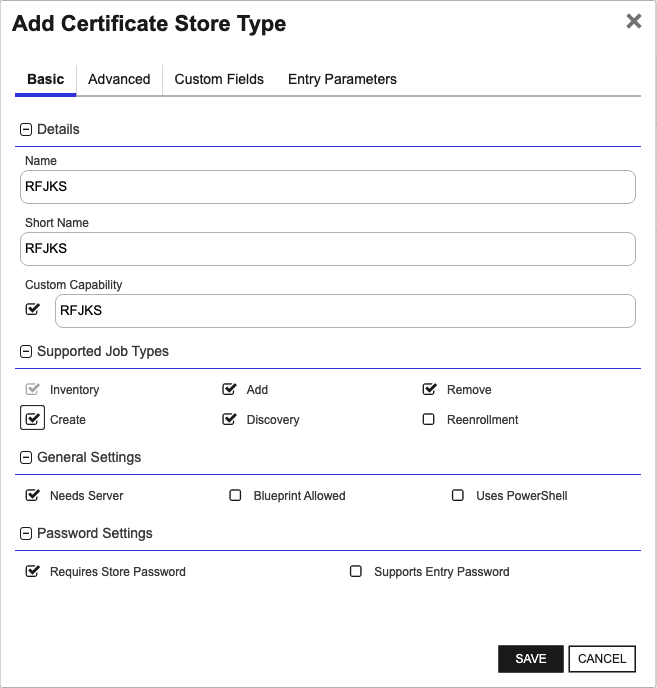

## RFJKS

The RFJKS store type can be used to manage java keystores of types JKS or PKCS12.  If creating a new java keystore and adding a certificate all via Keyfactor Command, the created java keystore will be of type PKCS12, as java keystores of type JKS have been deprecated as of JDK 9.

Use cases supported:
1. One-to-many trust entries - A trust entry is considered single certificate without a private key in a certificate store.  Each trust entry is identified with a custom alias.
2. One-to-many key entries - One-to-many certificates with private keys and optionally the full certificate chain.  Each certificate identified with a custom alias.
3. A mix of trust and key entries.


### Supported Job Types

| Job Name | Supported |
| -------- | --------- |
| Inventory | ✅ |
| Management Add | ✅ |
| Management Remove | ✅ |
| Discovery | ✅ |
| Create | ✅ |
| Reenrollment |  |

## Requirements

TODO Requirements is a required section


## Certificate Store Type Configuration

The recommended method for creating the `RFJKS` Certificate Store Type is to use [kfutil](https://github.com/Keyfactor/kfutil). After installing, use the following command to create the `RFJKS` Certificate Store Type:

```shell
kfutil store-types create RFJKS
```

<details><summary>RFJKS</summary>

Create a store type called `RFJKS` with the attributes in the tables below:

### Basic Tab
| Attribute | Value | Description |
| --------- | ----- | ----- |
| Name | RFJKS | Display name for the store type (may be customized) |
| Short Name | RFJKS | Short display name for the store type |
| Capability | RFJKS | Store type name orchestrator will register with. Check the box to allow entry of value |
| Supported Job Types (check the box for each) | Add, Discovery, Remove | Job types the extension supports |
| Supports Add | ✅ | Check the box. Indicates that the Store Type supports Management Add |
| Supports Remove | ✅ | Check the box. Indicates that the Store Type supports Management Remove |
| Supports Discovery | ✅ | Check the box. Indicates that the Store Type supports Discovery |
| Supports Reenrollment |  |  Indicates that the Store Type supports Reenrollment |
| Supports Create | ✅ | Check the box. Indicates that the Store Type supports store creation |
| Needs Server | ✅ | Determines if a target server name is required when creating store |
| Blueprint Allowed |  | Determines if store type may be included in an Orchestrator blueprint |
| Uses PowerShell |  | Determines if underlying implementation is PowerShell |
| Requires Store Password | ✅ | Determines if a store password is required when configuring an individual store. |
| Supports Entry Password |  | Determines if an individual entry within a store can have a password. |

The Basic tab should look like this:



### Advanced Tab
| Attribute | Value | Description |
| --------- | ----- | ----- |
| Supports Custom Alias | Required | Determines if an individual entry within a store can have a custom Alias. |
| Private Key Handling | Optional | This determines if Keyfactor can send the private key associated with a certificate to the store. Required because IIS certificates without private keys would be invalid. |
| PFX Password Style | Default | 'Default' - PFX password is randomly generated, 'Custom' - PFX password may be specified when the enrollment job is created (Requires the Allow Custom Password application setting to be enabled.) |

The Advanced tab should look like this:


### Custom Fields Tab
Custom fields operate at the certificate store level and are used to control how the orchestrator connects to the remote target server containing the certificate store to be managed. The following custom fields should be added to the store type:

| Name | Display Name | Type | Default Value/Options | Required | Description |
| ---- | ------------ | ---- | --------------------- | -------- | ----------- |
| LinuxFilePermissionsOnStoreCreation | Linux File Permissions on Store Creation | String |  |  | The LinuxFilePermissionsOnStoreCreation field should contain a three-digit value between 000 and 777 representing the Linux file permissions to be set for the certificate store upon creation. Example: '600' or '755'. |
| LinuxFileOwnerOnStoreCreation | Linux File Owner on Store Creation | String |  |  | The LinuxFileOwnerOnStoreCreation field should contain a valid user ID recognized by the destination Linux server, optionally followed by a colon and a group ID if the group owner differs. Example: 'userID' or 'userID:groupID'. |
| SudoImpersonatingUser | Sudo Impersonating User | String |  |  | The SudoImpersonatingUser field should contain a valid user ID to impersonate using sudo on the destination Linux server. Example: 'impersonatedUserID'. |


The Custom Fields tab should look like this:


</details>


## Certificate Store Configuration

After creating the `RFJKS` Certificate Store Type and installing the Remote File Universal Orchestrator extension, you can create new [Certificate Stores](https://software.keyfactor.com/Core-OnPrem/Current/Content/ReferenceGuide/Certificate%20Stores.htm?Highlight=certificate%20store) to manage certificates in the remote platform.

The following table describes the required and optional fields for the `RFJKS` certificate store type.

| Attribute | Description | Attribute is PAM Eligible |
| --------- | ----------- | ------------------------- |
| Category | Select "RFJKS" or the customized certificate store name from the previous step. | |
| Container | Optional container to associate certificate store with. | |
| Client Machine | The IP address or DNS of the server hosting the certificate store.  For more information, see [Client Machine ](#client-machine-instructions) | |
| Store Path | The full path and file name, including file extension if one exists where the certificate store file is located.  For Linux orchestrated servers, StorePath will begin with a forward slash (i.e. /folder/path/storename.ext).  For Windows orchestrated servers, it should begin with a drive letter (i.e. c:\folder\path\storename.ext). | |
| Orchestrator | Select an approved orchestrator capable of managing `RFJKS` certificates. Specifically, one with the `RFJKS` capability. | |
| LinuxFilePermissionsOnStoreCreation | The LinuxFilePermissionsOnStoreCreation field should contain a three-digit value between 000 and 777 representing the Linux file permissions to be set for the certificate store upon creation. Example: '600' or '755'. |  |
| LinuxFileOwnerOnStoreCreation | The LinuxFileOwnerOnStoreCreation field should contain a valid user ID recognized by the destination Linux server, optionally followed by a colon and a group ID if the group owner differs. Example: 'userID' or 'userID:groupID'. |  |
| SudoImpersonatingUser | The SudoImpersonatingUser field should contain a valid user ID to impersonate using sudo on the destination Linux server. Example: 'impersonatedUserID'. |  |

* **Using kfutil**

    ```shell
    # Generate a CSV template for the AzureApp certificate store
    kfutil stores import generate-template --store-type-name RFJKS --outpath RFJKS.csv

    # Open the CSV file and fill in the required fields for each certificate store.

    # Import the CSV file to create the certificate stores
    kfutil stores import csv --store-type-name RFJKS --file RFJKS.csv
    ```

* **Manually with the Command UI**: In Keyfactor Command, navigate to Certificate Stores from the Locations Menu. Click the Add button to create a new Certificate Store using the attributes in the table above.

